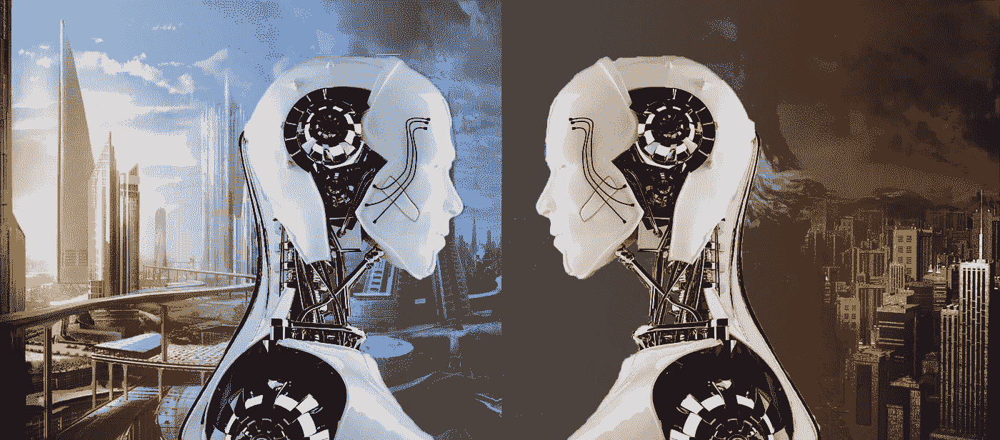
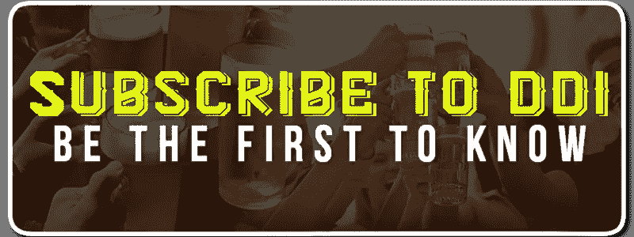

# 仁慈对恶意:人工智能…有没有准备？

> 原文：<https://medium.datadriveninvestor.com/benevolence-vs-malevolence-artificial-intelligence-is-there-anyway-to-prepare-f66a44be81f0?source=collection_archive---------1----------------------->

A.I.’s going to be big and beautiful or is it going to be a horrific mess?

是的，人工智能即将到来……是的，作为人类，你可以做好准备。似乎人们在人工智能对他们和人类意味着什么的问题上存在分歧。让我解释一下为什么会这样。人类非常擅长对新数据进行分类，但有一个问题，我们通常使用很少的类别，而且我们经常出错。进化从基因上保证了你可以用你的感官迅速分辨健康和危险。不幸的是，非常快速地对新的威胁数据进行分类的最原始需求是以用几乎二元的方式对一切进行分类为代价的。你知道这是刻板印象。

我们很早就学会了这种二元分类模式(心理学上)；妈妈和爸爸，男孩和女孩，家庭和非家庭，家和非家…看到模式出现了吗？我们在成长和教育过程中不断重复这些分类，分割、细分和扩展我们对感知的知识。最终，当我们成熟到 20 多岁时，我们在事物、人、地点和事件中看到了秩序，在其他事物、人、地点和事件中看到了混乱……我们使用我们的进化分类系统(主要)将男性归于秩序，将女性归于混乱……因为我们首先学会了这一点。

把事物归入这样或那样的范畴，是一种无意识或潜意识的结论。大多数宗教、哲学和人类启蒙运动都围绕着这样一个概念:安全就是秩序，危险就是混乱。东西方的思维方式都是这样做的，他们指出，生活不能只有秩序或混乱……生活意味着两者都存在。保持它们之间的平衡是你必须学会的真正技巧。

人工智能在很大程度上仍然是科幻小说。人工智能是个未知数。因此，我们下意识地将其归类；安全或危险，健康或患病，善良或邪恶，它会带来秩序或混乱。我们这样做是根据我们自己的知识、生活和经历、信仰和关注、希望和恐惧以及我们对未来的看法。因此，从比尔·盖茨到埃隆·马斯克，你可以看到一种模式的出现。哦，好莱坞无疑增加了我们对人工智能的看法，无论是积极的还是消极的，加强了我们自己的信念，无论他们倾向于哪一方。

谢天谢地，在人类历史上，我们还没有到那一步。主要的，真正主要的技术障碍存在于真正创造一个能像人类思维一样思考的人造大脑；更别说超越人类思维了。人工智能领域的许多人认为真正的人工智能还需要几十年的时间。可惜，机器学习的时代已经开始了。这就是我和我的朋友、同事、孩子在 2020 年和 2030 年所关心的事情！

由硬件和软件组成的机器学习系统可以比人类更快更好地学习几乎任何重复的任务……但它不能是“大部分”重复的任务……它需要是真正重复的任务，没有偏差。机器学习创造了范围狭窄的类似人工智能的系统，但不是真正的人工智能。这就是混淆产生大标题的地方。你的世界不是人工智能，还不是……而是“机器每次都能完美地学会烹饪和翻转汉堡！”并不像“人工智能给所有快餐工作带来厄运”那样吸引人

你生活在这些令人印象深刻的硬件和软件作品中，并经常与之互动。互联网上充满了非常复杂的窄范围人工智能系统来帮助你搜索信息…即使它们是付费的，并通过广告和营销努力将你可能需要或可能不需要的商品和服务放在你的眼前。(那也让我抓狂。)你的智能设备“学习”你经常使用的快捷方式和偏好，也许你的汽车可以在高速公路上自动驾驶，也许你的工作是与窄范围的人工智能系统或代理交互，以提高你的工作效率，也许你的孩子使用在线互动学习模块，这些模块会记住你孩子的偏好和常见错误，并使用它们来更快地教你的孩子。整个国家的数学都是这样！

这感觉就像我们是科技水中的青蛙，水正在慢慢变热…很快我们就会被煮死。人类不是青蛙。如果水变热了，我们人类就会逃出去！当我们得知脸书的窄范围人工智能式数据管理系统已被用于操纵我们所看到的信息时，人类开始成群结队地跳出水面。随着我们慢慢进入越来越聪明的窄范围人工智能系统，将会有更多令人不安的观察和发现……将会有巨大的失望以及看起来像是神奇的能力和创造。智能手机只有十年历史！从传感器实时收集信息的系统刚刚上线:面部识别摄像头、机器监听枪声、碎玻璃、振动和存在指示器等。这一切发生得非常快。

好吧，人类，你如何准备？在历史上，这可能不是决定你想成为一名工厂工人，一名司机，甚至是一名飞行员或任何其他你以完全相同的方式重复做同样事情的工作的时候。如果你看到你现在的工作慢慢被机器和人工智能系统取代，制定一个跳出锅的计划吧！学习更多的东西来增加你的价值。

朋友们问他们的孩子应该从事什么……嗯，我回答，他们喜欢什么？经济的每个部门都有被自动化和机器学习取代的危险，除了那些与人与人之间的互动有关的工作……生活、体验和互动的更软的一面。甚至麻醉学(我的领域)也有许多部分，其中一些是令人难以置信的完美重复，我的同事们看到了一些变化，当一些重复的任务自动化时，这些变化将提高麻醉师的警惕水平，以确保麻醉患者的安全。然而，没有任何机器或人工智能可以取代手术前看到病人醒着，看着他们的眼睛，并确信他们会好起来……这是人类独有的技能。

我们都需要学习的是有效地相互沟通。社交媒体扩大了信息交流的一种形式，但在这种情况下，它阻碍了大部分信息的传递。当面临挑战和问题时，人类在生活中经常需要和想要的是亲自沟通，并有足够的时间和注意力来真正倾听和理解。学会这样做，你会发现自己对雇主来说更有价值，如果自动化淘汰了你的旧工作，你也能在一个组织中得到调动。你的孩子学习这些技能给了他们巨大的机会来取代那些选择不拓展自己能力的人。

无论我们的机器和系统变得多么先进，总会有问题，在某些时候，你会打字或大声说话，甚至可能只是“想”…“我可以拜托，拜托，只是和一个人说话吗？”这是我们所有人未来的工作；服务、解决问题、沟通、治疗等等，不胜枚举。人类思维的其他努力:艺术、创造、幻想、研究、逻辑跳跃、顿悟不会被机器学习轻易接管，也许在我们的有生之年，人工智能永远不会真正成功。

那么我在我们人类的未来中看到了什么？

善远胜于恶，秩序远胜于混乱；我看到前方有一场伟大的复兴，就像农业机械首次减少耕种一英亩土地所需的人类数量时一样。所有那些不是整天、整年都在制作食物的人，给了我们人类所经历过的人类能力、创造力和探索力最大的提升。下一次复兴将再次开始，单调的工作将由机器学习系统完成，这将使更多的人比以往任何时候都更自由地进行自我教育，并追求其他创造力、激情、想法和理解。关键是永远不要停止学习。

