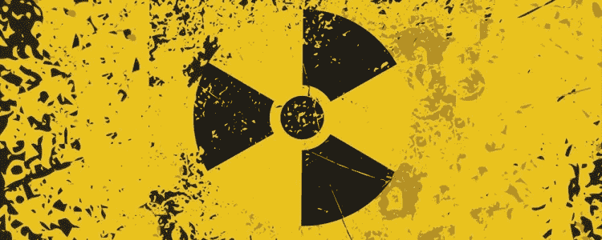

# 伯克利分校可以要求警告将手机放在裤子或胸罩里是危险的

> 原文：<https://medium.datadriveninvestor.com/berkeley-can-require-warning-that-carrying-your-cell-phone-in-your-pants-or-bra-is-dangerous-64b63b6e212a?source=collection_archive---------2----------------------->

法院支持"知情权"条例。

美国第九巡回上诉法院 7 月 2 日重申，伯克利市可以继续要求手机零售商警告消费者，将手机放在身上，即放在裤子口袋或胸罩中，会使他们暴露在危险的辐射水平下。

无线行业强大的贸易组织 CTIA 曾要求法院推翻该市于 2016 年生效的“知情权”条例，理由是该条例违反了第一修正案，要求零售商发布“煽动性”信息，从而阻碍了零售商的言论自由。

 [## 2019 年移动应用开发之路——数据驱动投资者

### 任何在移动应用程序开发行业工作的人，无论他们是专注于在伦敦开发 iOS 应用程序还是…

www.datadriveninvestor.com](https://www.datadriveninvestor.com/2019/01/15/the-path-of-mobile-app-development-in-2019/) 

所需的警告[显示为](https://www.codepublishing.com/CA/Berkeley/html/Berkeley09/Berkeley0996/Berkeley0996030.html):

> “为了确保安全，联邦政府要求手机符合射频(RF)暴露准则。如果您在手机打开并连接到无线网络时，将手机放在裤子或衬衫口袋中或塞在胸罩中携带或使用，您可能会超过联邦射频辐射暴露指南。有关如何安全使用手机的信息，请参阅手机或用户手册中的说明。

此前，经过三年的斗争，CTIA [在 2013 年阻止了旧金山市要求手机辐射信息](https://www.cnet.com/news/san-francisco-finally-kills-cell-phone-radiation-law/)。

射频辐射(RFR)是电磁波谱中发出的任何东西，从微波到 x 射线到无线电波到光计算机显示器或太阳。我们都从“最好打电话给索尔”中了解到一种叫做电磁过敏的奇怪情况，其中一些人在手机和 Wi-Fi 等辐射面前表现出虚弱的症状。研究人员已经研究这种情况三十年了，但还没有找到一个解释，除非没有证据表明它实际上是由辐射引起的。

更强大的下一代蜂窝技术 5G 的出现，重新引起了人们对手机和射频辐射之间联系的担忧，反对者声称射频辐射会损害 DNA 并导致癌症；引起早衰；扰乱细胞代谢，并可能通过产生应激蛋白导致其他疾病。

除了手机本身，批评者声称，由于 5G 发射机的功率较低，将会有更多的手机。环境健康信托基金表示,“5G 将需要在社区、城市和城镇建设成千上万的新无线天线。据估计，每 2 到 10 户家庭将安装一个蜂窝小区或另一个发射器。”

几十年的研究发现手机和脑瘤等癌症之间没有联系，但这并不能说服所有人。至少在伯克利，你不能说你没被警告过。