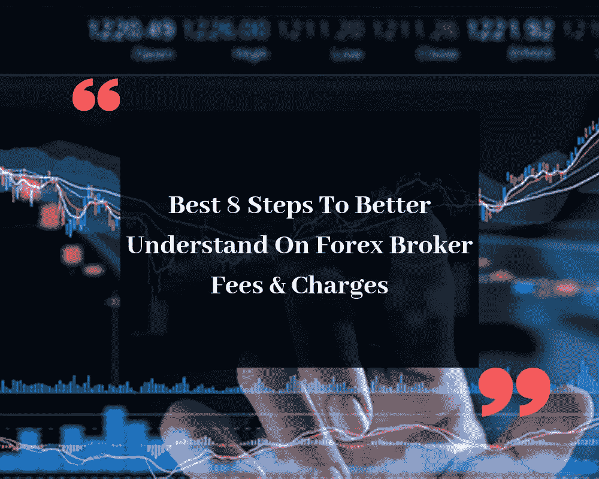

# 更好地了解外汇经纪人费用和收费的最佳 8 个步骤

> 原文：<https://medium.datadriveninvestor.com/best-8-steps-to-better-understand-on-forex-broker-fees-charges-4949c324f493?source=collection_archive---------3----------------------->

Photo by [Austin Distel](https://unsplash.com/@austindistel?utm_source=medium&utm_medium=referral) on [Unsplash](https://unsplash.com?utm_source=medium&utm_medium=referral)

外汇市场是有史以来最大的网上货币交易市场。它已经在短时间内获得了巨大的知名度。

所以，当谈到外汇交易时，每个人首先想到的是-

 [## 机器学习的外汇交易挑战|数据驱动的投资者

### 机器学习是人工智能的一个分支，之前占据了很多头条。人们是…

www.datadriveninvestor.com](https://www.datadriveninvestor.com/2019/02/18/the-challenge-of-forex-trading-for-machine-learning/) 

*它很贵吗？或者要花多少钱？*

所以，答案很简单。是的，有一些费用，因为你必须选择一个经纪人，还有一些费用，比如押金之类的。事实上，许多人不知道经纪人的费用。

*对于他们，我想说不用担心。*

今天，我将强调一些关于经纪人费用和收费的事实。所以我们开始吧，好吗？

外汇经纪人以这种或那种形式收取各种费用，而且每笔交易都有一些相关的交易成本。

许多交易者经常忽略每次交易的总成本会对投资组合的整体结果产生很大的影响。

虽然最明显的成本是通过传播，还有其他费用和收费适用，不应被忽视。

透明的经纪人总是会提前告知他们的成本，并在他们的网站上，在他们的交易平台上和任何交易票一起列出(或者，理想情况下，在两个地方都列出)。

他们还为你提供[最佳外汇信号](https://pipswin.com/)。所以，如果你加入一家经纪公司，你会从那里得到各种各样的信号，你不必为此多花钱。

**一瞥直接交易费用**

直接成本包括差价交易、佣金率互换、隔夜融资成本、仓储费和托管费。并非每笔交易的所有适用费用，如果交易是基于保证金和每笔交易的持续时间，则所有费用都取决于交易的资产。

每笔交易涉及的所有费用应由经纪人具体说明；所有透明的经纪人在他们的交易条件中列出他们自己，并且给出费用是如何产生和计算的例子。

另外，交易成本可以在交易平台中找到。如果经纪商提供自营交易平台，情况尤其如此。

还提供了计算器，允许交易者在下单前计算每笔交易的成本。

**价差**

价差是与交易相关的最明显的成本，指的是买价和卖价之间的差额。利差是经纪人的主要收入来源，他们在原始利差的基础上继续加价。

欧元/美元的原始利差可低至 0.0 点，这是流动性最高、配置最低的货币对。高于这个水平的都是加价经纪费。

虽然价差列在各自的网站经纪人，交易员可以很容易地看到他们在他们的交易终端。

**佣金**

有些账户的欧元/美元差价可能低至 0.0 点，但每手交易的经纪佣金。ECN 账户通常收取一笔佣金，用于无交易桌面执行。

交易者从交易所经纪人佣金中获得原油差价或非常接近的差价。

该委员会还对股票和各种其他资产(ETF、this 等、债券等)的交易征税。)将负责佣金。

为了获得资产携带佣金的全部细节，交易者应该查阅经纪人提供的目录资产或者直接从交易平台获得信息。

透明经纪商会在其网站上列出完整的合约规范，而自营交易平台会列出每笔交易的所有信息。批量折扣通常是给客户佣金的。

**互换利率**

互换利率，有时也称为展期利率，适用于隔夜持有的所有头寸。互换的发生是由于基础货币和报价货币的利率不同。

经纪人将列出如何计算利率，并有长期和短期利率互换。根据交易者是持有多头还是空头头寸，掉期利率将被记入账户余额的贷方或借方。许多经纪商未能向交易员传递积极的掉期交易。

外汇交易员可以通过以下步骤在 MT4 交易平台上查看确切的掉期交易:

*   在“市场观察”窗口中右键单击所需的符号，然后选择“符号”。
*   选择您的首选货币，然后单击右侧的“属性”。
*   向下滚动，直到看到“交换多头”和“交换空头”

**隔夜融资成本**

这是与保证金交易相关的成本。经纪人将解释如何计算有效的隔夜融资利率。这取决于每次交易使用的杠杆数量和交易的资产。

这是一项需要监控的成本，因为它会随着固定资产账户的增加而增加。

**仓储费用**

一些经纪人会向持有某些资产的交易者收取保管费。这是一笔不必要的费用，但在账户中持有头寸是以互换和/或融资为代价的。

基本上，这是为了维持你投资组合中的头寸而收取的费用。应避免收取存储费用的经纪人。

**托管费**

股票、交易所交易基金和债券都有托管费，通常是每年收取的一小部分，但可以每月最低扣除。

并不是所有的经纪人都提供股票或债券交易，并使用 CFD 来参与交易而不需要支付托管人的费用。

**一瞥直接交易费用**

间接交易成本是指每笔交易不收取的成本，但不包括取款费和账户不活动费等成本。所有券商都免收保证金，这是行业标准做法。

一些经纪人甚至代替他们的交易员通过银行转账进行存款，通常由银行交易员收取。经纪人通常不收取取现费，但第三方可能会收取取现费，如银行转账费。

所有与存款和取款相关的费用都必须列在经纪人网站上。

不必要的费用，填补了一些经纪人由于不活跃的帐户费用。它通常在三个月没有交易活动后应用。

然后，经纪人将收取季度费用，该费用将列在经纪人网站的交易条款中，直到账户余额耗尽或交易恢复。

一般来说，经纪人可以收取的所有费用都会列在他们网站的交易条件下。交易者应该仔细阅读这一部分，因为它的成本不太为人所知。

如果经纪人的网站上没有提供这些信息，那么最好避开经纪人。可以联系到客服，但还是那句话，一个透明可信的经纪人是不会隐瞒自己的成本的。

利差和掉期等成本最好直接从交易平台获取，因为它们可能会因市场条件而快速变化。使用提供的经纪费计算器也可用于确定交易的每项资产和交易量的确切成本。

总之，每个经纪人收取几笔费用。由你来选择他们中最好的值得信赖的、受监管的经纪人。

干杯！