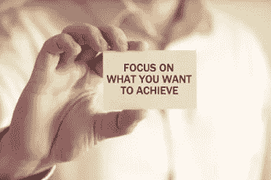

# 我得到的最好的建议是:只对一件事疯狂……结果

> 原文：<https://medium.datadriveninvestor.com/best-advice-i-ever-got-be-maniacal-about-just-one-thing-the-outcome-7f383360c288?source=collection_archive---------7----------------------->

作为一名首席执行官，这些年来，我给出并收到了大量的建议。我想我在这两方面都有所进步。每当我被要求说出我得到的最好的建议时，我从不犹豫。对我来说，这和我今天早餐吃了什么一样清楚。对于这篇媒体文章，我想我会在这里分享它，希望它能引起别人的共鸣。我喜欢建立我的导师网络，现在希望能继续发展下去。

我得到的最好的建议很简单:从你想要的结果开始，然后倒着做。

**就像度假一样，选择你的目的地**

你有没有试过在不知道想去哪里的情况下计划假期？也许吧，但这远非理想。对目的地有一个清晰的认识会让旅行计划变得简单而高效。

**它同样适用于职业规划****:**

1985 年，我的职业生涯已经进行了两年。我在去达拉斯的飞机上，读着李·艾柯卡的自传。第一章开头的一段给了我深刻的印象。这是李先生在福特汽车公司工作的第一天。他看到一群穿着三件套西装的主管走过。他问他的同事“这些人是谁？”。他的同事回答说，“哦，他们是福特汽车公司的副总裁”。李开复立即设定目标，在 35 岁时成为福特公司的副总裁(顺便说一下，他实现了这个目标)。那一刻我意识到，我没有目标，没有我想要达到的结果，所以我无耻地偷走了他的目标。35 岁时，我也成为了一家上市公司的副总裁。这个结果对我的每个职业选择都有帮助。

有一个明确的目标帮助我制定了一个反向的时间表，并确保我做出正确的选择来培养所需的技能。更重要的是，当我感到停滞不前时，它帮助我导航，总是问自己下一步是带我走向目标，还是远离目标。这个概念很简单:如果你不知道你想去哪里，那么你怎么能设定一个到达那里的路线呢？你会漫无目的地徘徊，尽管这条路可能很有趣，但衡量成功将会更加困难。所以，从目标开始，不断评估你所做的事情是否让你更接近目标。

**这同样适用于公司战略:疯狂地关注结果**

九年前，我创办了 Mercatus，作为一家专注于能源的投资银行，与大型投资者和资产所有者合作，寻找和收购可再生能源资产。我们很快对从核心系统和电子表格中“获取”数据的劳动密集型过程感到失望，这一过程需要我们提供帮助做出关键投资业务决策所需的洞察力。我们很早就意识到结果(“投资备忘录”)必须吸引我们的客户:投资者。这是我写的第一篇博客。[https://www . gomer catus . com/blog/CEOs-perspective-are-customer/](https://www.gomercatus.com/blog/ceos-perspective-are-customer/)

我们开发这个软件是为了扩大我们的业务，我们的崇高目标是成为最好的投资银行公司。我们构建的软件出乎意料地吸引了我们客户的注意，他们说服我们销售该软件来扩展他们的内部运营和决策准确性。这是我们公司历史上的第三年——一个偶然的软件公司，几乎没有软件背景——销售软件。我们一直在努力编写规范，将我们的 1.0 版软件设计成真正的、可销售的产品。

所以，我回到了我得到的最好的建议。我们的客户想要什么样的结果？答案是:一个简单的单页仪表板，用于对他们的资产和投资组合做出投资决策。我们开始问我们的客户“你到底想知道什么来做出快速准确的投资决策？”这迫使我们在[极其详细地分析它，并挑战我们的团队用更广泛的受众来验证它，从评级机构到最大的银行和机构投资者。](https://www.google.com/search?q=excruciating&spell=1&sa=X&ved=0ahUKEwi3lf_JsercAhUCQawKHeYPBzgQkeECCCQoAA)

这开始了我疯狂关注结果的旅程。我们花了 6 个月时间，试图将一份 12 页多的投资备忘录论文浓缩成一份单页简历，只关注做出最重要投资决策所需的最关键信息。那份简历成了我们的执行仪表板——这是我们苦心经营的结果。这就是 Mercatus 如何从一家投资银行转变为一家软件公司，缓慢而持续地专注于结果，然后构建技术来实现这一结果。

**也许会杀了你**

我们的目标是为能源高管创建一个仪表板，将几个月的不确定性从等式中剔除，并给出一个明确的是或否的答案，因为可能会杀死你，杀死你的企业

我们认识到，哪种技术、哪种资产类别或哪个地区等都无关紧要。—每个项目或投资组合的核心看起来都是一样的。我们只专注于发现和定义那些核心元素和所需的洞察力。将近五年后的今天，这个仪表板仍然是我们平台基础的核心。

**帮助客户梳理出他们想要的结果，并创建反向时间表**

这条建议同样适用于帮助我们的客户。客户经常带着他们试图解决的症状或问题来找我们，但他们可能不理解(或不关注)问题的真正根源。坦率地说，大多数人都在追逐数字化、大数据、人工智能、区块链等时髦词汇。

我们将整个客户获取流程设计为值得信赖的顾问，以帮助我们的客户高管团队更好地定义他们想要实现的结果，以便我们能够确定软件和我们的技术平台是否有助于实现这一目标。如果没有对客户的目标和阻止他们实现预期结果的根本原因有一个坚实的了解，我们永远不会谈论我们的软件功能。这是徒劳的活动。

从结果开始，倒推。每次都管用！

疯狂地关注结果，不要陷入需求的细枝末节，这是我收到的最好的建议。坚持下去需要练习和训练。但它会确保你做的每一个决定都与最终目标一致，每一个行动都让你更接近那个目标。

我很想知道这个建议是否会引起其他人的共鸣，以及读者会在这个话题上分享什么其他策略或建议。这是一个永无止境的追求，以变得更好，并开发新的技能和见解。我欢迎所有的评论和反馈。