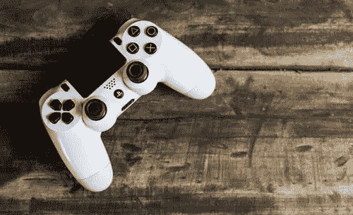
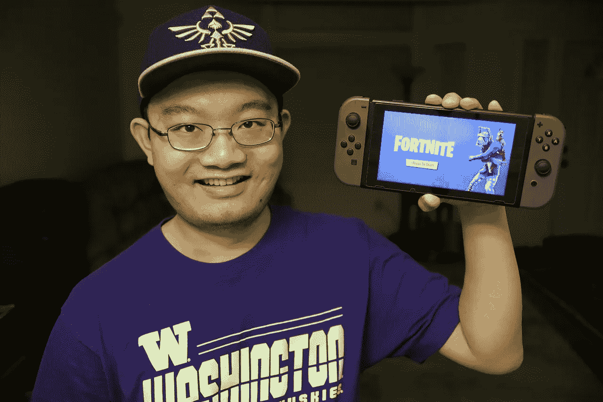
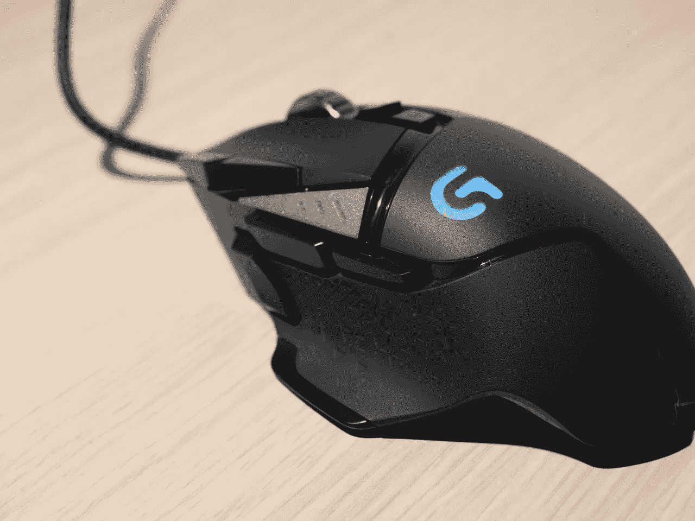

# 百思买任由堡垒之夜摆布

> 原文：<https://medium.datadriveninvestor.com/best-buy-is-at-the-mercy-of-fortnite-f2fe7c382279?source=collection_archive---------12----------------------->

百思买受堡垒之夜的支配。因此，电子产品商店对轰动一时的多人游戏的依赖表明了数字媒体是如何扰乱实体零售的。

详细来说，百思买的收入在 2018 年 11 月至 2019 年 2 月期间增长了 52.11 亿美元。奇怪的是，**百思买(纽约证券交易所:BBY)** 首席财务官科里·巴里[认为](https://www.bloomberg.com/news/articles/2019-02-27/best-buy-thanks-fortnite-for-boost-but-nothing-lasts-forever) *堡垒之夜*负责销售增长，*彭博*报道。

 [## 苹果会成为新的网飞吗？-数据驱动型投资者

### 有可能。然而，该公司肯定会与大公司竞争。许多人不得不看到这一天的到来…

www.datadriveninvestor.com](https://www.datadriveninvestor.com/2019/02/15/will-apple-be-the-new-netflix/) 

为了解释这一点，巴里认为堡垒之夜的受欢迎程度驱使大量的男孩和青少年在圣诞节索要新的游戏机。因此，乐于助人的父母在百思买购买了游戏机。

对于那些家里没有孩子的人来说，【史诗游戏】[*【堡垒之夜】*](https://www.esquire.com/lifestyle/a26897209/fortnite-250-million-players-apex-legends-competition/) 是最受年轻男性欢迎的多人射击游戏；而许多更年轻的雌性，离不开外出。令人难以置信的是，*堡垒之夜*在全球拥有近 2.5 亿玩家，*商业内幕* [报道](https://www.businessinsider.com/how-many-people-play-fortnite-2018-11)。

# 堡垒之夜是否推动了百思买的销售？

然而，堡垒之夜推动百思买销售的理论值得怀疑。值得注意的是，百思买 2017 年至 2018 年圣诞季的收入增幅大于 2018 年至 2019 年。

具体而言，2017 年第四季度至 2018 年第一季度，百思买的销售收入增长了 61.33 亿美元。详细来看，百思买 2017 年 10 月报告的营收为 93.2 亿美元，2018 年 2 月为 153.63 亿美元。

相比之下，百思买报告 2018 年第四季度的收入为 95.9 亿美元，2019 年第一季度为 148.01 亿美元。因此，百思买的圣诞季收入低于去年。

然而，巴里认为，如果没有堡垒之夜，百思买的收入降幅会更大。不幸的是，很难确定堡垒之夜对百思买收入的实际影响。

例如，可能有很多人会买新的游戏机，不管有没有堡垒之夜。因此，*堡垒之夜*因整体文化的改变而受到好评。值得注意的是，很多游戏产业观察家认为，**电子艺界** [*巅峰传奇*](https://marketmadhouse.com/is-electronic-arts-making-money/) 可能比*堡垒之夜*还要大。

# **数字如何影响实体建筑**

*堡垒之夜对**百思买(纽约证券交易所:BBY)** 的*影响显示了实体企业对数字媒体的依赖程度。特别是，视频和视频游戏等流行的数字娱乐正在影响零售销售。

因此，*堡垒之夜的*成功解释了为什么**亚马逊(纳斯达克股票代码:AMZN)** 和**苹果(纳斯达克股票代码:AAPL)** 正在开发他们自己的数字内容。亚马逊和苹果管理层明白，一个受欢迎的程序或游戏可以推动销售。

例如，苹果公司正在花费 10 亿美元开发电视节目，《纽约时报》报道。值得注意的是，苹果正在聘请许多好莱坞人才，包括史蒂文·斯皮尔伯格、J.J .艾布拉姆斯和 M. Night Shyamalan 来开发程序。此外，苹果正在圣丹斯和多伦多国际电影节上购买电影。

# **苹果如何用游戏威胁百思买**

首席执行官蒂姆·库克显然希望苹果能够复制堡垒之夜的成功，并带动成千上万的人购买带有必看节目的新苹果设备。此外，资助一个电视节目无疑比开发一部新的 iPhone 更便宜。

显然，开发自己的游戏；尤其是多人游戏，对苹果来说是明智之举。在这种情况下，我们可以期待苹果这样的科技巨头收购游戏公司或聘请一流的游戏设计师。希望能创造出像堡垒之夜一样的东西来推动 iPhone 的销售。

苹果已经在制作很多游戏了。例如， *CultofMac* [估计](https://www.cultofmac.com/601492/app-store-google-play-revenue-2018/)2018 年来自 iOS 游戏的收入为 332 亿美元。因此，苹果已经是威胁百思买的游戏中的主要玩家。

# **百思买赚钱吗？**

另一方面，由于堡垒之夜和它的众多模仿者，百思买可以赚更多的钱。为了解释这一点，百思买报告称，2019 年第一季度的毛利为 32.83 亿美元，高于 2018 年第四季度的 22.324 亿美元。

然而，百思买 2019 年第一季度的毛利仍低于其 2018 年 2 月报告的 34.21 亿美元。因此，*堡垒之夜*并没有保护百思买免受亚马逊的攻击。

此外，百思买报告称，2019 年第一季度净收入为 7.35 亿美元，营业收入为 9.78 亿美元。这些数字好于 2019 年第一季度的 3.64 亿美元和 8.72 亿美元。因此，百思买赚了更多的钱，但利润却更低。

更重要的是，百思买的现金流在增长。具体来说，百思买的自由现金流从 2018 年第一季度的 7.39 亿美元增长到 2019 年第一季度的 11.01 亿美元。此外，同期百思买的运营现金流从 9.38 亿美元增长至 130.1 万美元。因此，*堡垒之夜*正在帮助百思买赚取更多的现金。

相反，百思买很难保留这些现金。2019 年 2 月 3 日，百思买拥有 19.8 亿美元的现金和等价物。这一数字比 2018 年 2 月的 11.01 亿美元有了很大改善。

# **Best 买的是好的分红股票吗？**

堡垒之夜可能对投资者有利，因为百思买支付股息。事实上，股息将从 2018 年 12 月 31 日的 45₵增长到 2019 年 4 月 10 日的 50₵。

然而，Dividend.com[报道](https://www.dividend.com/dividend-stocks/services/electronics-stores/bby-best-buy/)在堡垒之夜*出现之前，百思买的股息已经增长了七年。此外，截至 2019 年 4 月 9 日，百思买投资者的股息收益率为 2.68%，年化股息为 2 美元，股息支付率为 39.1%。*

因此，百思买是一只好股票，但我认为市场先生在 2019 年 4 月 9 日将其定价过高，为每股 74.75 美元。我认为投资者现在应该远离百思买，因为这家公司在亚马逊面前太脆弱了。

归根结底，所有投资者都需要看看*堡垒之夜对百思买的*影响。数字媒体越来越受欢迎，正在影响实体企业，尤其是零售商和大型科技公司的运营方式。理解这种现象的人可以从中赚钱。