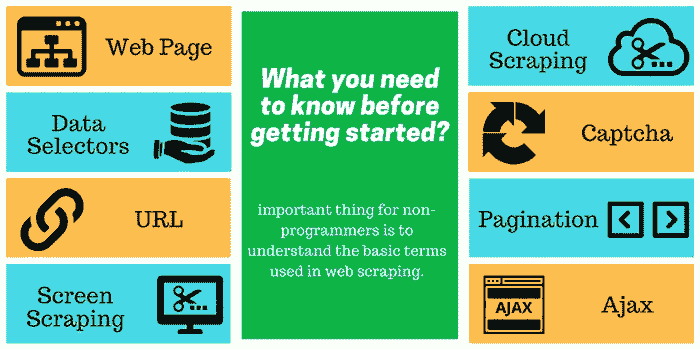
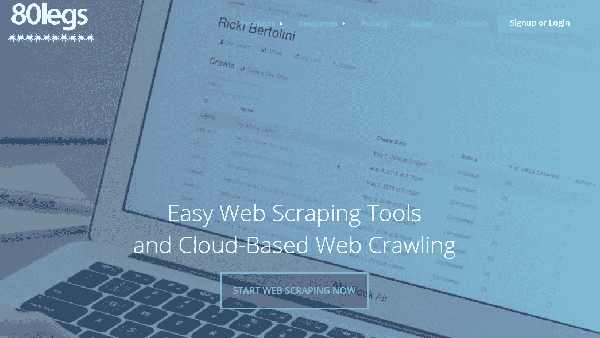
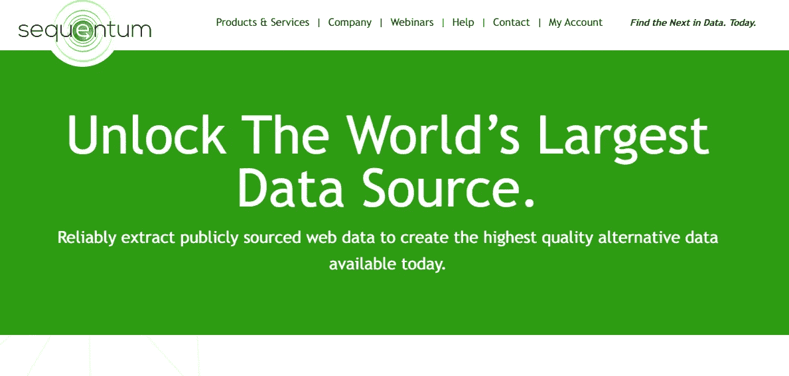
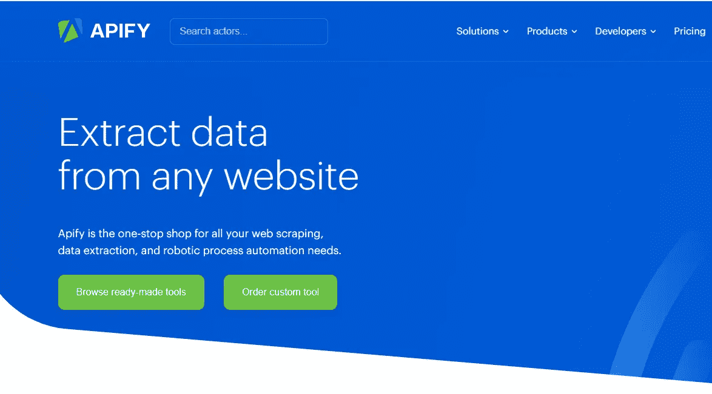
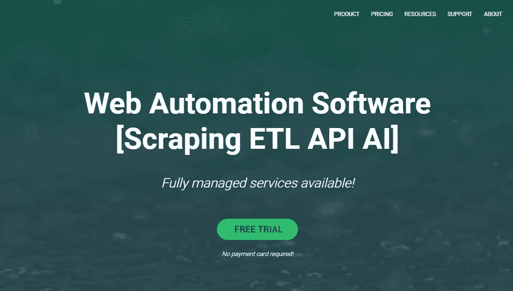

# 2021 年最佳数据搜集工具(10 大评论)

> 原文：<https://medium.datadriveninvestor.com/best-data-scraping-tools-for-2019-top-10-reviews-4a686061a184?source=collection_archive---------0----------------------->

2021 年注定是一个网页抓取年。公司通过从大量用户那里收集的海量信息相互竞争——无论是他们的消费行为、社交媒体上分享的内容还是名人关注。因此，为了取得成功，您需要构建您的数据资产。

许多企业和行业在数据领域仍然很脆弱。2017 年进行的[调查显示 **37.1%** 的企业没有大数据战略。在其余的数据驱动型企业中，只有一小部分取得了一些成功。其中一个主要原因是由于对数据技术了解甚少或缺乏。因此，网络抓取软件是建立数据驱动的商业战略的关键。你可以使用 Python、Selenium 和 PHP 来抓取网站。另外，如果你精通编程，那就太好了。在这篇文章中，**我们讨论使用**](http://newvantage.com/wp-content/uploads/2017/01/Big-Data-Executive-Survey-2017-Executive-Summary.pdf) [**网页抓取工具**](https://www.octoparse.com/) **来促进毫不费力的抓取。**

**我测试了一些网页抓取软件，列出注意事项如下。**一些工具，如 Octoparse，提供抓取模板和服务，对于缺乏数据抓取技能或不愿意花时间进行网页抓取的公司来说，这是一个很好的奖励。一些 web 抓取工具要求您具备一些编程技能，以便配置高级抓取，例如 Apify。所以，**真的要看你想刮什么，想达到什么结果**。网络刮削工具就像厨师的刀，在启用一个配备的烹饪环境之前检查条件是很重要的。

 [## 成为数据科学家所需的 8 项技能|数据驱动型投资者

### 数字吓不倒你？没有什么比一张漂亮的 excel 表更令人满意的了？你会说几种语言…

www.datadriveninvestor.com](https://www.datadriveninvestor.com/2019/02/07/8-skills-you-need-to-become-a-data-scientist/) 

**首先**，试着花点时间研究一下目标网站。这并不意味着你必须解析网页。只是彻底浏览网页。至少你应该知道你需要刮多少页。

**第二个**，注意它的 HTML 结构。有些网站写的不规范。也就是说，如果 HTML 结构混乱，仍然需要抓取内容，就需要修改 XPath。

**第三**，找对工具。这是一些关于刮削工具的个人经验和想法。希望它能提供一些见解。

# #1 [八分音符](https://www.octoparse.com/)

[Octoparse](http://www.octoparse.com) 是一款免费且功能强大的网页抓取工具，功能全面。他们非常慷慨地提供免费的无限页面！Octoparse 模拟了人类的刮削过程，因此整个刮削过程操作起来超级简单流畅。如果你对编程一点头绪都没有也没关系。您可以使用正则表达式工具和 XPath 来帮助精确提取。经常会遇到由人编写的代码结构混乱的网站，人们犯错误也是正常的。在这种情况下，很容易在采集过程中遗漏这些不规则的数据。XPath 可以解决 80%的数据丢失问题，甚至在抓取动态页面时也是如此。然而，并不是所有人都能写出正确的 Xpath。感谢 Octoparse，这绝对是一个救命的功能。此外，Octoparse 有内置模板，包括亚马逊、Yelp 和猫途鹰，供初学者使用。抓取的数据将被导出到 Excel、HTML、CVS 等等。

**优点:**现成的指南和 Youtube 教程、内置的任务模板、免费的无限制抓取、Regex 工具和 Xpath。说出它的名字，Octoparse 提供了足够多的惊人功能。

**缺点:**不幸的是，Octoparse 还没有 PDF 数据提取功能，也不能直接下载图片(只能提取图片网址)

**用例:** [从 Twitter 提取](https://medium.com/dataseries/how-to-extract-data-from-twitter-without-coding-92381e3298b8)，[抓取谷歌地图](/5-free-google-maps-data-extractors-2f3a279ed18b)，[抓取亚马逊](/how-to-scrape-and-find-the-best-selling-product-on-amazon-39271aa0a43b)，[提取并下载图片](https://betterprogramming.pub/how-to-build-an-image-crawler-without-coding-ffb6c8245c2e)

了解如何使用 Octoparse 创建 web scraper

# 莫曾达

Mozenda 是一个基于云的网络抓取服务。它包括一个 web 控制台和代理生成器，允许您运行自己的代理，查看和组织结果。它还允许您将提取的数据导出或发布到云存储提供商，如 Dropbox、亚马逊 S3 或微软 Azure。Agent Builder 是一个 Windows 应用程序，用于构建您自己的数据项目。数据提取由 Mozenda 数据中心的优化采集服务器处理。因此，这利用了用户的本地资源，并保护他们的 IP 地址不被禁止

**优点:** Mozenda 提供全面的 Action Bar，非常容易抓取 AJAX 和 iFrames 数据。它还支持文档提取和图像提取。除了多线程提取和智能数据聚合，Mozenda 还提供了地理定位以防止 IP 禁止，测试模式和错误处理以修复错误。

**缺点:** Mozenda 有点贵，每 5000 页收费 99 美元。此外，Mozenda 需要 Windows PC 才能运行，在处理超大网站时存在不稳定问题。也许这就是他们按刮页收费的原因？

# # 3[80 条腿](https://80legs.com/)

80legs 是一个强大的网络爬行工具，可以根据定制的需求进行配置。有趣的是，你可以自定义你的应用程序来抓取和爬行，但如果你不是一个技术人员，你需要谨慎。当你定制你的刮刮乐时，确保你知道你在每一步做什么。80legs 支持提取大量数据，并提供即时下载提取数据的选项。在免费计划中，每次运行可以抓取多达 10000 个 URL，这非常好。

80legs 让预算有限的公司和个人更容易使用网络爬行技术。

**缺点:**如果想要获取海量数据，需要设置一个抓取和预建的 API。后援队动作慢。

# #4 [Import.io](https://www.import.io/)

进口。Io 是一个支持大多数操作系统的网络抓取平台。它有一个用户友好的界面，无需编写任何代码即可轻松掌握。你可以点击并提取网页上出现的任何数据。这些数据将在其云服务上存储数天。是企业的绝佳选择。

**优点:** Import.io 界面友好，几乎支持所有系统。它相当容易使用其漂亮干净的界面，简单的仪表板，屏幕捕捉。

**缺点:**免费计划不再可用。每个子页面都需要积分。如果您从许多子页面中提取数据，它会很快变得昂贵。付费计划每月 5000 次 URL 查询的费用为 299 美元，每年 50 万次为 4999 美元。

# #5 [内容抓取器](https://sequentum.com/)

顾名思义。内容抓取器是一个强大的多功能视觉网络抓取工具，用于从网络中提取内容。它可以自动收集完整的内容结构，如产品目录或搜索结果。对于拥有出色编程技能的人来说，可以通过集成到内容抓取器中的 Visual Studio 2013 找到更有效的方法。内容抓取器通过许多第三方工具为用户提供了更多的选择。

**优点:** Content Grabber 在处理复杂网站和数据提取方面非常灵活。它为您提供了根据您的需要编辑刮削剪裁的特权。

**缺点:**该软件仅在 Windows 和 Linux 系统下可用。它的高灵活性对于初学者来说可能不是一个好的选择。此外，它没有免费版本。永久的价格是 995 美元，这拒绝了那些想要一个预算有限的小项目工具的人。

# #6 [智胜轮毂](https://www.outwit.com/)

Outwit Hub 是最简单的 web 抓取工具之一，它可以免费使用，为您提取 web 数据提供了便利，无需编写任何代码。它既有 Firefox 插件，也有桌面应用程序。其简单的界面便于初学者使用。

**优点:**“快速抓取”是一个非常好的功能，可以从你提供的 URL 列表中快速抓取数据。

非常讽刺的是，简单导致缺点。基本的 web 数据提取不包括高级功能，如 IP 轮换和验证码旁路。如果没有 IP 轮换和验证码旁路，您的抓取任务可能无法完成。这是因为大量的提取很容易被发现，网站会迫使你停止，并阻止你采取行动。

# #7 [Parsehub](https://www.parsehub.com/)

ParseHub 是一个桌面应用程序。与其他网络爬行应用不同，ParseHub 支持大多数操作系统，如 Windows、Mac OS X 和 LINUX。此外，它有一个浏览器扩展，可以让你立即刮。您可以抓取弹出窗口、地图、注释和图像。教程是有据可查的，这对新用户来说绝对是一个巨大的奖励。

**优点:**对于有 API 访问的程序员来说，Parsehub 更加用户友好。与 Octoparse 相比，它支持更多的系统。而且根据不同需求在线抓取数据也非常灵活。

**缺点:**然而，就抓取的页面和每次运行只有 5 个项目和 200 个页面的项目而言，免费计划受到了痛苦的限制。他们的付费计划相当昂贵，每月从 149 美元到 499 美元不等。大体积刮擦可能会减慢刮擦过程。因此，小型项目非常适合 Parsehub。

# #8 [年度](https://apify.com/)

Apify 是一个面向编码人员的有趣的网络抓取平台。如果你有基本的编码技能，你可以试一试。它没有点击提取功能。相反，你必须写 JavaScript 来告诉爬虫你想要提取什么。

**优点:**它好的一面是可以处理结构不规则的网页。它集成了 JQuery，这是一个开源的 JavaScript 库。免费版每月最多允许抓取 5000 条。

**缺点:**缺点很明显，对于大多数没有编程技能的人来说，使用起来很有挑战性。开发者的价格是免费的，其他用户的价格从每月 49 美元到每月 499 美元不等。而且它的数据保留期很短，一定要及时保存提取的数据。

# #9 [报废工具](https://scrapinghub.com/)

Scrapinghub 是一个基于云的网络平台。它有四种不同类型的工具——Scrapy Cloud、Portia、Crawlera 和 Splash。很棒的是，Scrapinghub 提供了一个覆盖 50 多个国家的 IP 地址集合，这是一个解决 IP 地址禁止问题的方案。

**优点:** Scrapinghub 为不同类型的人提供不同的 web 服务，包括开源框架 Scrapy 和可视化数据抓取工具 Portia。

**缺点:** Scrapy 可供程序员使用。Portia 不容易使用，如果你想处理复杂的网站，需要添加许多广泛的附加组件。

# #10 [Dexi.io](https://dexi.io/)

席德。Io 是一个基于浏览器的网络爬虫。它提供了三种类型的机器人——提取器、爬行器和管道。PIPES 有一个主机器人功能，一个机器人可以控制多项任务。它支持许多第三方服务(验证码解决方案，云存储等)，你可以很容易地集成到你的机器人。

**优点:**第三方服务绝对是熟练铲运机的亮点。伟大的支持团队帮助你建立自己的机器人。

**缺点:**价格相当有竞争力，从每月 119 美元到每月 699 美元不等，取决于你的抓取能力和运行机器人的数量。此外，理解流程非常复杂。有时候机器人调试起来很烦人。

