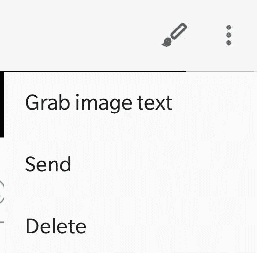

# 最好的免费 OCR 应用是即使你有也不知道的应用。

> 原文：<https://medium.datadriveninvestor.com/best-free-ocr-app-is-the-one-that-you-dont-know-even-though-you-have-it-abcf6e8167c5?source=collection_archive---------8----------------------->

每当你需要用手机扫描一份文件时，你最有可能看到的是一个能准确裁剪文件并给文件上色的应用程序，这样看起来就像一次完美的扫描。有很多 app 可以做到这一点。但是，如果您需要这些扫描来复制文本并在其他地方使用它呢？

现在，你需要一个 OCR(光学字符阅读器)应用程序来识别文档中的文本。这就是棘手的地方。许多做 OCR 的免费应用程序准确性很差，无法准确识别，当你有花哨字体的文本时，事情会变得更糟。即使你可以通过从 CamScanner 或任何其他类似的应用程序获得付费订阅来获得更好的结果，但这里的问题是，你准备好为这项服务付费了吗？我个人不喜欢这些订阅，除非没有像样的免费服务。在搜索这个免费的 OCR 应用程序时，我震惊地知道最好的 OCR 应用程序已经安装在我的手机上，甚至不知道这个应用程序可以做到这一点。

# **App 名称是什么？**

Google Keep 是您正在寻找的应用程序。这款应用预装在库存 android 设备和其他一些 OEM 设备上。这主要是一个笔记和提醒应用程序，应用程序在 Play store 的名字'*Google Keep-Notes and Lists '*也暗示了同样的*。*但是，该应用的描述中并没有提到它可以从图像中识别文本。我不知道为什么谷歌不提及/推广，即使他们正在使用先进的人工智能进行 OCR。由于人工智能的使用，随着人们越来越多地使用它，这个功能变得越来越好。它还支持多种语言，随着谷歌在谷歌镜头中增加对多种语言的支持，这个列表在未来还会增加，我认为谷歌镜头从后端使用了相同的技术。

# 怎么用？

这个应用程序并没有马上给出这个功能，因为这不是为这个用途设计的。你需要按照这三个步骤从图像中抓取文本。

1.  你需要创建一个新的笔记，然后上传图像或打开相机应用程序来拍照。但是，为了获得更好的效果，我更喜欢从任何扫描仪应用程序上传完美裁剪后的图像。
2.  添加图像后，打开选项菜单*(三个点)中的图像查找’*从图像中抓取文本’*选项。*图像中的文本将被识别并添加到注释中。
3.  现在，您可以从注释中复制文本，并继续您的进一步任务。

Grab image text option

# 应用程序的缺点

1.  由于这个应用程序不是主要用于 OCR，从图像中抓取文本的过程并不是无缝的。您需要创建一个新便笺，然后添加一张照片。
2.  当您需要对多次扫描进行同样的操作时，这个过程可能会变得令人厌烦。
3.  不支持导出文本到一个 Word/RTF 文件，因为它是纯粹的谷歌产品

# 最终裁决

总的来说，这款应用拥有我所知道的最好的 OCR 技术，但流程并不完美。对于偶尔需要这个功能的轻度用户，我可以推荐这个流程。但是，对于需要从多个图像中获取文本或者需要 word 格式的完美文档的频繁用户，我不推荐这个过程。然而，如果你正在免费获取最好的 OCR 技术，而这需要一些变通方法来完成你的工作，我建议你应该使用它。