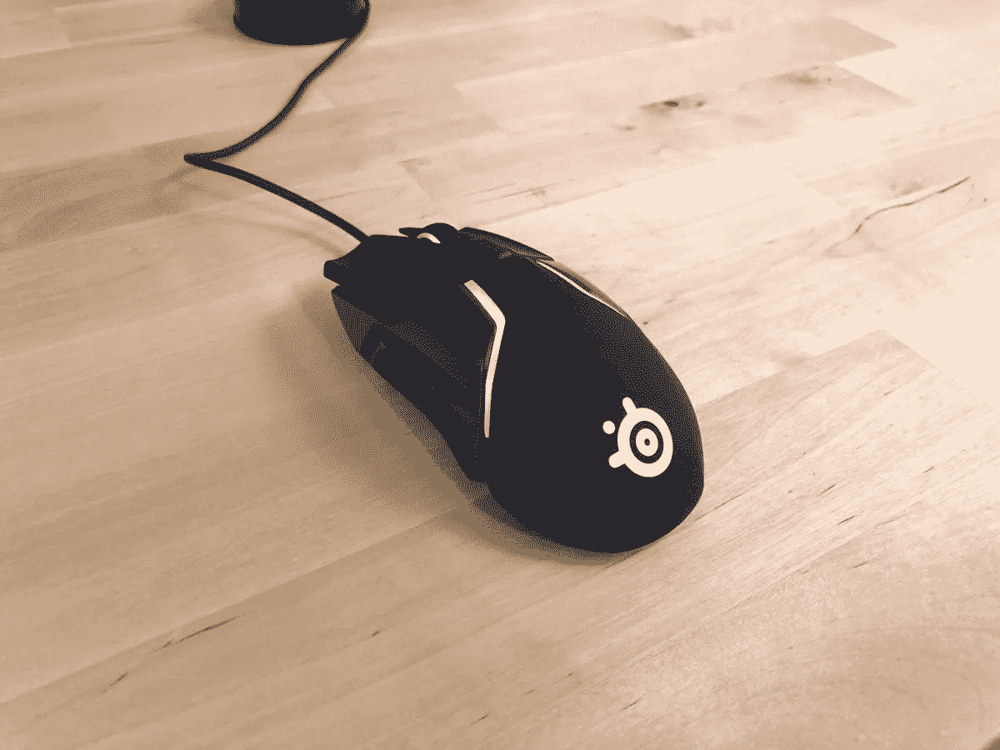
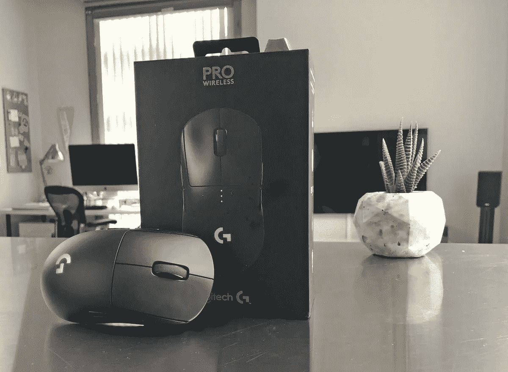
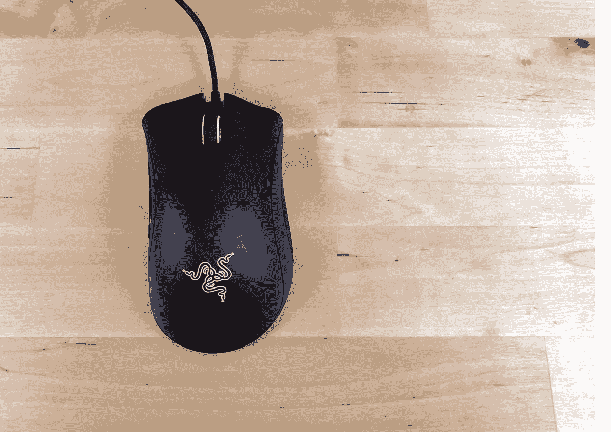
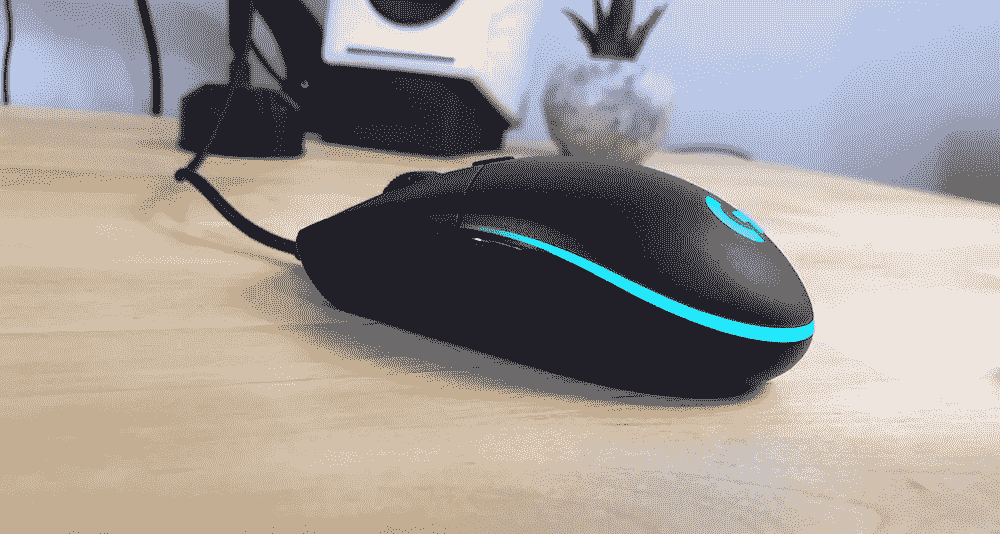
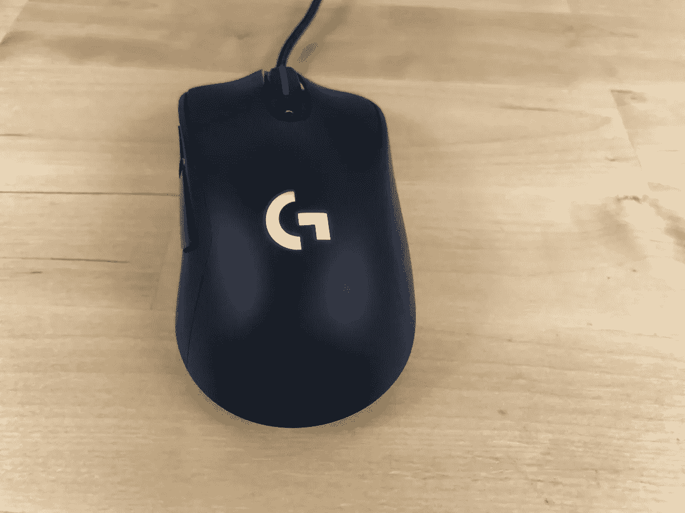

# 最佳游戏鼠标——5 款最佳鼠标

> 原文：<https://medium.datadriveninvestor.com/best-gaming-mouse-the-5-best-mice-88e7a5441fda?source=collection_archive---------15----------------------->

考虑到价格，在玩过所有鼠标后，前 5 名[最佳游戏鼠标](https://thegamingsetup.com/gaming-mice/best/best-wireless-gaming-mouse/)是:

# SteelSeries 对手 600:

竞争对手 600 与罗技 G703/G403 之间有许多不同之处:

竞争对手 600 比无线 G703 便宜很多。

对于那些喜欢定制的人来说，它有更好的重量系统

价格更低，它有更好的传感器。

明显更好的 RGB

形状一样好，这当然取决于喜好。

# 罗技 G Pro 无线:

它的重量接近 80 克，一切都很好。

这款鼠标采用 HERO 16K 完美传感器，具有良好的安全外形。

每键 RGB 照明。

它有一个无线，有线模式的编织充电电缆，无线充电可用。

# 雷蛇死亡骑士

死亡加法器有很大的性能和内部伟大的形状。

电缆由柔性橡胶制成，对于 105 克的鼠标大小来说，重量很好。

价格实惠的大型响应侧按钮

# 罗技 G305/G Pro:

*   HERO 16K 中的完美传感器
*   轻量级老鼠:80 克
*   游戏鼠标的最佳电池续航时间，长达 60 小时
*   可更换的侧按钮
*   无线充电能力
*   很棒的形状

# 罗技 G703/G403:

*   奇妙的无线网络，无延迟
*   市场上最好的传感器:Pixart PMW 3366
*   良好的电池寿命
*   良好的重量考虑技术和大小:107 克
*   伟大的右手人体工程学设计

# 在游戏鼠标中寻找什么

如果你不确定该买哪种鼠标，并且想确保在寻找新鼠标时不会错过任何东西，那么你就来对地方了。

# **外形**:

一个[好的游戏鼠标](https://thegamingsetup.com/gaming-mice/best/best-gaming-mouse/)确保它们的形状适合各种尺寸和游戏手柄。

*   **鼠标抓握:**

这是必要的，以确保你的鼠标大小适合你的手的大小，挑选和移动机动容易，没有紧张你的手指是理想的。

# **传感器:**

今天大多数游戏鼠标都有很好的传感器，如果你想要一个有信誉的鼠标，你可能会得到一个完美的传感器，最好的传感器擅长这些关键的事情。

一个好的传感器应具备以下特征:

大 DPI 范围内的精确跟踪

无抖动

无加速度

没有预测和角度捕捉

快速的投票率

低提离距离

# 小跟班

所有游戏鼠标公司拉紧按钮的方式都有所不同，所以需要留意你喜欢哪种按钮，哪种按钮适合你每天玩的游戏类型。

两大钮扣制造商是美伦和华诺。

对于射手(FPS 和第三人称)，你需要一个按钮更重的鼠标，以确保你不会有任何意外射击或技能射击泄露位置，当然，这取决于你的手自然放在鼠标上的重量。

# 涡轮

滚动按钮应该是实心的，不会左右摇摆(除非它有那些点击)，当你在中间点击输入时会有一个响应的点击。

明显步进的代价是噪音，鼠标滚轮越明显，滚动的声音就越大。