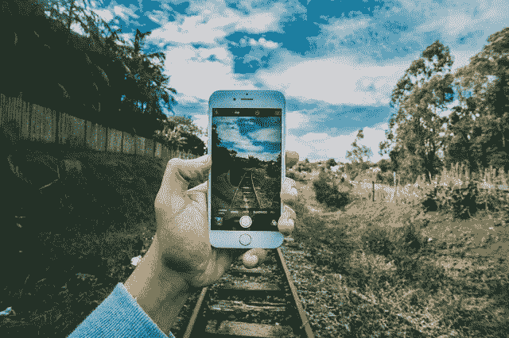
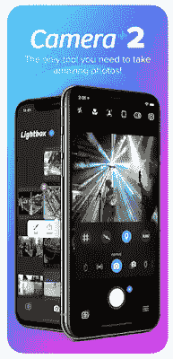
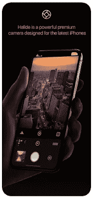
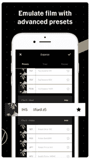
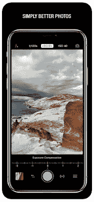

# 2019 年最佳 iPhone 拍照应用

> 原文：<https://medium.datadriveninvestor.com/best-iphone-camera-apps-for-photos-in-2019-9029da12d536?source=collection_archive---------8----------------------->

今天，iPhones 有一个默认的摄像头，它很容易启动，具有强大的功能，并支持最新的硬件，如双镜头。与任何第三方应用程序不同，相机可以从锁定屏幕上快速使用。

**默认 IOS 摄像头概述**

*   拍摄高质量的照片
*   聚焦和曝光
*   人像模式
*   用肖像模式模糊背景
*   活动图像的现场照片
*   具有连拍模式的动作照片
*   拍摄 HDR 照片以获得更好的曝光
*   从锁定屏幕启动
*   拍摄超宽全景照片的 Pano 模式。

* *人像模式仅适用于:* [*i*](https://iphonephotographyschool.com/iphone-7-plus-camera/) *手机 7 Plus、iPhone 8 Plus、iPhone*[*X*](https://iphonephotographyschool.com/iphone-x-camera/)*、XR、XS、XS Max。*

苹果的相机应用程序不断改进，很难看出为什么有人会想在自己的硬件上与苹果竞争。那么开发者如何竞争呢？

苹果以 IOS APIs 的形式向开发者提供了相机功能的全部范围。他们这样做是为了支持各种应用程序，如 Snapchat 或 Instagram，无人机或游戏，或其他需要访问机载摄像头的应用程序。

但对于基本的摄影，让我们看看一些比默认相机更高级的应用程序。这些应用程序都使用相机 API，因此从这个意义上来说，它们彼此之间或默认的相机应用程序之间没有内在的优势。对于有用的第三方应用程序，它们应该提供默认相机应用程序之外的以下功能。

**超出默认相机应用的特殊功能。**

*   **战略应用程序设计:**易用性，同时增强默认功能。
*   **手动控制**:更详细的对焦、曝光、ISO、白平衡、快门速度。
*   **增强人像模式:**配备双摄像头的新 iPhones 提供深度信息。深度图就像一幅图像；但不是每个像素提供颜色，而是像素指示从相机到图像中该像素的距离。我们正在寻找应用程序，建立在飞行中的绿色筛选，背景模糊，甚至完全不同的东西。
*   **Raw Capture:** 未压缩的 Raw 图像以较大的文件大小为代价提供了更好的质量。但是更高的质量是一个有价值的特点。
*   **快速捕获:**即使在实现增强功能时，捕获阶段也需要很快。
*   **更好的图像效果:**默认相机有一些效果，但这是一个第三方相机 App 如果做得好可以大放异彩的机会。

【2019 iPhone 摄影最佳选择

## [**1。**摄像头+2](https://itunes.apple.com/us/app/camera-2/id1313580627?mt=8)

*   非常适合在肖像模式下控制背景模糊。有一个机载编辑器。
*   手动模式可以更好地控制快门速度、ISO 和白平衡。
*   单独控制焦距和曝光。
*   高细节 RAW 和 JPEG 捕获格式。
*   特写镜头功能称为微距模式 j。
*   捕捉移动目标的动作模式。
*   长时间曝光的慢速快门。
*   好用。
*   已付(最佳价格)

## [**2。卤化物**](https://itunes.apple.com/us/app/halide-camera/id885697368?mt=8)

*   基于智能手势的设计。
*   好用。
*   人像模式背景模糊。
*   高细节 RAW 和 JPEG 捕获格式。
*   手动对焦。
*   有报酬的

## [**3。VSCO**](https://itunes.apple.com/us/app/vsco/id588013838?mt=8)

*   有趣的设计
*   快门速度滑块
*   手动 ISO 和白平衡
*   分开手动曝光和对焦
*   高细节 RAW 和 JPEG 捕获格式。
*   漂亮的图像效果编辑器
*   免费(在应用程序中)

## [**4。ProCamera**](https://itunes.apple.com/us/app/procamera/id694647259?mt=8)

*   背景模糊的人像模式。
*   手动快门速度、白平衡和 ISO。
*   分开对焦和曝光。
*   高细节 RAW 和 JPEG 捕获格式。
*   人像模式背景模糊。
*   干净的应用程序设计
*   有报酬的

这些应用程序都比默认的相机应用程序有特殊的优势，并且物有所值。

我发现了几个应用程序，它们很奇怪，但很有趣，它们有一些非常令人惊讶和意想不到的相机功能。我以后会写的。

*原载于 2018 年 12 月 29 日 www.bestcameraapps.com**T21*[。](https://www.bestcameraapps.com/2018/12/best-iphone-camera-apps-for-photos-in.html?spref=fb&fbclid=IwAR2wnkVwHVUSHlAgmuZC3I08hIAqPGzTf2eVzA1VPK9yxRwFjK2HYQcLZug)