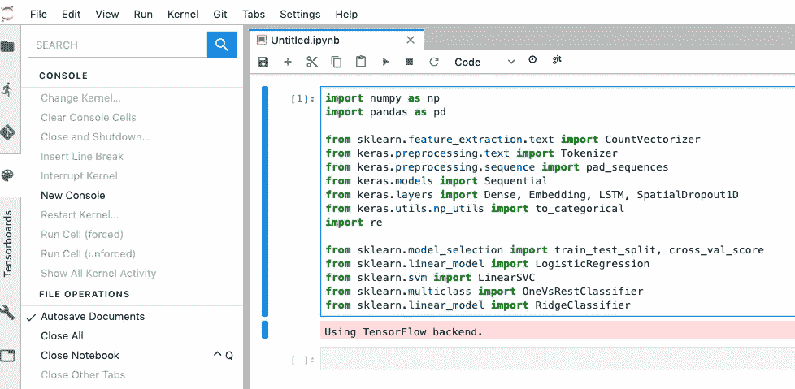
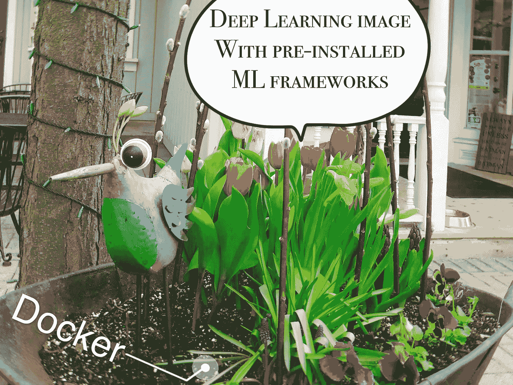

# 运行 Jupyter 的最佳方式是什么:使用命令行创建一个具有最新 TensorFlow 实例的深度学习 VM

> 原文：<https://medium.datadriveninvestor.com/best-practice-create-a-deep-learning-vm-with-the-latest-tensorflow-instance-using-the-command-line-f4cf8f04e47d?source=collection_archive---------6----------------------->

[](http://www.track.datadriveninvestor.com/1B9E)

> "在你爬梯子之前，确保它靠在正确的建筑物上。"

因此，在采取任何行动之前，我们需要问自己的第一个问题是:

## 为什么我们要使用[深度学习虚拟机映像](https://cloud.google.com/deep-learning-vm/)来运行 Jupyter？

使用深度学习虚拟机映像至少有四个优点:

*   预装了 TensorFlow、PyTorch、scikit-learn 等流行的机器学习框架。
*   在安装时在实例中添加一个或多个 GPU
*   根据需要指定 CPU 和内存
*   从命令行通过 Cloud SDK 实例化映像

# 开始之前

1.  选择或创建一个 Google 云平台项目。
2.  确保您的 Google 云平台项目启用了计费。
3.  在命令行下载并安装 Cloud SDK

```
$ sudo apt-get update && sudo apt-get install google-cloud-sdk
```

如果您已经安装了 Cloud SDK，您可以运行以下命令进行更新。

```
$ gcloud components update
```

4.验证您的帐户以登录

```
$ gcloud auth login
```

5.设置您的项目 id

```
$ gcloud config set project PROJECT_ID
```

# 使用最新的 TensorFlow 实例和 8 个 CPU 创建深度学习虚拟机

在命令行输入以下内容，使用最新的 TensorFlow 实例和 8 个 CPU 创建深度学习虚拟机:

```
export IMAGE_FAMILY="tf-latest-cpu"export ZONE="us-west1-b"export INSTANCE_TYPE="n1-standard-8"export INSTANCE_NAME="my-instance-skylinerunner"gcloud compute instances create $INSTANCE_NAME \ --zone=$ZONE \ --image-family=$IMAGE_FAMILY \ --image-project=deeplearning-platform-release \ --machine-type=$INSTANCE_TYPE
```

你的实例类型**“n1-Standard-8”**的意思是:8 个 vCPUs，30 GB 内存的标准机种。您可以选择或定义自己的机型，参见[标准机型](https://cloud.google.com/compute/docs/machine-types)和[定制机型](https://cloud.google.com/compute/docs/machine-types#custom_machine_types)。

你的镜像类型是**“TF-latest-CPU”**。如果你想尝试 Tensorflow 2.0，你可以简单地设置 INSTANCE_TYPE 等于**“TF-latest-CPU-experimental”**。

创建实例需要几分钟时间。您可以使用以下命令检查所有实例。

```
$ gcloud compute instances list
```

通过以下方式返回虚拟机实例的摘要:

```
$ gcloud compute instances describe my-instance-skylinerunner --zone us-west1-b
```

# 连接到 Jupyter 实验室

您可以通过将“alinazh”替换为您的用户 id，将“my-instance-skylinerunner”替换为您的实例名来连接到 Jupyter 实验室。

```
gcloud compute ssh alinazh@my-instance-skylinerunner --zone us-east1-b -- -L 8080:localhost:8080
```

在浏览器中输入 [http://localhost:8080](http://localhost:8080/) :



干得好！现在你可以在那里开始工作了。从上面的截图可以看到，sklearn，keras 都是预装的，直接调用就可以了。

# 额外收获:向实例添加一个或多个 GPU

如果您想在实例中添加 GPU，该怎么办？

*   使用英伟达特斯拉 V100 [GPU](https://cloud.google.com/compute/docs/gpus/) : `type=nvidia-tesla-v100,count=8`。
*   120 GB 的引导盘。
*   第一次运行时安装 NVIDIA GPU 驱动程序:`install-nvidia-driver=True`。

```
export IMAGE_FAMILY="tf-latest-gpu"export ZONE="us-west1-b"export INSTANCE_TYPE="n1-standard-8"export INSTANCE_NAME="my-instance-skylinerunner"gcloud compute instances create $INSTANCE_NAME \
        --zone=$ZONE \
        --image-family=$IMAGE_FAMILY \
        --image-project=deeplearning-platform-release \
        --maintenance-policy=TERMINATE \
        --accelerator="type=nvidia-tesla-v100,count=8" \
        --machine-type=$INSTANCE_TYPE \
        --boot-disk-size=120GB \
        --metadata="install-nvidia-driver=True"
```

最后但同样重要的是，在本地机器上使用 [Docker](https://www.docker.com/products/docker-engine) 运行所有这些命令会更干净。

