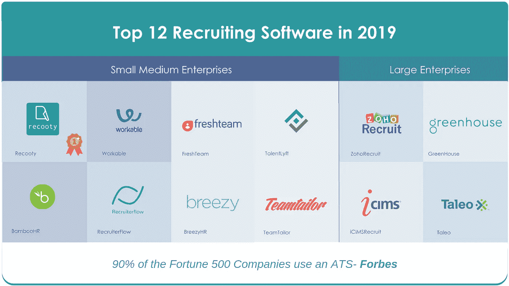

# 最佳招聘软件| 2019 年 12 大招聘软件

> 原文：<https://medium.datadriveninvestor.com/best-recruiting-software-top-12-recruiting-software-in-2019-8becf8a0bd79?source=collection_archive---------1----------------------->

Top 12 recruiting software in 2019

> "**没有伟大人物的伟大愿景是没有意义的**"——**吉姆·科林**

***我们周围的世界正在迅速变化。在当今世界，技术已融入我们生活的方方面面，并在我们实现目标的过程中发挥着重要作用。从送餐到跟踪我们的健康状况，科技已经接管了一切，招聘过程也不例外。在人才获取和招聘的过程中，招聘软件近年来大幅涌现，并使招聘人员和招聘经理的工作变得轻松和系统化。***

# **招聘事实:**

**1.填补一个空缺职位平均需要 42 天。( [SHRM](https://www.shrm.org/hr-today/trends-and-forecasting/research-and-surveys/Documents/2016-Human-Capital-Report.pdf) )**

**2.小企业平均花费 1872 美元来雇佣新人。([怪物](https://www.monster.com/about/a/more-than-half-of-surveyed-u-s-small-business-owners-recognize-the-risks-of-making-the-wrong-hire))**

**3.获得工作机会平均需要 5-6 周。( [MRINetwork](http://www.mrinetwork.com/media/303951/recruiter_sentiment_study_1st_half_2016.pdf)**

**4.60%的求职者停止填写求职申请是因为流程太长。( [Officevibe](https://www.officevibe.com/blog/12-recruiting-stats) )**

**5.三分之二的求职者有兴趣为你工作时，会直接进入你的求职页面。([可行](https://resources.workable.com/blog/best-applicant-tracking-system))**

**6.75%的招聘和人才经理在招聘时使用招聘软件和/或求职者跟踪软件。( [Capterra](http://www.capterra.com/recruiting-software/impact-of-recruiting-software-on-businesses) )**

** [## 零工经济如何改变未来的就业前景——数据驱动的投资者

### 随着自动化的发展和 Z 世代的出现，劳动力的构成和动态正在发生变化…

www.datadriveninvestor.com](https://www.datadriveninvestor.com/2018/12/19/how-is-the-gig-economy-changing-the-future-jobs-landscape/) 

# **什么是招聘软件？**

简而言之，招聘软件是一个软件，帮助招聘专业人士和招聘人员优化和系统化的招聘过程，从开始到结束。它是人力资源管理(HRM)的一个类别，它简化并自动化了整个招聘过程中涉及的各种子过程，从吸引顶级人才到让他们入职，从而变得更加高效和有效。有时一个**招聘软件**也被称为**求职者跟踪系统** (ATS)，尽管这两者并不完全相同。招聘软件是一个更广泛的类别，包括 ATS 和许多其他招聘工具。因此，招聘软件是一个完整的软件包，简化了招聘人员的工作。

# **为什么使用招聘软件？**

《财富》500 强中 90%的公司都使用求职者追踪系统——福布斯。

毫无疑问，招聘过程很耗时。招聘人员和招聘经理经常面临着简历超载，以及对每份申请进行排序和排名并进一步转发给下一个人的压力。候选人需要经过筛选、面试和入职。总的来说，这是一个复杂而庞大的过程。这就是为什么招聘人员需要注意使用招聘软件的好处，并使用它们来增强他们的招聘过程。

*   招聘软件通过自动化整个招聘过程中涉及的几乎所有日常任务，提高了招聘过程的效率。它不仅使过程和结果高效，而且使招聘非常省时。
*   招聘不是一个人的工作。雇佣一个人需要整个团队，每个人都扮演不同的角色。招聘软件通过使招聘过程更加信息丰富和快速，为所有利益相关者提供了更好的体验。
*   一款招聘软件能够对招聘过程进行分析和报告。通过说明性的和基于数据的分析，获得招聘流程如何进行的定期报告并让招聘人员了解流程瓶颈变得非常容易。

随着数字化的发生，越来越多的招聘人员和人力资源人员开始涉足其中，招聘软件市场蓬勃发展。截至今天，招聘人员有数百个选项可供选择。在当今竞争激烈的世界，招聘人员使用最好的招聘软件变得至关重要。为了让选优的决定更简单，我们来看看 2019 年的几款最佳招聘软件。

## [**1。记录**](https://recooty.com/)

Recooty 是最容易的招聘软件，为企业建立他们的伟大团队。 [Gartner Digital Markets](https://www.softwareadvice.com/hr/applicant-tracking-software-comparison/#top-products) 最近比较了 320 多个申请人跟踪系统，Recooty 因其简单性和可负担性而名列前茅&。它可以很容易地吸引、吸引、雇佣和留住最优秀的人才。Recooty 是为招聘人员和中小企业准备的一整套软件。

## [2。塔利奥](https://www.oracle.com/in/applications/taleo.html)

Taleo 是 Oracle 完全集成的人才获取解决方案，为大型企业提供服务，包括招聘营销和员工推荐以寻找人才，提供端到端的招聘自动化，并简化员工入职流程。大多数大型企业都使用 Taleo 来实现招聘流程的自动化。

## [**3。可行**](https://www.workable.com/)

Workable 是一个全方位的招聘。这是公司寻找、追踪和评估优秀人才的单一系统。它易于使用，可以快速实现。工作台的安装是完全免费的。Workable 通过更快地找到最佳人选并改善招聘团队的协作，加快了招聘过程。

## [**4。Zoho 招**](https://www.zoho.com/recruit/)

Zoho Recruit 管理公司招聘的方方面面，从职位申请到面试安排。Zoho Recruit 一直是表现出色的招聘人员的选择，用于简化他们的招聘流程，并有效地管理当前和潜在的候选人。

## [**5。BambooHR**](https://www.bamboohr.com/)

BambooHR 拥有简单的入职工具和屡获殊荣的申请人跟踪功能，作为其人力资源平台的一部分。BambooHR 提供了惊人的报告功能，包括平等就业机会和福利报告。BambooHR 使招聘和新员工入职过渡变得非常顺利和容易。

## [⑥**⑥。Freshteam**](https://www.freshworks.com/hrms/applicant-tracking-features/recruitment-software/)

Freshteam 是一款简单易用、直观实惠的招聘软件。它帮助招聘人员有效地寻找、筛选、面试和聘用优秀人才。使用 Freshteam，招聘人员可以轻松地共享职位发布、建立职业页面，并与招聘团队协作。

## [**7。温室**](http://www.greenhouse.io/)

温室是一个高效和负担得起的招聘软件，它不仅仅是一个 ATS。它有效地帮助公司建立了一个成功的招聘文化，并取得了巨大的成果。Greenhouse 使其客户在人才获取的竞争中保持领先。

## [**8。BreezyHR**](https://breezy.hr/)

BreezyHR 是一款端到端的招聘软件。它通过帮助招聘人员以最小的努力吸引和雇佣优秀的员工，有效地使招聘过程现代化。它提供了申请人的清晰愿景，以及他们目前所处的阶段。拖放管理系统允许招聘人员对候选人有绝对的控制权。

## [**9。iCIMS 招**](https://www.icims.com/)

iCIMS 有效地支持招聘人员，帮助他们赢得人才战争。他们的申请人跟踪系统使得寻找和雇佣最佳候选人变得非常容易。iCIMS 是最大的独立人才获取软件提供商之一。它支持组织管理其招聘生命周期的每一步。

## [**10。talentlyft**](https://www.talentlyft.com/en)

Talentlyft 是一个一体化的招聘软件，在一个平台上提供营销和申请人跟踪解决方案。它有助于公司吸引、发现、选择和雇佣最适合他们需求的人，并拥有高效的工作流程。这是一个价格合理的全套服务。

## [**11。招聘流程**](https://recruiterflow.com/)

Recruiterflow 是一款现代化的招聘软件，为招聘人员提供 ATS、采购和 CRM 解决方案。它让招聘人员能够吸引人才，吸引他们并留住他们，同时有效地管理各种流程。招聘人员可以使用 Recruiterflow 的 chrome 插件寻找候选人，并找到任何人的联系信息。

## [12**。团队裁缝**](https://www.teamtailor.com/en/)

Teamtailor 是一个易于使用的招聘软件，它封装了 ATS、职业网站和分析仪表板。Teamtailor 改变了招聘人员处理候选人流程和雇主品牌的方式。Teamtailor 无缝连接一家公司的所有社交媒体。此外，Teamtailor 让候选人只需在手机或平板电脑上点击一下就可以申请。**