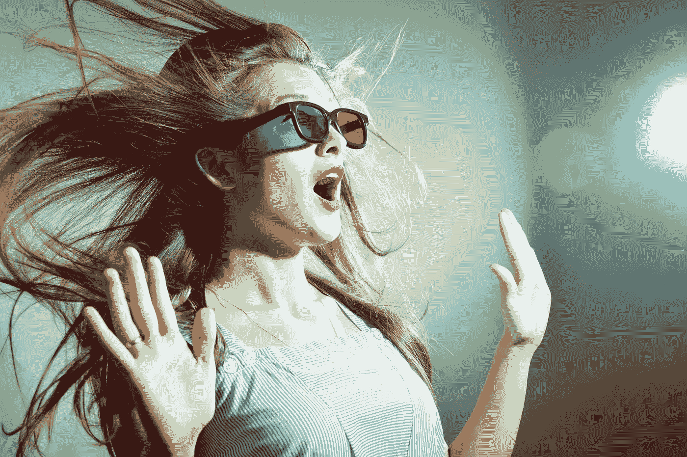
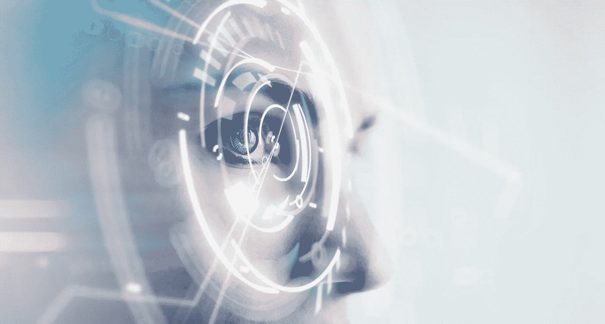

# 最佳 VFX 定制开发软件

> 原文：<https://medium.datadriveninvestor.com/best-vfx-software-for-custom-development-651524eb50d8?source=collection_archive---------14----------------------->

这些年来，计算机图形学有了许多新的进步，其中最大的进步之一就是允许用户创建自己的 3D 艺术作品。这种艺术作品不一定要出现在视频游戏或电影中，也可以出现在现实生活中，例如创建演示文稿、构建模型或其他任何需要视觉表现信息的场合。 [Skywell Software](https://skywell.software/) 提供 VFX 开发服务，并编制了一份十大视觉效果软件的清单，向您展示当今市场上的产品。

*   Autodesk Maya —最好的视觉效果软件之一，因为有了它，您可以从零开始制作角色，并对项目进行专业风格的更改。因为它已经集成了 MEL 编程语言，所以您可以创建自定义脚本或查找已经存在的脚本以在您的项目中使用。
*   Autodesk 3DS Max —创建 3D 模型的工具，它有一个非常简单的用户界面，即使初学者也可以使用。它的建模工具涵盖了所有领域，允许你创建任何项目，不管它有多复杂，也可以做任何你需要的改变。如果您需要创建建筑模型，它会特别有用，因为它已经集成了 CAD 软件。

*   blender——创造视觉效果的免费技术。它也适用于构建 3D 管道模型、渲染、动画和许多其他东西。它支持 NURBS 曲面以及多边形网格，因此成为当今市场上使用最广泛的视觉效果软件之一。但是和 Autodesk 不同的是，如果你以前没有用过 Blender，那么使用起来会很困难。
*   胡迪尼——易于使用的伟大的视觉特效程序之一。它是基于节点的，这很方便，因为每个动作都会创建一个节点。这些节点可以组成一个网络，您可以相对容易地对单个节点或整个节点网络进行任何必要的更改。即使它非常容易使用，您仍然可以创建非常高级的粒子和动态模拟。例如，您可以创建栩栩如生的火和从中冒出的烟，或者对表面张力做出反应的水效果。
*   Adobe After Effects —广泛用于创建动画和特殊效果。它可以用来为视频游戏和电影创造各种各样的东西，比如角色，编辑过的 2D 素材等等。所有这些创新和广泛的实际应用为 Adobe After Effects 赢得了 2019 年的奥斯卡奖。说到这里，重要的是要记住 Adobe After Effects 不会取代视频编辑软件。将该软件应用于已经编辑过的材料会更有益。
*   ZBrush——数字雕刻的标准工具。它允许用户选择最适合他们需求的 3D 艺术工作流程，并使用像素技术来存储屏幕上对象的各种信息，如颜色、深度、光照等。每个人都喜欢使用它的最大原因之一是因为它提供了如此高的分辨率，你可以对你的模型做微小的改变。比如说你在做一个人脸，里面有各种各样的细节。不是每个 VFX 软件都允许你做这样微小的改变，但是这些改变可以让世界变得不同。
*   SpeedTree Cinema——用于大片，如《阿凡达》、《钢铁侠 3》、《鸟人》,等等。它的主要用途是为需要实时模拟的电影和视频游戏创建人造树叶和植被。例如，让我们说你正在玩一个视频游戏，并且角色继续跑进一个森林。这样的游戏需要新的树、草、灌木和其他叶子和植物马上出现。这就是 SpeedTree 的用武之地，它取得了最大的成功。事实上，由于其能够实现的技术进步水平，它在 2015 年被授予科学和技术学院奖。
*   了不起的设计师——当今市场上最好的时装设计包之一，但是有点贵。它每月收取 50 美元的费用，这看起来似乎很多，但事实上，这比以前的版本更便宜。如果你正在创建一个视频游戏，你需要最先进的软件来打扮你的角色，这个软件会给你最多的选择。最新版本增加了可用性，因为你不必费力地制作每一套服装。相反，你可以从库中抓取你需要的东西，然后调整到你正在使用的头像。

*   substance Painter——市场上广为人知的纹理绘制软件。它很快赢得了越来越多的追随者，因为它有许多内置功能，其他功能可以通过第三方资源进行增强。你将在最新版本中体验到的最大变化是那些隐藏在表面之下的变化，比如场景加载速度、资产处理和许多错误修复。
*   substance designer——第一个使用 Nvidia 材料定义语言的工具，允许您创建作品并在应用程序之间共享。这也是一个开创性的软件，为用户带来了增强的功能，因为它提供了一个创建 MDL 材料的界面。

我们希望这份视觉效果程序清单对你创作作品有所帮助。上面提到的每个软件都有其独特的特性，但是最终，您必须确定您的项目需要的特性。这可能是详细程度、主题、可用性和你认为必要的任何其他因素。在描述所有不同的软件时，提到了很多缩写和工具，但是如果你不知道它们的意思，你也不要惊慌。它们是所有设计师都知道的技术术语，并试图找到结合该技术的解决方案。

此外，您必须考虑您和您的团队使用最佳 VFX 软件的经验，因为其中一些软件不太容易上手，但它们可能是最适合您的项目的。所以，列出你需要的所有东西，用你的经验来平衡，因为最好把这个责任委托给别人，而不是冒着设计错误的风险。当创建虚拟效果时，即使是很小的细节也能产生很大的不同，因此，重要的是你要对你想要创建的东西有一个愿景，并有确切的技能来创建它。

*最初发表于*[*sky well . software*](https://skywell.software/blog/best-vfx-software-for-custom-development/)*。*