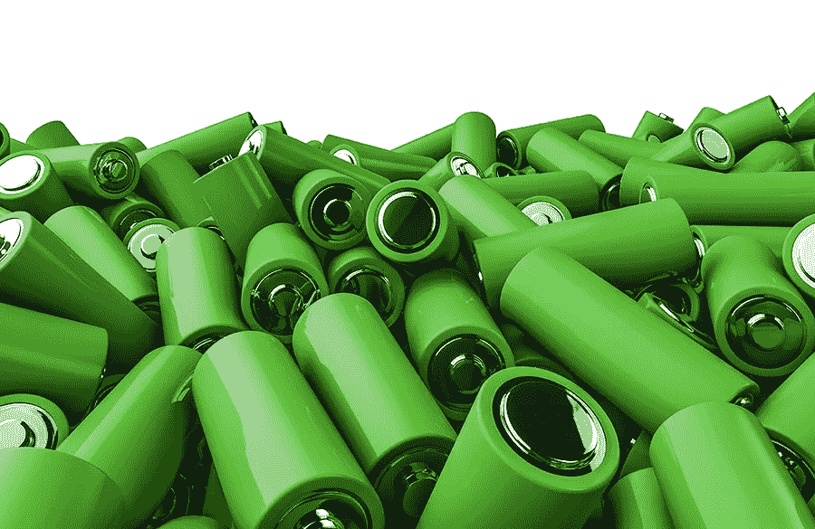
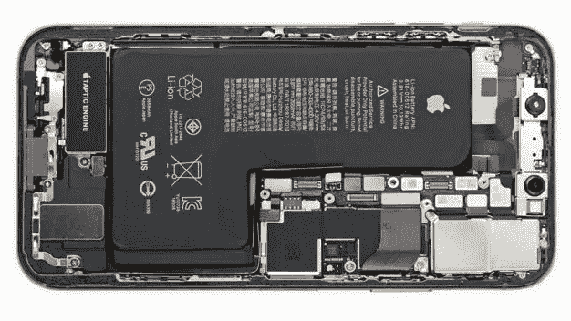
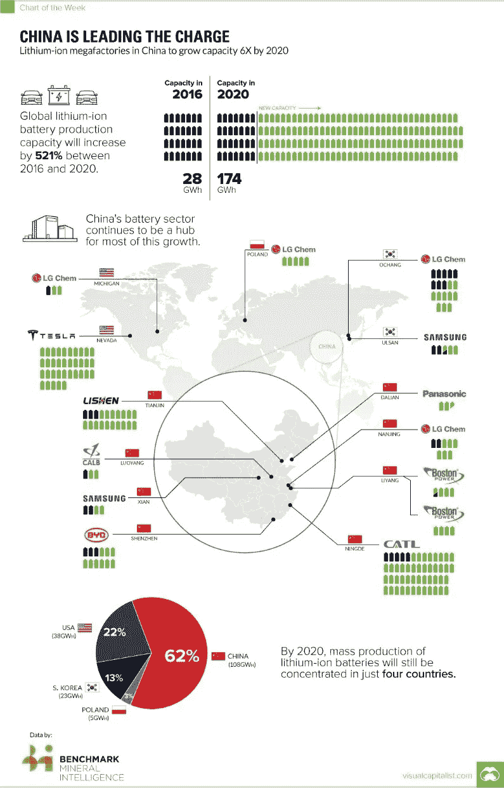

# 更好的电池技术将帮助人类进步

> 原文：<https://medium.datadriveninvestor.com/better-battery-technology-will-help-humanity-advance-5e40f6a55762?source=collection_archive---------39----------------------->

这非常令人沮丧。我正在接一个重要的电话，突然电话断了。电池没电了。

这些天来，我似乎无法在不需要给智能手机充电的情况下度过一天。当我在办公室的时候，这很好，但是当我在旅行的时候，我不能给它充电，这是非常令人沮丧的。

今天的问题是，这些智能手机对于为它们供电的电池来说太先进了。看下图。这是最新款 iPhone XS 的拆版。

你注意到什么奇怪的事情了吗？它有一个 L 形电池。而且，你不会在任何其他智能手机上看到这样的电池。

这是工程学的壮举。在这款手机内部，主逻辑板上的微型化达到了前所未有的程度。就尺寸而言，它只有 iPhone 8 Plus 的 70%，因为苹果比以往任何时候都装入了更多的连接器和芯片。

苹果公司巧妙地将电池安装在每个角落。整个手机没有多余的空间。

令人印象深刻。然而，我很遗憾地说，这不是创新。

首先，苹果被迫走上小型化的道路。然后，它不得不将超大电池弯曲成新的 iPhone，因为具有相同功率输出水平的较小电池在经济上不存在。

这是一个非常严重的问题，远远超出了 iPhones 的范畴。缺乏持久的电池动力阻碍了创新，阻碍了更快的经济发展。如果这不是一个问题，那么我们的智能手机会比现在先进得多。全电动汽车将是我们道路上唯一的车辆。因此，我们的城市将没有污染。

甚至我们的能源市场也会变得不同。现在，我们的全球经济是由石油推动的。可再生能源的一大障碍是我们不能很好地储存它。如果我们可以，那么它将成为我们的主要能源，因为储存将使它可持续和丰富。

随着风力发电场、太阳能发电、太阳能热发电等的出现，我们已经看到了可再生能源行业技术的巨大进步。在地下运行的高功率直流电压输电线几乎没有传输损耗，电力公司可以从离岸风力发电场向几千公里以外的内陆城市输送电力。

然而，除非我们能够储存这种能量，否则所有这些都不会起作用。想想你家的供水。自来水公司通常需要在水库中储存淡水，以确保全年都有稳定的供应。可再生能源也是一样。如果你不能适当地储存它，那么你接收到的能量就不会是一致的。在阴天或无风的时候，你会停电。

我们会看到什么？

对电池金属的需求持续上升，尽管我认为电池金属价格的波动并不是这一趋势最有趣的指标。我更喜欢物理测量。例如，锂离子巨型工厂的迅速出现令人震惊。

2015 年，全球仅有三家。今天，有超过 50 家，特斯拉现在已经建立了一个巨型工厂。对于那些不熟悉“兆”和“吉”这两个术语的人来说，这两个术语指的是以兆瓦和吉瓦为单位的电池单元年产量。一千兆瓦代表着每年足以供 70 万个家庭使用的电力。特斯拉的千兆工厂目前的产量为 20 千兆瓦，一旦满负荷，将达到 35 千兆瓦。如信息图所示，中国也在扩大生产，计划到 2030 年实现公路网电气化。

然而，这里最大的限制是电池金属供应。满足这些工厂的需求需要时间。这是当然的，除非技术进步导致对电池金属的需求减少。

因此，电池技术需要显著提高。我们需要密度更高的电池技术，充电时间更快，充电周期数显著增加，电池性能下降更低。

这是阻碍人类发展的一个制约因素。它阻止我们拥有无污染的城市，而无污染的城市本可以拯救全球数百万人的生命。

我希望我们能找到解决办法。