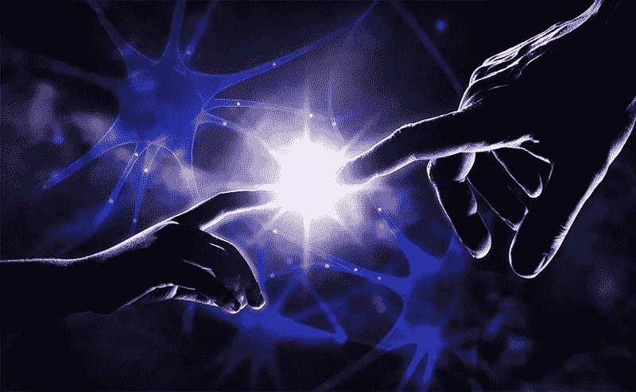
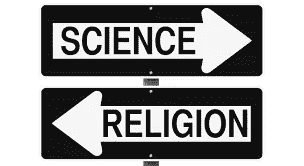
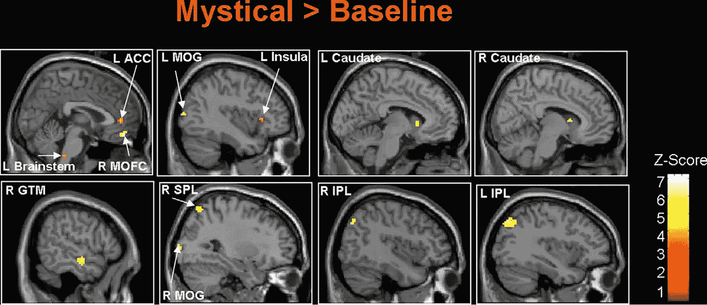
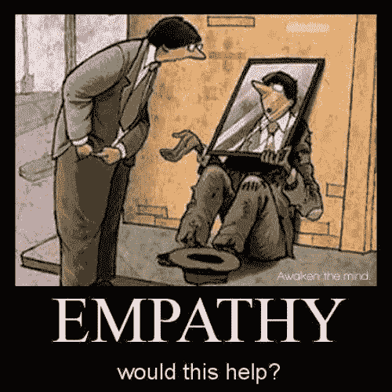
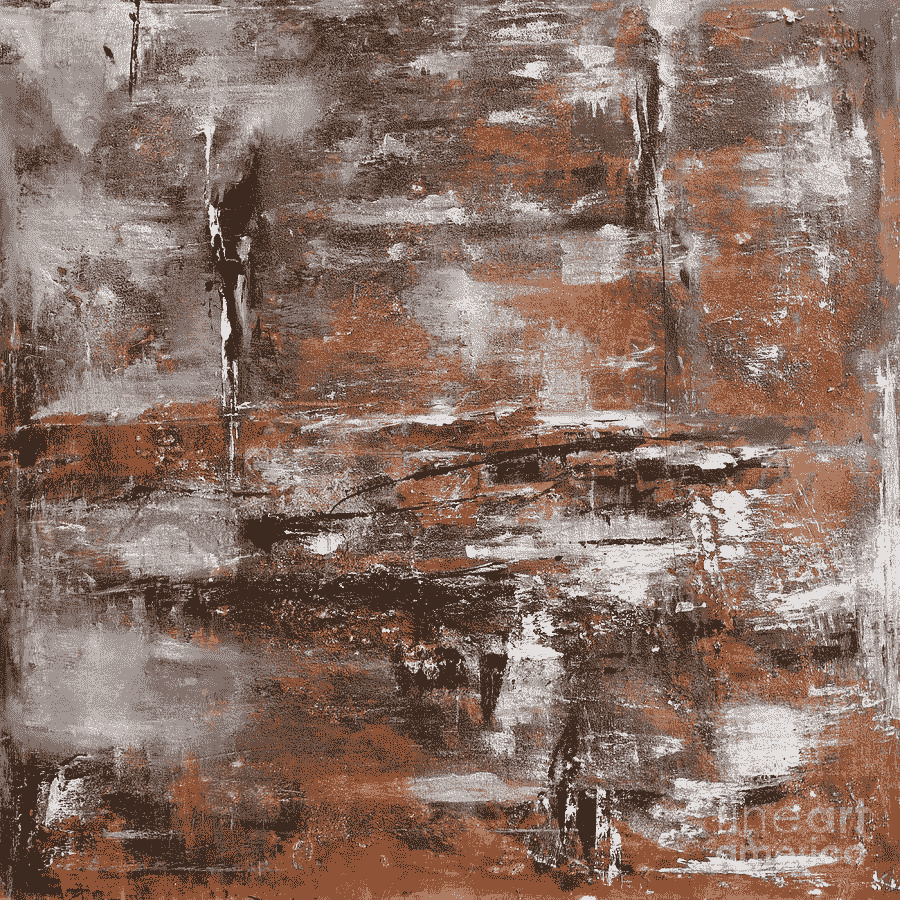
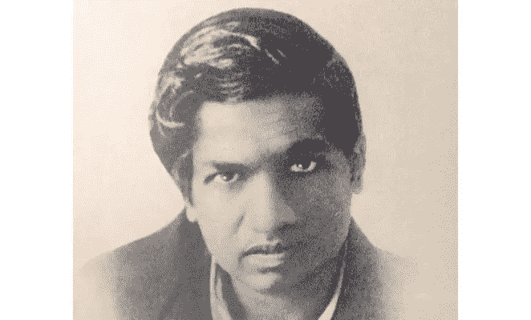

# 超越宗教，神秘主义和精神，神经科学的观点

> 原文：<https://medium.datadriveninvestor.com/beyond-religion-mysticism-and-spirituality-the-perspective-of-neuroscience-in-evidence-ce754e8b38c2?source=collection_archive---------1----------------------->

> 大自然的智慧在于它不会产生任何多余或无用的东西。

-尼古拉·科普尔尼科

给无神论者的问题:你有没有想过，或者你有没有想过，宗教的出现不仅仅是一个白日梦或者人类的错觉，而是生物所固有的，在智慧(人类)的进化和产生中有目的的东西？

对宗教的问题:如果其他宗教和邪教能给你带来更多的答案会怎样？还是从感觉和存在中觉醒？你会允许自己扩展你的意识吗？

宗教和科学。从西方世界的角度来看，人类历史上的两大奇迹彼此都遭受了痛苦。科学被忽视、妖魔化和迫害，宗教被贬低、低估和忽视。

以实用主义为基础的科学远离宗教，以科学的方法寻找自己的真理。很长一段时间以来，这两个世界一直是分离的，任何试图将它们连接起来的努力都近乎伪科学或招摇撞骗。

然而，由于神经科学研究迷幻药物的禁忌被打破，一个新的窗口为宗教和邪教的研究打开(其中一些与这些药物有关[1-2])。

这个窗口来自神经科学，甚至会成为一个重要科学杂志的主题:[神经科学、无私和精神体验](https://www.elsevier.com/books/neuroscience-selflessness-and-spiritual-experience/johnstone/978-0-08-102218-4)

但是神经科学有那么多东西要告诉我们吗？

首先，任何宗教、神秘或精神事件都有可能在大脑中被探测到，而且显然是只在特定环境下出现的现象。大脑激活的关系是非常复杂的，多因素的，也就是说，大脑的几个区域被激活以产生这些体验并被区分，一些感觉只存在于基督教，其他的存在于印度教或佛教，或者穆斯林等等[3]。举例来说，在下面的图片中，我们有一个被称为**、【卡梅尔修女】**的神秘体验的例子，其中它被基督徒描述为一种与上帝连接/结合的感觉，在这种感觉中，它导致个人对永恒的感知，对空间缺失(“无空间”)的感知，与宇宙和人类的结合，产生积极的情感、和平、欢乐和无条件的爱。

*Image extracted from [4]. The yellow dots are the activations in the brain about the effect of the Carmelite nuns phenomenon.*

由于神秘体验的丰富性是数不胜数的，为了方便起见，我们将对科学家提出的[5]和他们引用的以前的研究进行一些划分。

所有的经验都嵌入在两种媒介中，它们被命名为精神的或宗教的。简而言之，所有的精神体验更多地与感觉、情感联系在一起，而所有的宗教体验都与行动、行为或认知变化以及信仰联系在一起。

这在第一时间听起来可能很奇怪，但是随着你对这个主题的深入研究，它会非常有用。

> 例如，同理心可以在情感上或认知上表现出来。理解他们的区别的一个简单的方法是，在认知移情和情感移情的情况下，用短语“我能理解你的处境”来思考，“我感受到你的情感痛苦。”

在移情作用下，我们开始识别宗教赋予人们的有趣属性。宗教/精神/神秘的人发展出同理心和与他人更好联系的意愿。

这个想法给了我们思考的空间，一旦一些经历可以转化为更大的健康和心理能力，那么理解和复制这些经历是非常有益的。

*Timeless — Abstract Painting, painted by Ismeta Gruenwald.*

例如，想象一下，在卡梅尔修女的经历中实验对时间和空间的感知可能会帮助人们学习现代和复杂的物理学概念，其中没有时间或空间的抽象对于理解假设或理论是必不可少的。

> 在这些关于宇宙的意识需要被扩展(超越)的领域，这会帮助他们更好地学习和生产吗？

一个数学天才是一个虔诚的印度人，他的理论很难被理解，直到他学会通过科学和方法论的语言来传达他的数学思想(宗教意义上的)。他的故事甚至拍成了电影:[看见无限的人](https://en.wikipedia.org/wiki/The_Man_Who_Knew_Infinity_(film))。

[Ramanujan](https://en.wikipedia.org/wiki/Srinivasa_Ramanujan), the mathematician.

> *我沉浸在对周围美景的敬畏中，我一定是进入了一种高度警觉的状态……当我后来努力回忆这段经历时，我似乎完全没有了自我:我和黑猩猩、大地、树木和空气似乎融为一体，与生命本身的精神力量融为一体……我从未如此强烈地意识到每片叶子的形状、颜色以及使它们独一无二的叶脉的各种图案。这几乎是压倒性的。*

—简·古道尔，*希望的理由*

酷好吧！关于神经科学，还有哪些我们已经知道的经验？

**【无私】**:是一种超越存在的精神体验。它的最终特征是自我(“我”)意识的丧失，空虚的存在以及与神圣信仰或神圣方面如自然、宇宙的联系的丧失。在这种情况下，上面引用的简·古道尔的话描述了无私的特征。

下面的例子来自[7]:

**“连接性”:一种精神体验，容易与某物或某人连接，并以家庭、情感或自我结合的形式或方式呈现。**

****【日常精神体验】**:一种更大的力量在日常生活中作用的感觉(例如:“我直接或通过他人感觉到一种更大的力量对我的爱”，“我感觉到一种更大的力量的存在”或“当我在日常生活中作用于我所有的精神/存在时，我感觉到一种更大的力量”)。**

****【意义】**:生命的宗教意义感(例如:“我的生命中有一种使命感”或“我生命中的事件按照神的计划展开”)。这种感觉非常有趣，因为即使是机构也授权它将目的放在员工的工作中，这与下面的下一个宗教体验非常匹配。**

****【价值观/信仰】**:给予价值或提升一种信仰的宗教体验(如“我深感有责任减少世界的痛苦和苦难”)。很明显，任何精神方面都可以像上述情况一样用于善，但也可以用于恶，比如:“我相信地球是平的，我们为每个人都知道真相而战。我们知道这是被低估的假设，因为光明会或强大的全球组织不想告诉我们关于宇宙的真相”。意识到这些过程是很重要的，这样你就能更明智地引导注意力，或者更多地思考是什么操纵了你的思想和行动。**

****【宽恕】**:一种更容易原谅自己和他人的宗教情怀。**

****“宗教或精神交易”**:应对策略的宗教或精神体验(例如:“我作为伙伴与更大的力量一起工作”，“我寻求这种更大的力量，我汲取力量、支持、指导和平衡”)。**

****【神秘主义】**:通过超感官知觉对神/自然或动机程度的感觉。**

****【超个人认同】**:对宇宙中无所不包(有生命的或无生命的)的深刻而感性的感受(例如:“我通常感到与我周围的所有人有着强烈的精神和情感联系”，“我感到与自然相连，它的所有部分似乎都成为一个有生命的有机体的一部分”)。**

****【自我遗忘】**:变得全神贯注、全神贯注或失去时间感的能力(例如:“我通常对自己正在做的事情如此着迷，以至于在那一刻迷失了自我，就好像我远离了时间”)。**

**我们可以选择(不过分)*神经质*、*外向*、*开放*(接受新的经历、想象、想法和价值观)、*随和*(信任、利他主义、温柔等等。)、*正念*和*尽责*。**

**一件重要的事情是，精神/宗教衡量/体验的一些因素非常类似于自然存在的、可以扩展或唤醒的个人方面(如情感方面)的构建/再认识。**

**一些研究表明，精神和宗教现象与边缘/性系统和批判性思维(前额叶)高度相关。面对这种情况，有一些假说认为，宗教拓宽了人类感同身受的感觉，并将性快感重新导向宗教/精神体验，从而在进化上有利于生存。据文献推测，高度的同理心促进了更有组织的人类群体的形成，这些群体在社会的自然选择中表现得更好[9-10]。**

****总结……****

**神经科学在这些方面的研究是最近的事，大约 25 年，仍有许多事情有待澄清或发现。**

**这个领域对于新形式的心理发展、心理健康以及第一人称意识的扩展/超越很感兴趣。**

> **"成长的关键是在我们的意识中引入更高的意识维度."**

**-老子**

***参考文献:***

**[1]死藤水:精神卫生专业人员需要知道什么，Rafael GUI mares dos Santos 等人，Arch。Clin。《精神病学》(圣保罗)第 44 卷第 4 期，圣保罗，7 月/8 月；2017.**

**[2]在复发性抑郁症患者中使用单一剂量的无花万年青的抗抑郁作用:一项初步报告。Osório Fde，l .，Sanches，R. F .，Macedo，L. R .，Santos，R. G .，Maia-de-Oliveira，J. P .，Wichert-Ana，l .，…，Hallak，J. E .2015.**

**[3]作为精神超越的普遍神经心理学基础的无私:基督教、印度教和穆斯林传统的验证；布里克·约翰斯通等人；心理健康、宗教和文化；2017.**

**[4]卡梅尔派修女神秘经历的神经关联；马里奥·博勒加德、文森特·帕盖特；神经科学快报；第 405 卷第 3 期；2006.**

**[5]情感是灵性和移情的基本心理过程；布里克·约翰斯通等人；心理健康、宗教和文化；2018.**

**[6]作为精神超越的普遍神经心理学基础的无私:基督教、印度教和穆斯林传统的验证；心理健康宗教与文化；2017.**

**[7]宗教性/精神性的简单多维测量的趋同/趋异有效性:作为“精神”结构的情感连接性的实证支持；布里克·约翰斯通等人；j .宗教健康；2011.**

**[8]五种不同信仰传统的精神性、宗教实践、人格因素和健康之间的关系，Brick Johnstone el at 宗教健康；2012.**

**[9]达尔文的选择和宗教:主位和客位的对比；洛里艾·比尔纳奇；评论；宗教、大脑和行为；2018.**

**[10]改变大脑:从原始部落到核心家庭再到宗教；丹尼尔·科恩；评论；宗教、大脑和行为；2018.**

*****其他语言-*****

*   **[葡萄牙 ](https://www.brainlatam.com/blog/alem-da-religiao-da-misticidade-e-da-espiritualidade-a-perspectiva-da-neurociencia-em-evidencia.--454)**

**[发表在大脑支持神经科学上的博客](https://www.brainlatam.com/blog/beyond-religion-mysticism-and-spirituality-the-perspective-of-neuroscience-in-evidence.-455)**