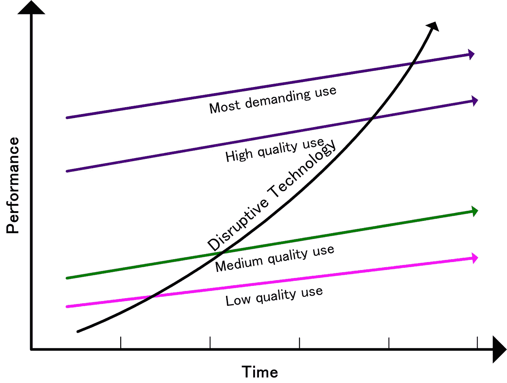

# 双向创新者

> 原文：<https://medium.datadriveninvestor.com/bi-directional-innovators-5af48734c21e?source=collection_archive---------6----------------------->

## ***用 M 个*** 人妖取代独角兽

Clayton Christensen’s Disruptive Innovation Paradigm

> 识别双向创新，而不是在颠覆性框架内给它们贴上错误的标签，可能会被证明是对创新者和投资者的*基本*帮助。到目前为止，我第一次做出这样的区分。

在 Clayton Christensen 定义的颠覆中，在位的创新者被那些颠覆高性能、高质量、增加市场份额的核心创新范式的创新者所取代，他们通过提供低性能、低复杂度的技术来吸引新的、未开发的消费者市场。最终，随着新创新的“早期采用者”的质量逐渐提高，规模扩大，主流客户采用新的破坏性创新，取代质量更好的现有创新。

近年来，许多表面上看起来具有颠覆性的创新被贴上了错误的标签。优步的打车应用可能是颠覆性错误标签的最突出的例子。毕竟，优步的打车应用不符合任何严格的颠覆性创新特征。具体来说，安装应用程序以方便客户订购并不是降低出租车服务产品的级别，而是改善整体服务，同时该产品的目标不是针对非出租车用户，而是现有的出租车乘客。

 [## 准备在 2019 年改变世界的技术-数据驱动的投资者

### 很难想象一项技术会像去年的区块链一样受到如此多的关注，但是……

www.datadriveninvestor.com](https://www.datadriveninvestor.com/2019/01/17/the-technologies-poised-to-change-the-world-in-2019/) 

无论优步被描述为颠覆性创新时可能被贴上怎样的错误标签，忽视优步创新对运输市场的净效应在某种程度上与颠覆性创新不相似，或者没有密切相似之处的事实，同样具有误导性。优步的创新可能不会将出租车司机作为新的消费者，但它为“零工经济”的出租车司机打开了巨大的市场，这些司机对以前垄断(主要是)的运营商市场产生了显著的侵蚀作用。与此同时，虽然优步并没有导致服务质量标准的下降，但其创新的性质对服务质量构成了威胁，这种威胁不是以任何常规方式可以控制的。例如，在英国伦敦，出租车司机传统上是受过广泛培训、知识渊博的专业人员，他们不需要阅读地图或查阅指南来为顾客的潜在路线服务。相比之下，优步司机依赖 GPS 路线图来确定客户的路线，很少对道路有全面的了解。在其他市场也可以看到类似的对比。虽然这种影响在大多数时候不会被出租车司机注意到，但不能说它排除了核心的破坏性特征，这些特征在与更广泛的新工人群体结合时，会以一种与纯粹的市场规模扩张创新不一致的方式从根本上改变服务提供的性质。优步威胁着，事实上很可能会成功，用一个不了解情况、通常年轻且大多缺乏经验的自由职业者来取代职业出租车司机和他的特许载人工具。与此同时，可以注意到，越来越多的学生和年轻人在业余时间或只是在上学或上班的路上开出租车，以此赚取额外的收入。所有这些供给侧调整的另一个显著效果是最终剥夺了小企业所有者通常所依赖的廉价、非技术劳动力。这些综合效应与破坏性创新对非消费市场的影响完全一致。

优步处于在位创新者和颠覆性创新者之间的特殊边缘地位，为创新者带来了一种新的潜在范式:双向创新者。双向创新者对待产品和服务的态度与在位创新者和颠覆性创新者完全不同。

> 具体来说，这些创新者不是通过消费，而是通过生产来定义市场份额。

在双向创新的情况下，新的缺乏经验的工人通过一种技术被众包，取代了相当于受过更专业训练、技能更高的劳动力，同时现有的市场份额被逐渐吞并到同一范围内。另一个双向创新的例子是区块链令牌产品和数字资产交易所。在这种情况下，通常不被要求登记大量发行文件(有时是法律文件，有时是实质性文件)的专业发行人取代了现任金融专业人士和法律团队的角色，这让监管机构感到不安，就像优步出租车司机让交通部门感到不安一样。

我将这类创新者描述为双向，因为与现有企业一样，他们的目标最终是扩大并主导传统市场份额(优步想要出租车司机，而币安想要股票市场投资者)，同时，这类创新者获取这一市场份额的方法是通过低级别的技术实现来破坏现有的专业(通常是法律强制执行的)标准化(区块链在技术上并不复杂，相当于替代的数字动态数据工作表)。

## 为什么重要？

双向创新对破坏性创新的影响完全相反。克莱顿·克里斯滕森是这样阐述的:

> “……优步和苹果的 iPhone 都将它们的成功归功于基于平台的模式:优步将乘客和司机数字化连接起来；iPhone 将应用开发者和手机用户联系起来。但优步忠于其持续创新的本质，专注于扩展其网络和功能，使其优于传统出租车。另一方面，苹果走了一条颠覆性的道路，建立了应用开发者生态系统，让 iPhone 更像一台个人电脑。”

但即使是创新之父自己也无法解释优步:

> “根据分裂理论，优步是一个异常值，我们没有一个通用的方法来解释这种非典型的结果。”

***现在情况危急，我们可能在这里。*** 在颠覆性创新中，先发优势是至关重要的，如果不是必不可少的话。在 Spotify 出现之前，苹果的 i-store 几乎不可能被取代，现在 Spotify 几乎控制了音乐市场。过去情况并非如此:许多竞争激烈的音乐出版社和唱片公司，以及许多唱片店品牌，为顾客提供音乐服务。如今，只有 Spotify(或许还有苹果，但如果是这样的话，也不会太久。)因此，颠覆本身就具有垄断性。它创造了一个规模无法控制的中央供应商。

对于双向创新者来说，这种趋势与一家垄断市场的趋势相反:事实上，*这是不完整的*。出租车过去由地方垄断企业控制(在某些情况下，监管机构仍然禁止打车应用创新)。证券交易所本质上也是垄断性的:每个国家最多有 2 到 3 家——但加密交易所创新的内在双向(如果你喜欢，需求链主导)框架意味着现在任何人都可以与币安(和优步)竞争。

颠覆性创新者和双向创新者之间的另一个区别是，颠覆性创新者只从价值网络的重组中获利，因为他们的创新切入点来自劳动力调整，而双向创新者不仅通过重组价值网络，还通过重组供应链系统获利。

当苹果利用一个足够大的价值网络来销售 MP3 文件时，它就获利了。相比之下，优步在最初阶段并不那么依赖其价值网络，而是仅仅通过“激增定价”等功能来“游戏化”客户体验，以弥补其利基客户群最初较低的收入水平，并激励其非熟练劳动力。

同样，由于持有其网络数字货币 BNB 的大部分股份，币安不像苹果那样依赖于一夜之间建立一个庞大的客户网络*，因为币安的很大一部分利润来自于其自身货币价值相对于法定货币价值的增加(这也使货币成为其平台上其他数字资产的更好购买者，从而改善客户体验，同时从交易费用中获得更大收益)。*

*换句话说，优步通过制造昂贵、高利润的出租车创造了利润，而币安通过制造和销售自己的支付货币，以交易费的形式，在规模标准化收入增长之外创造了利润。这样，与破坏性创新者相比，同步的价值链和价值网络重组为双向创新者实现了更少的核心客户价值网络依赖。这让它们变得极其危险，而且与颠覆不同，它会在任何时候产生一个充满新进入者的高度竞争的市场包。*

*如果是这样的话，至少可以说，由此产生的影响是巨大的，因为在那种情况下，垄断式现有市场向多个双向参与者市场的爆发，可能会成为后颠覆性创新时代的决定性标志。如果是这样的话，我们——创新者、企业家、风险投资家——很可能现在就把一切都夺回来:因为如果是这样的话，那就不是发现或成为独角兽的问题了。这是一种双向虚构:这根本不可能。相反，它变成了关于外面的*许多* *美人鱼*的故事。这是一个完全不同于当前我们通常采用的创新建模的焦点。*