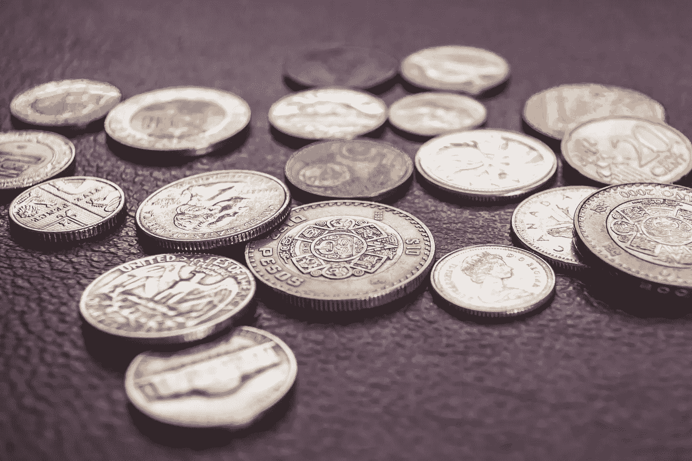

# 《双周评论》第三期，神秘的赚钱机器小组

> 原文：<https://medium.datadriveninvestor.com/bi-weekly-review-number-three-in-the-mystical-money-machine-group-108064bec4c7?source=collection_archive---------30----------------------->

Photo by [Steve Johnson](https://unsplash.com/photos/WVUrbhWtRNM?utm_source=unsplash&utm_medium=referral&utm_content=creditCopyText) on [Unsplash](https://unsplash.com/search/photos/money-mind?utm_source=unsplash&utm_medium=referral&utm_content=creditCopyText)

下面是我在脸书上创建的神秘货币机器群中的一个帖子。

在本周的回顾中，我将主要关注条件。更准确地说，是基于我作为一个生活在资本主义社会的人给自己设定的条件。一切都是如此。

但为了简单起见，我将把重点放在我过去两周的投资之旅上。

我有两个独立的书库。被动投资。另一个是更积极的投资。

我主要关注的是积极投资。在这两周之前，我为自己设定了目标。我想在 12 月份尽可能多地赚钱，因为又一个投资机会出现了。我想拥有这个机会所需要的资本。

所以，我在给自己定一个条件。可以是好的、坏的或中性的。我主要是支持设定明确的目标并努力实现，但有时它们会扰乱我们的思维。更重要的是，让我们远离我们真正应该做的事情。

这是其中的一次。

***因为在这一切之下我为自己设定了另一个条件。我非常清楚地陈述了对我来说成功应该是什么样的。***

这没问题，但是我们的思维方式有点不同。

在那一刻，我实际上是在调节自己的思维，认为如果我实现了赚那笔钱的目标，我就成功了。如果我失败了，我就是个失败者。

我们的思想不喜欢失败。

本质上，我只给自己一种成功的方式。我把我的成功限制在一条非常非常狭窄的道路上。

但我还是做了，因为我不明白自己实际在做什么。

你大概能猜到当事情没有完全按照计划进行时发生了什么。

我很痛苦。

虽然我在赚钱，但在我看来，我赚的钱还不够多。因为那些固定的条件，我需要做更多。

***当我们用某些东西和现实来制约我们的头脑时，我们处于与我们所设想的不同的境地，我们痛苦不堪。***

但是这里有一个问题，我们只有在不理解这一点的时候才会痛苦。

我没有。一段时间。我呻吟着。

可怜的我，挣的钱比我想要的少。呜呜呜。

这就是我大约 30 分钟的想法。

突然，我明白了自己在做什么，脑海中突然灵光一现。我给自己的成功和幸福设定了条件。

我立即停止了。

一个更健康的思考过程可能是“好吧，所以我做得不如我希望的那样好，我对此有点不安，但也没关系。有时候这就是生活。如果我不能参与这项努力，希望我能投资下一个。”

或者类似的东西。

在我改变了我的思维模式后，我开始做出更好的决定，更好的用钱的决定，并且花得更多了。

这总是好的。

所以，在很短的时间内，我从对自己的处境感到无能为力，到感到强大和有控制力。这反过来会带来更多成功。

事情的运作方式很奇怪，不是吗？

如果你对金钱的心态有问题，或者对如何更好地利用金钱有疑问，请加入我的神秘金钱机器脸书小组 [*这里*](https://www.facebook.com/groups/532315657241148/) *。在那里，我分享我的投资故事，并教人们如何找到自己的理财方法。*

伊恩·阿尔托萨尔