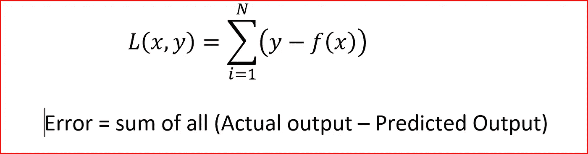
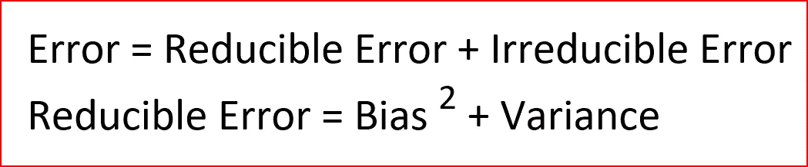
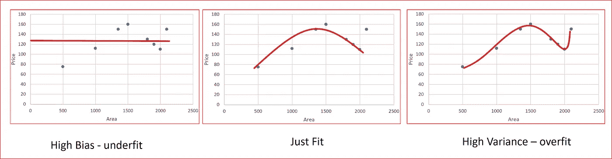
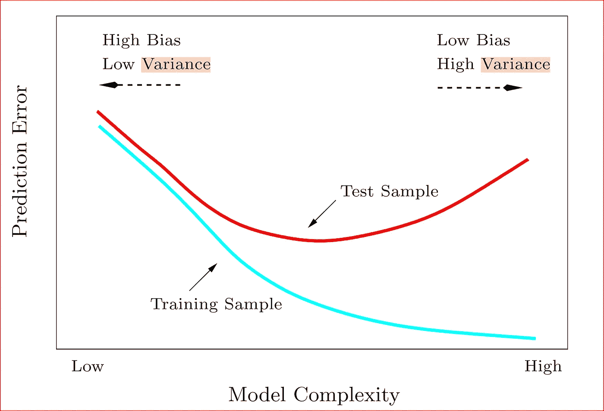
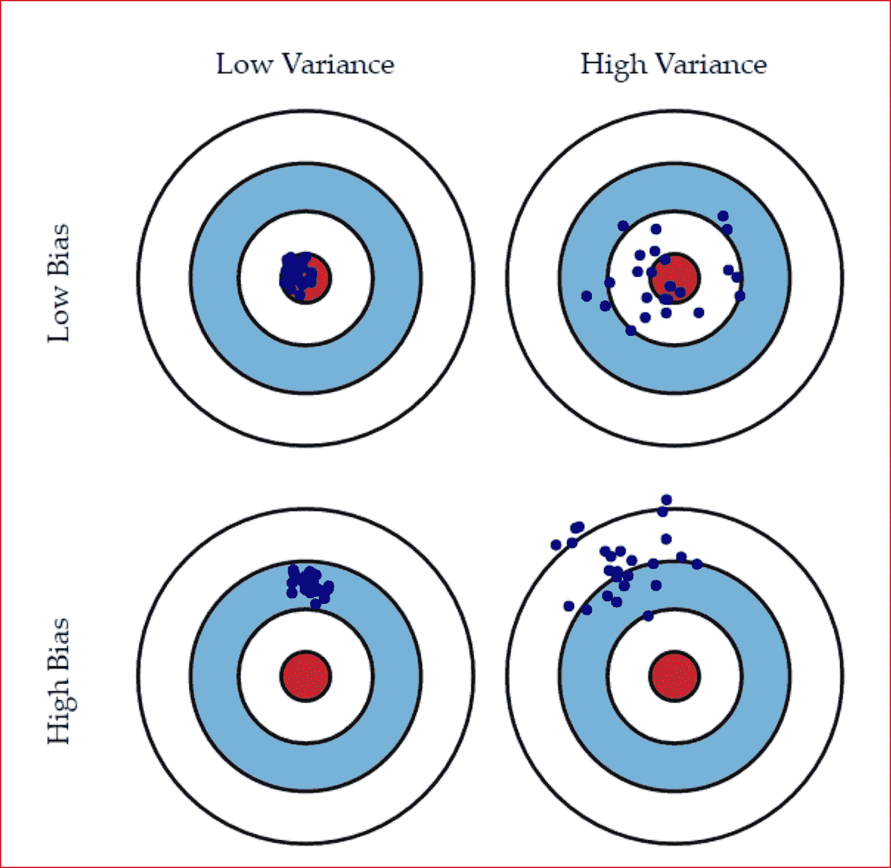
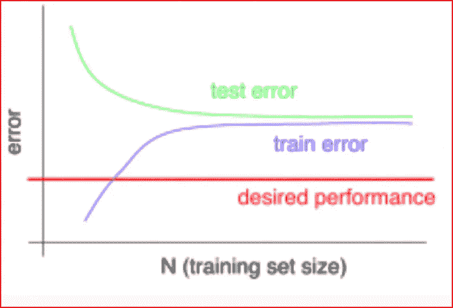
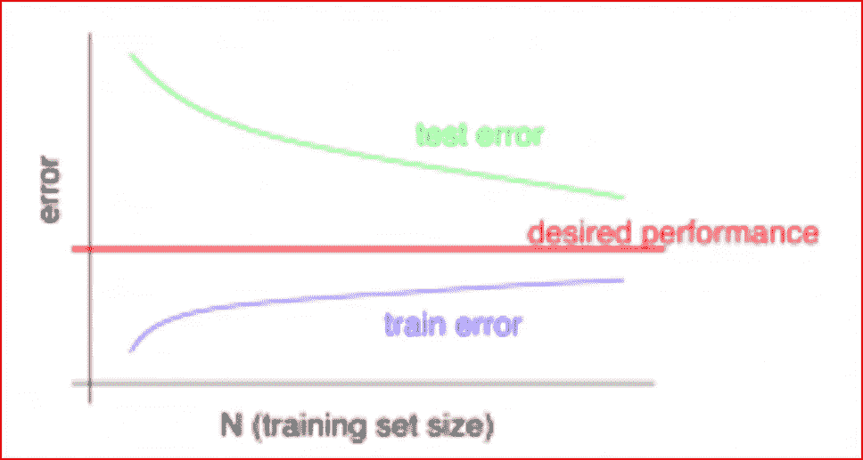

# 机器学习中的偏差和方差

> 原文：<https://medium.datadriveninvestor.com/bias-and-variance-in-machine-learning-51fdd38d1f86?source=collection_archive---------0----------------------->

在这篇文章中，我们将学习如何评估机器学习模型的性能。

先决条件:你需要知道[机器学习](https://medium.com/datadriveninvestor/machine-learning-demystified-4b41c3a55c99)的基础知识。

首先，我们将了解什么定义了模型的性能，什么是偏差和方差，以及偏差和方差如何与欠拟合和过拟合相关联。然后我们将理解如何修正偏差方差。

***我们怎么知道一个模特表现好不好？***

**机器学习模型的性能根据其预测和在独立测试数据上的概括程度而被视为良好。根据不同模型的性能，我们选择性能最高的模型。**

让我们用一个例子来理解这一点，假设我们想预测谁会在 2018 年的中期选举中表现出色，是共和党还是民主党？

我们去一个社区，开始询问人们是否会投票给民主党人或共和党人。我们采访了 100 个人，44 个人说他们会投民主党的票，40 个人说他们会投共和党的票，16 个人还没有决定。根据这一数据，我们可以预测民主党获胜的机会高于共和党。

我们能否将这一预测应用到整个县、州，然后是国家层面？

不，因为如果我们去不同的社区或不同的县或州，预测可能会改变。我们将观察到预测中的不一致。这意味着我们的模型表现不佳，因为它不能可靠地用于预测。

我们的模型性能的原因之一是由于小样本量和没有足够的数据变化。这给我们的预测带来了误差。误差是指预测值与实际值不同。

当我们有一个输入**x 并且我们对输入 *x* 应用一个函数 *f* 来预测一个输出*y*T21*。*实际输出和预测输出之间的差异就是误差。我们的机器学习算法的目标是生成一个模型，使测试数据集的错误最小化。**

基于新测试数据集的预测误差来评估模型。

Error is difference between the actual output and predicted output

我们模型中的误差是可约误差和不可约误差的总和。

Error is ML models known as bias variance decomposition

## 不可约误差

无论应用什么算法都无法减少的误差称为不可约误差。这通常是由可能对输出变量有影响的未知变量引起的。

**可约误差**有两个分量——**偏差和方差。**

偏差或方差的存在导致数据的过度拟合或欠拟合。

# **偏差**

偏差是预测值与实际值的差距。如果**平均预测值远离实际值，则偏差较大**。

高偏差导致算法丢失输入和输出变量之间的相关关系。当模型具有高偏差时，则意味着模型过于简单，没有捕捉到数据的复杂性，因此**对数据**拟合不足。

# **方差**

当模型在经过训练的数据集上表现良好，但在未经训练的数据集(如测试数据集或验证数据集)上表现不佳时，就会出现差异。**方差告诉我们预测值与实际值有多分散**。

**高方差导致过拟合，这意味着算法对训练数据中存在的随机噪声进行建模**。

当模型具有高方差时，该模型变得非常灵活，并根据训练集的数据点进行自我调整。当高方差模型遇到它没有学习的不同数据点时，它就不能做出正确的预测。

High bias , high variance and just fit

如果我们看上面的图表，我们会发现高偏差模型看起来非常简单。具有高方差的模型试图拟合大多数数据点，使得模型复杂且难以建模。这可以从下面的测试和训练预测误差之间的图中看出，作为模型复杂性的函数。

Source: Elements of Statistical Learning by Trevor Hastie, Robert Tibshirani and Jerome Friedman

我们希望有一个模型的复杂性，交易偏差与方差，使我们尽量减少测试误差，并使我们的模型表现更好。这在下面的偏差方差权衡中有所说明。

Source: An Introduction to Statistical Learning by Gareth James, Daniela Witten, Trevor Hastie, Robert Tibshirani

**高偏差低方差**:模型一致但平均不准确

**高偏差高方差**:模型不准确，平均起来也不一致

> ***低偏差低方差:模型准确，平均值一致。我们在我们的模型*** 中为此而努力

**低偏差高方差**:模型有些准确，但平均值不一致。数据的微小变化都会造成很大的误差。

***当我们有一个高偏差或者一个高方差的时候，有办法发现吗？***

当我们有以下情况时，可以识别高偏差

*   高训练误差
*   验证错误或测试错误与训练错误相同

在以下情况下，可以识别高差异

*   低训练误差
*   高验证误差或高测试误差

***我们如何修复数据集中的高偏倚或高方差？***

高偏差是由于一个简单的模型，我们也看到一个高训练误差。为了解决这个问题，我们可以做以下事情

*   添加更多输入要素
*   通过引入多项式特征来增加复杂性
*   减少正则项

High bias -Test error is not reduced with more training data

高差异是由于模型试图拟合大多数训练数据集点，因此变得更加复杂。要解决高差异问题，我们需要努力

*   获取更多培训数据
*   减少输入要素
*   增加正则项

High variance — Test error is reduced with more training data

在结束偏差和方差的话题之前，先简单介绍一下正则化。

正则化是一种技术，其中我们对非常灵活的复杂模型的损失函数进行惩罚。这有助于过度拟合。它通过惩罚不同的参数或权重来减少训练数据的噪声，并在测试数据上很好地概括

正则化显著降低了方差，而没有显著增加偏差

阅读 L1 L2 正规化[这里](https://medium.com/datadriveninvestor/l1-l2-regularization-7f1b4fe948f2)

# 如果你喜欢这篇文章，请鼓掌！

# 来自 DDI 的相关帖子:

 [## 用 7 个步骤解释深度学习——数据驱动投资者

### 在深度学习的帮助下，自动驾驶汽车、Alexa、医学成像-小工具正在我们周围变得超级智能…

www.datadriveninvestor.com](https://www.datadriveninvestor.com/2019/01/23/deep-learning-explained-in-7-steps/)  [## 数据科学和软件工程哪个更有前途？-数据驱动型投资者

### 大约一个月前，当我坐在咖啡馆里为一个客户开发网站时，我发现了这个女人…

www.datadriveninvestor.com](https://www.datadriveninvestor.com/2019/01/23/which-is-more-promising-data-science-or-software-engineering/)