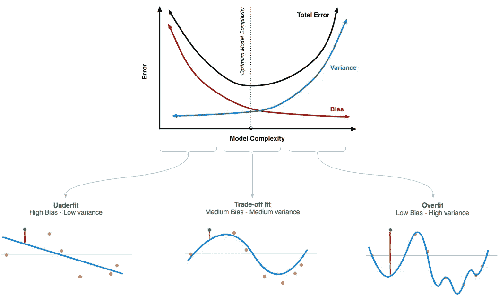

# 如何在偏差和方差之间讲和？

> 原文：<https://medium.datadriveninvestor.com/bias-variance-trade-off-fb5fa4c8ab56?source=collection_archive---------1----------------------->

## 不断争论来破坏你的模型？请继续阅读，了解如何平衡这两者…

这篇文章详细描述了短篇故事中提到的所有观点。如果你只是想复习或时间不够，你可以在这里查看系列[*【https://medium.com/series/eca8ea2d6653】*](https://medium.com/series/eca8ea2d6653)

# 什么是偏见？

偏差是指模型对数据的错误假设。高偏差或 ***欠拟合*** 意味着模型无法捕捉数据中的趋势或模式。这通常是由于假设函数过于简单或特征非常少造成的。

# 如何识别高偏倚？

它在训练和测试集上表现不佳，因为它无法识别数据中的模式。由于预测值和实际值之间的差异很大，因此遭受高偏差的此类模型的评估指标(如准确性、f1 得分)非常低。

# 如何修复高偏差？

我们可以增加功能或执行功能工程，为数据添加更有意义的因素。这可以帮助模型更好地理解数据。增加假设函数中的多项式次数也有助于对抗高偏差，因为具有高偏差的模型太简单，而增加多项式次数会增加复杂性，从而减少偏差。但是只有到了某一点，你才能增加复杂度，因为过了那个点，交叉验证错误就开始增加了(往下读就知道为什么了？).也可以尝试降低正则化的 alpha 参数([https://medium . com/@ aishan air 21/the-art-of-regulation-caca 8de 7614 e](https://medium.com/@aishanair21/the-art-of-regularization-caca8de7614e))。

# 什么是方差？

方差是指模型衡量数据扩散的能力。高方差或 ***过度拟合*** 意味着模型符合可用数据，但不能很好地概括以预测新数据。这通常是由于假设函数过于复杂，并且试图精确地拟合训练数据集上的每个数据点，从而导致大量不必要的曲线和与数据无关的角度。

# 如何识别高方差？

具有高方差的模型在训练集上表现很好，但在测试或交叉验证集上表现很差。它无法进行归纳，并且在以前没有见过的数据集上表现不佳。因此，训练精度将会很高，而测试精度将会很低。

# 如何修复高方差？

通过减少模型中的特征数量，可以减少高方差。有几种方法可以用来检查哪些特性没有给模型增加多少价值，哪些特性是重要的。增加训练集的大小也有助于模型的泛化。降低多项式的次数有助于降低模型的复杂性并解决高方差问题。正则化是一种用于克服过拟合问题的流行方法([https://medium . com/@ aishan air 21/the-art-of-regulation-caca 8de 7614 e](https://medium.com/@aishanair21/the-art-of-regularization-caca8de7614e))。

# 如何保持偏倚和方差的平衡？

增加偏差可以减少方差，而增加方差可以减少偏差。对于一个好的模型，我们怎样才能达到完美或最佳点？

Photo credits: ebc ([http://www.ebc.cat/author/eduard-bonadagmail-com/](http://www.ebc.cat/author/eduard-bonadagmail-com/))

如上图所示，存在一个点，在这个点上，由于方差增加和偏差减小，交叉验证误差开始上升。这正是模型需要停止增加其复杂性并使用曲线中该点定义的所有参数的点。通常，这是偏差和方差曲线相交的地方，创建了最佳的模型复杂性点。此时，模型具有低偏差和低方差，不会导致模型欠拟合或过拟合。

*如果你喜欢我的文章，并且正在用浅显易懂的数学知识寻找更多关于数据科学的帖子，请在 medium 上鼓掌或关注我。如果您有任何疑问，可以在 LinkedIn(*【https://www.linkedin.com/in/aishwarya-nair-21091994/】*)上与我联系。谢谢你一路读到这里，请继续关注！*