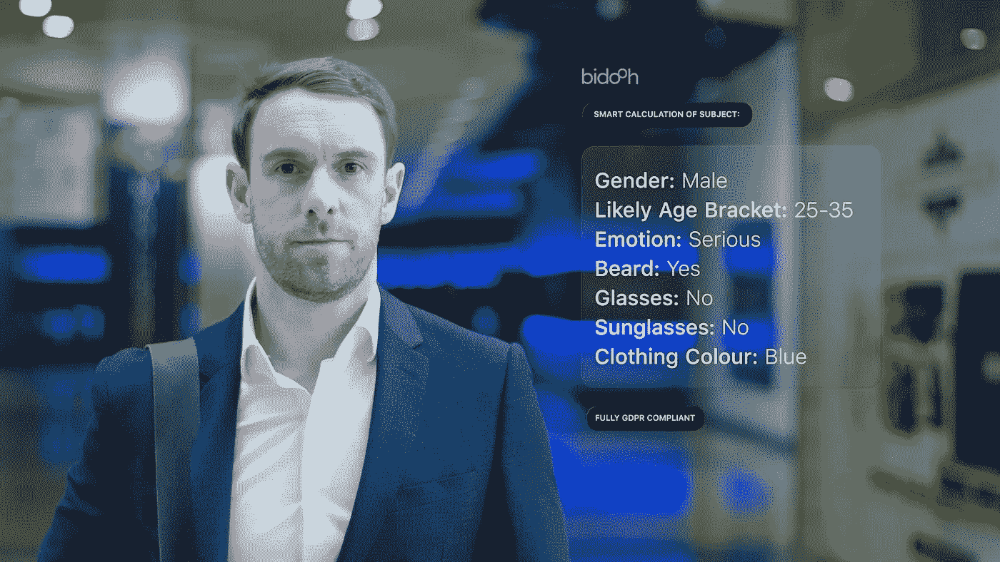

# Bidooh 解决了高科技广告牌广告中的隐私和 GDPR 问题

> 原文：<https://medium.datadriveninvestor.com/bidooh-solves-privacy-and-gdpr-issues-in-high-tech-billboard-advertising-152226b9d3a3?source=collection_archive---------20----------------------->

想象一下，一个数字广告牌屏幕可以在你靠近它的时候分析你的特征，然后根据你是谁和你的个人喜好向你展示一个广告！

一个高度智能的屏幕，可以拾取面部和身体特征，你穿的品牌，你是男性还是女性，甚至你的情绪！

Bidooh 的科幻类数字广告广告牌屏幕可以做到这一点，甚至更多。Bidooh 的两位联合创始人在一起看电影时产生了这些屏幕的想法。电影《少数派报告》设定在未来，当汤姆·克鲁斯走向商店的一个屏幕时，屏幕认出了他，并根据他的个人喜好发送广告，这是一个鼓舞人心的时刻。

18 个月后，联合创始人 Abdul Alim 和 Shaz Mughal 开发了他们自己的科幻智能数字广告广告牌，他们现在正在区块链推出他们的公司 Bidooh。

“等等！”，我听到你问。这种突破性的技术非常惊人，但是“这对个人数据隐私有什么影响？”

请放心，Bidooh 非常认真地对待自己的责任。

首先，Bidooh 数字屏幕中使用的“面部分析”技术和使用 Bidooh 应用程序的用户将使用的“面部识别”技术之间存在差异。

## 面部分析

Bidooh 数字屏幕上的摄像头能够识别人脸的不同特征。这些特征包括头发颜色、胡须、小胡子、太阳镜/眼镜、品牌认知度、身高、体型和情绪。内置摄像头能够以极高的概率(99%)判断出它们捕捉到的人脸是男性还是女性。

然而，必须强调的是，这里使用的技术不能识别世卫组织这个人，也不能收集或存储任何个人信息。对于广告商来说，这只是一个能够捕捉人口统计数据的过程，他们可以利用这些数据有效地锁定他们选择的受众。

按照设计，所有数据都是匿名的，因此没有任何东西可以识别个人身份，这意味着整个过程完全符合 GDPR 标准。

## 面部识别

另一方面，Bidooh 为其订户应用程序开发的面部识别技术能够识别面部特征，其程度令人难以置信，可以将面部与脸书的个人资料进行匹配，可以识别该人，并根据该人的偏好定制广告——所有这一切都在瞬间完成！

显然，并不是所有的人都会对自己的数据被收集感到满意，而“选择”是我们社会中的一个压倒一切的原则。

## Bidooh 的应用程序选择加入

然而，这里的关键区别是，希望利用面部识别功能的人必须首先下载 Bidooh 移动应用程序，然后必须给出他们的许可(应用程序内)，以便进行这种高级识别。应用程序用户可以随时撤销这一许可，因此这是一种确保完全遵守个人隐私的安全方式。

只有当希望充分利用面部识别的用户首先同意 Bidooh 的条件及其附带的隐私政策时，该过程才有效。如果不这样做，用户实际上不能使用应用程序，因此确保识别不会发生错误。

## 许可收集**什么样的数据？**

*   身份数据(姓名、地址、出生日期)
*   联系数据(电子邮件地址和电话号码)
*   技术数据(您使用的设备和技术的种类，包括 IP 地址、浏览器、操作系统、平台等。)
*   营销和传播数据(来自 Bidooh 和第三方的营销偏好加上传播偏好，如通过脸书或 Twitter 等。)

Bidooh 通过遵守“[通用数据保护条例 2016/679](https://publications.europa.eu/en/publication-detail/-/publication/3e485e15-11bd-11e6-ba9a-01aa75ed71a1/language-en) ”来合法收集这些信息。

## 为什么同意被认可？

那么，对于那些允许 Bidooh 的高科技软件识别他们的脸的人来说，到底有什么好处呢？

奖励。该平台向移动应用程序用户支付代币，仅用于向 Bidooh billboard 屏幕走去，并且如果用户以某种方式与广告交互(例如触摸屏幕的某些部分或跟随链接等),甚至增加这些代币。)不同的广告会有不同的代币金额，有些还会提供奖品和代金券等其他奖励。

以这种方式通过应用程序获得的代币可以用于参与的商店，如餐馆、商店和在线零售商——这里的可能性很大。在这些业务中花费的代币可以被他们用来购买更多的广告空间，从而创建一个对双方都有利的业务到客户的循环。

## 结论

随着 Bidooh 高科技数字屏幕的使用，数字广告牌广告的人口统计将变得非常全面和可靠。广告商将能够利用他们以前从未获得的大量数据，并将能够激光瞄准他们的广告，以便他们能够接触到他们瞄准的精确受众。

当史蒂文·斯皮尔伯格制作《少数派报告》时，他试图描绘一个未来的科幻世界，这远远超出了我们当今技术进步的能力。Bidooh 将这一未来派的梦想带入了今天的现实，并将彻底改变 dooh(数字户外)产业。

*免责声明:以上所有观点均为我个人观点，绝不应被视为财务建议。所有希望投资密码市场的人都应该自己做研究，或者使用完全认证的金融顾问的服务。*