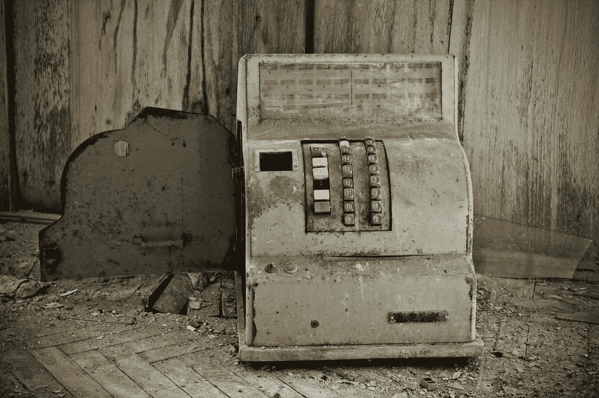

# 大盒子经济学和气候变化——消费正在杀死我们吗？

> 原文：<https://medium.datadriveninvestor.com/big-box-economics-and-climate-change-is-consumption-killing-us-7804b18561c8?source=collection_archive---------19----------------------->

这是关于大型国际零售商的一个大类，但我将主要关注沃尔玛，因为有关于该公司的强大数据。当分析这个问题时，国际零售商*对美国有益吗*，我们需要更深入地了解这意味着什么。对美国来说，经济*最好的情况是什么？这是中产阶级的生活方式吗？有 2.3 个孩子，有自己的房子，有年假，还有一些储蓄，导致 65 岁退休？是最富有的美国人加剧了他们和其他人之间已经不断扩大的财富积累差距吗？有没有可能，一个财富分布更加平均的公平的经济竞争环境是最好的结果？或者说，未来的经济现实比上述任何一种都更丑陋、更复杂？*

大多数经济指标表明，国际零售商在很大程度上有利于中低收入美国人的短期微观经济利益，主要是对他们钱包的直接影响。以低廉的价格和便利的地点获得商品和服务的能力保持了经济引擎的运转。此外，国际零售商有利于整个社会的短期宏观经济利益，例如，从公司六位数职位的入门级工作，以及高利润的商业模式，加上低消费价格，导致美国经济增长。在前一个和后一个例子中，关键短语都是*短期*。尽管数据显示，国际零售商在短期内有利于美国经济，但长期前景如何？我认为，从 10，000 英尺的长远角度来看，国际零售商可能是人类最大的单一威胁。为什么？因为消费主义是造成气候变化的最大因素，占全球温室气体排放量的 60%,占地球上土地、材料和水使用量的 50 %- 80%。再加上最大的零售商利用人们的心理来保持消费者的消费，以及消费者根深蒂固的习惯，他们太容易忘记改变。所有这些无节制的消费行为都导致了人为的气候变化，而气候变化的影响将从根本上改变人类在地球上的生存方式。但稍后会详细介绍。

为了帮助理解全貌，我们必须深入研究大型超市对家庭的微观经济影响，这样我们就可以将它与气候变化可能的负外部性进行权衡。那么，一家大型国际零售商的本地微观经济是什么样的呢？结果喜忧参半。在某些情况下，沃尔玛或其他国际零售商所在的地方会出现更复杂的经济环境。研究发现，很多时候，大量二级零售商会跟随沃尔玛的脚步，因为从长远来看，向沃尔玛提供类似产品的小型零售商无法竞争，很大程度上被取代。但是像麦当劳、威瑞森无线、星巴克、Autozone 和其他专业和精品零售商这样的公司定位于利用大量的消费者。很多时候，这些二级零售商是当地拥有的特许经营商，为周围社区提供多样的购物和就业机会。然而，这些就业机会加强了当地经济吗？从历史上看，研究发现，沃尔玛是唯一一家对价格设定和越来越低的工资水平负责的公司，而且在很大程度上导致了更广泛的经济通胀。但是这种工资策略可能正在改变。沃尔玛一直在考虑提高工资，以努力找到并留住更好的员工……这可能奏效了！(10)虽然加薪赌博尚未尘埃落定，但在这个以高流动率著称的行业，沃尔玛有望提高员工保留率。其他研究发现，沃尔玛的引入实际上增加了周围一英里内的住宅价值 2-3%。( [13](http://business.time.com/2012/06/04/the-unexpected-effects-of-walmart-coming-to-town/) )对于拥有大型超市的地方来说，这是一个显著的优势。其他结果并不乐观。也许并不奇怪，沃尔玛的增加也会导致周围地区肥胖率上升 43%。( [14](http:// https://www.forbes.com/sites/timworstall/2015/01/29/walmart-makes-you-fat-no-seriously-its-been-proven/#7eb0d057407b) 更多的肥胖人口对当地经济是好是坏可能还需要讨论。一方面，肥胖者往往需要更多的医疗护理，因此他们通常会通过购买医疗服务和产品来为经济做出贡献，但平均而言，他们的寿命也更短，因此对经济的贡献不会更长。结果也是喜忧参半。

现在让我们看看国际零售商对美国和全球宏观经济的更广泛影响。美国通过国际零售商的商品消费是净正还是负？沃尔玛是地球上最大的公司，在 27 个国家的 11965 家商店中雇用了 230 万名员工，如果它是一个国家，它将是地球上第 25 大经济体。这是一个不小的影响，如果你把前 10 名零售商中的后 9 名加入进来——好事多、克罗格、沃尔格林、乐购、家乐福、亚马逊、麦德龙集团、家得宝和塔吉特——全球零售商的经济影响是惊人的。作为一个行业，零售业为全球经济贡献了 24 万亿美元。作为单一的最大经济体，美国消费了这个经济蛋糕的很大一部分。国际零售商对更广泛的经济做出贡献的另一个领域是物流和配送技术的发展。1977 年，沃尔玛开始使用电子收银机，简化了 POS(销售点)互动，并推动零售业朝着这个方向发展。1987 年，沃尔玛拥有世界上最大的私有卫星系统，事后看来，这让他们看起来非常超前。2005 年，沃尔玛将射频识别(RFID)技术引入他们的商店，使员工能够立即快速识别大量的产品信息。( [18](http://www.cio.com/article/2437873/infrastructure/45-years-of-wal-mart-history--a-technology-time-line.html) )他们能够知道各种产品的购买数量和购买时间，甚至可以精确地追踪商店里 15 万件商品中的任何一件。该行业紧随其后，从根本上改变了零售商跟踪产品数据的方式。国际零售商给美国宏观经济带来了一些不太好的结果。除了作为行业价格制定者压低工资之外，沃尔玛和其他国际零售商确实让类似的小型零售商破产。大多数经济学家会认为，让竞争力差的公司出局实际上对整体经济来说是件好事。一般来说，人们很难认为国际零售商对美国经济来说是不可或缺的。

我们已经确定，国际零售商在小规模和地方规模上导致了喜忧参半的结果，并且对美国的宏观经济来说是一个福音，但我们也知道消费主义是温室气体的最大贡献者。那么气候变化的经济学是什么呢？事实证明，失控的消费主义可能真的是无声杀手，并可能导致巨大的社会支出。让我们想象一下，到 2050 年海平面上升 2 英尺(估计各不相同，但这是可行的，甚至可能是保守的)。这将导致大量沿海人口流离失所，导致地球上有史以来最大的难民危机。这会给美国经济带来什么损失？根据 2007 年出版的《环境与城市化》杂志，全球有 6.34 亿人生活在距离海洋 30 英尺以内的地方。同一项研究指出，超过 500 万人口的三分之二大城市位于地势低洼的沿海地区。( [9](https://en.wikipedia.org/wiki/Sea_level_rise) 瑞士再保险公司报道，到 2030 年，仅佛罗里达州因海平面上升而造成的经济损失就将高达 330 亿美元。到 2050 年，这个数字可能会是现在的 10 倍。一项自然研究发现，到 2500 年，整个特拉华州都将被淹没。( [9](https://en.wikipedia.org/wiki/Sea_level_rise) 那可是一笔不小的税啊！那么气候难民的宏观经济学是什么呢？我想我们都应该在地下室和备用卧室里为佛罗里达退休人员腾出空间。我希望他们能在当地的沃尔玛找到工作。

下一个主要的气候经济学问题是可能导致全球饥荒的世界末日般的生态崩溃。(7)随着气候变化导致海洋酸化和缺氧，海洋渔业开始崩溃。如果不潜水太深(没有双关语)，酸化将影响海洋中的许多基本物种，例如浮游植物、珊瑚礁、沿海物种和深海物种。如果海洋生态继续沿着这条路走下去，这可能是食物链上的级联效应。不再有蛤蜊和牡蛎，不再有鲭鱼，也不再有金枪鱼。海洋是地球生态系统的基础，如果它崩溃了，陆地生态也就不远了。由于我们的食物来自这些不同的生态系统，看起来气候变化可能是下一个时尚饮食。但是，数亿人在街头挨饿的直接经济成本是多少？一项研究发现，儿童营养不良使马拉维经济损失了 10.3%的国内生产总值，一项更大的 12 个国家的研究发现，非洲国家营养不良造成了 3.1%的国内生产总值损失。( [8](https://www.wfp.org/news/news-release/new-study-reveals-huge-impact-hunger-economy-malawi-0) 自从美国的 GDP。美国的经济远远超过非洲国家，营养不良或营养不良的经济状况可能不同，但可能是灾难性的。

为什么沃尔玛和其他国际商店是有罪的？消费主义的习惯在很大程度上因大卖场掠夺性营销叙事而加剧，这种叙事可追溯到 20 世纪 50 年代，灌输了一种攀比心理，并利用人类的本能为更艰难的时期做准备，就像松鼠在秋天埋坚果一样。( [12](http://www.medscape.com/viewarticle/814649) )当人们感到害怕、焦虑或有竞争力时，他们就会买东西，国际零售商知道这一点并利用这一点。此外，国际零售商利用人类的虚荣心推销产品，让我们变得更漂亮，满足我们的自我。人类从根本上想要找到一个伴侣并传播他们的遗传密码，至少零售商认为，难闻的瓶装化学物质和润肤霜将有助于这一努力。国际零售商也是一次性消费的同谋，为了让消费者继续消费，他们设计失败的产品。商品从提取、使用到处理的速度惊人的快。99%的产品在 6 个月内就被填埋了！( [2](http://storyofstuff.org/movies/story-of-stuff/) )但是，除了消费习惯，还有别的选择吗？能有细心，体贴，慈悲，消费主义吗？一些现代思想家认为有更好的可持续消费方式。《点燃快乐》一书的作者玛丽·近藤认为，我们所拥有的东西一定会点燃我们生活中的快乐。如果商品不符合这个标准，那么它们就不应该被购买，如果你拥有的东西没有通过测试，就把它送人。很可能许多人会认为这是一个激进的观点，这可能是合理的。然而，近藤的观点很重要。消费者通过他们的行为在消费主义相关的气候变化中负有责任，就像国际零售商在推销产品一样。

人们通常认为，在政治层面上，解决选民选择问题的方法，在这种情况下是不受约束的消费主义，是简单地教育民众，让他们做出符合其最佳长期利益的理性决定，但可能符合其最差短期利益的理性决定，但经济学家知道，人们不一定那么理性。政策战略家也必须面对帮助经济从消费型转型的需要。但这是一颗政治上难以下咽的致命药丸。尝试再次当选，同时告诉消费者上瘾的选民，他们必须改变。但是有没有消费经济的替代品呢？那么，政策制定者如何解决消费者的自私选择和国际零售商的掠夺行为，同时保持政治上的可行性呢？由于历史表明，在大多数情况下，人类对灾难的反应很大程度上是消极的，而不是积极主动的，很可能气候难民将需要在我们的象征性的，也许是字面上的门口，在任何真正实质性的变化实施之前，人们将需要在街上挨饿。抛开我个人的愤世嫉俗，还是有一线希望的。巴黎气候协议是国际舞台上的一个亮点，190 多个国家正在共同努力应对气候问题。最新的 IPCC 报告可能会引发全球行动，但也可能不会。或许，如果用于生产和分配所有商品的能源是清洁的，这个问题将在很大程度上得以避免。在经济方面，一项名为“碳红利的保守案例”(The Conservative Case For Carbon 股息)的碳市场提案被提交给了特朗普政府，但没有得到认真考虑。( [15](https://www.ted.com/talks/ted_halstead_a_climate_solution_where_all_sides_can_win) )该提案将逐步提高碳税，以股息的形式分配给中低收入的美国人，这远远抵消了碳税带来的价格上涨。但是碳只是问题的一部分。露天开采、过度捕捞、砍伐雨林种植鳄梨和咖啡，以及人类的侵占都需要从消费者的角度来解决。人类需要问自己一个尖锐的问题——消费主义加速气候变化的前景是否证明任何以经济为代价的行动都是正当的？这是一个我们在未来几十年都要努力解决的问题。个人和政府的经济决策和行动很难预测，所以我想我们会在另一边相遇，也可能不会。

我最初在 linkedin 上发表这个:[https://www . LinkedIn . com/pulse/consumption-climate-change-Walmart-good-America-killing-Maxwell-roe/](https://www.linkedin.com/pulse/consumption-climate-change-walmart-good-america-killing-maxwell-roe/)

引文

1.  “消费主义在气候变化中扮演着巨大的角色”苏珊·雅各布，2016 年 2 月 4 日，[http://grist . org/living/Consumerism-Plays-A-big-Role-In-Climate-Change/](http://grist.org/living/consumerism-plays-a-huge-role-in-climate-change/)
2.  “东西项目的故事”2007 年 12 月，【http://storyofstuff.org/movies/story-of-stuff/ 
3.  “留住员工——如何留住员工”华尔街日报，2008 年 9 月 12 日
4.  "城市社区沃尔玛:是福还是祸？"尤里·柏林纳、黛比·埃利奥特和克里斯·格罗斯科夫 2015 年 4 月 1 日[http://www . NPR . org/2015/04/01/396757476/the-neighborhood-wal-mart-a-bless-or-a-curse](http://www.npr.org/2015/04/01/396757476/the-neighborhood-wal-mart-a-blessing-or-a-curse)
5.  “当沃尔玛来到镇上，这对工人意味着什么”詹妮弗·卢登，Yuki Noguchi，2015 年 4 月 2 日[http://www . NPR . org/sections/the salt/2015/04/02/396892753/When-wal-mart-come-To-Town 对工人意味着什么](http://www.npr.org/sections/thesalt/2015/04/02/396892753/when-wal-mart-comes-to-town-what-does-it-mean-for-workers)
6.  沃尔玛效应的保守估计”Robert E. Scott，2016 年 12 月 9 日，[http://www.epi.org/publication/the-wal-mart-effect/](http://www.epi.org/publication/the-wal-mart-effect/)
7.  《第六次灭绝》伊丽莎白·科尔伯特，2014 年 2 月 11 日
8.  “新研究揭示饥饿对马拉维经济的巨大影响”世界粮食计划署，Sarah Rawson，2015 年 5 月 13 日[https://www . WFP . org/news/news-release/New-Study-Reveals-Huge-Impact-Hunger-Economy-Malawi-0](https://www.wfp.org/news/news-release/new-study-reveals-huge-impact-hunger-economy-malawi-0)
9.  【海平面上升】维基百科，[https://en.wikipedia.org/wiki/Sea_level_rise](https://en.wikipedia.org/wiki/Sea_level_rise)
10.  “沃尔玛的加薪实验对低工资工作的未来有何启示”，《经济学人》，R.A，2016 年 10 月 17 日，[http://www . Economist . com/blogs/free exchange/2016/10/not-always-low-wages](http://www.economist.com/blogs/freeexchange/2016/10/not-always-low-wages)
11.  “4 海洋酸化对海洋生态系统的影响”美国国家科学、工程和医学科学院，【https://www.nap.edu/read/12904/chapter/6#60 
12.  “我们为什么购物”，医学博士 Bret S. Stetka 基特·亚罗博士，2014 年 11 月 19 日，【http://www.medscape.com/viewarticle/814649 
13.  “沃尔玛进城的意外影响”，布拉德·塔特尔，2012 年 6 月 4 日，[http://business . time . com/2012/06/04/The-Unexpected-Effects-of-Walmart-Coming-to-Town/](http://business.time.com/2012/06/04/the-unexpected-effects-of-walmart-coming-to-town/)
14.  “沃尔玛让你变胖。不，说真的，这已经被证明了”，吉姆·沃索尔，2015 年 1 月 29 日，[https://www . Forbes . com/sites/timworstall/2015/01/29/Walmart-makes-you-fat-no-serious-It-Proven/# 7 eb0d 057407 b](https://www.forbes.com/sites/timworstall/2015/01/29/walmart-makes-you-fat-no-seriously-its-been-proven/#7eb0d057407b)
15.  《各方共赢的气候解决方案》，Ted Halstead，2017 年 4 月，[https://www . Ted . com/talks/Ted _ Halstead _ A _ Climate _ Solution _ Where _ All _ Sides _ Can _ Win](https://www.ted.com/talks/ted_halstead_a_climate_solution_where_all_sides_can_win)
16.  世界十大零售商”，威廉·卡彭特，2015 年 12 月 24 日，[http://www . investopedia . com/articles/markets/122415/Worlds-Top-10-Retailers-wmt-cost . ASP](http://www.investopedia.com/articles/markets/122415/worlds-top-10-retailers-wmt-cost.asp)
17.  《沃尔玛宏观经济学导论》，英国论文，2015 年 3 月 23 日，[https://www . UK Essays . com/Essays/management/An-introduction-to-the-macroeconomic-of-Walmart-management-essay . PHP](https://www.ukessays.com/essays/management/an-introduction-to-the-macroeconomics-of-walmart-management-essay.php)
18.  “沃尔玛 45 年的历史:一条技术时间线”，Thomas Wailgum，2007 年 10 月 17 日，[http://www . CIO . com/article/2437873/infra structure/45-Years-Wal-Mart-History-a-technology-time-line.html](http://www.cio.com/article/2437873/infrastructure/45-years-of-wal-mart-history--a-technology-time-line.html)