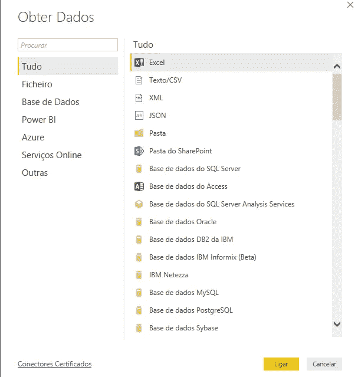
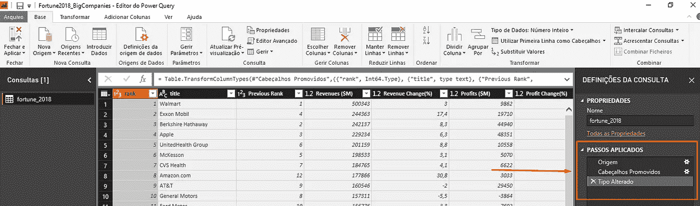
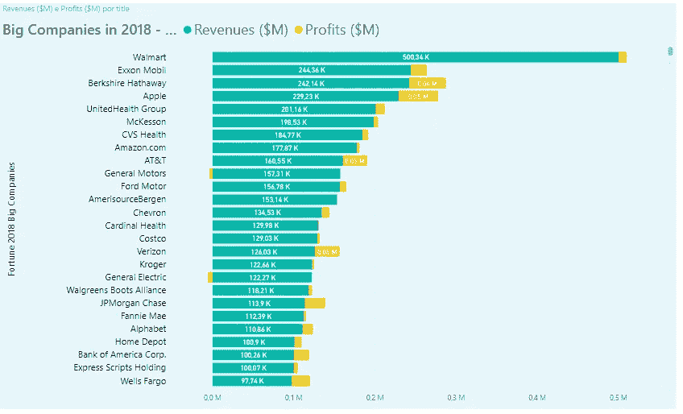
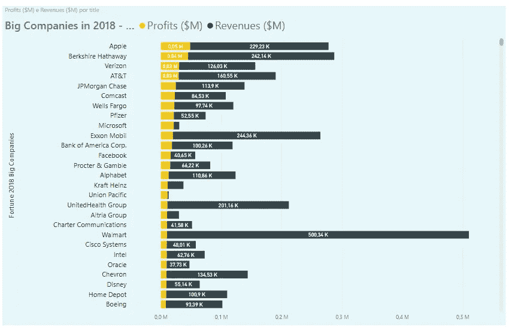
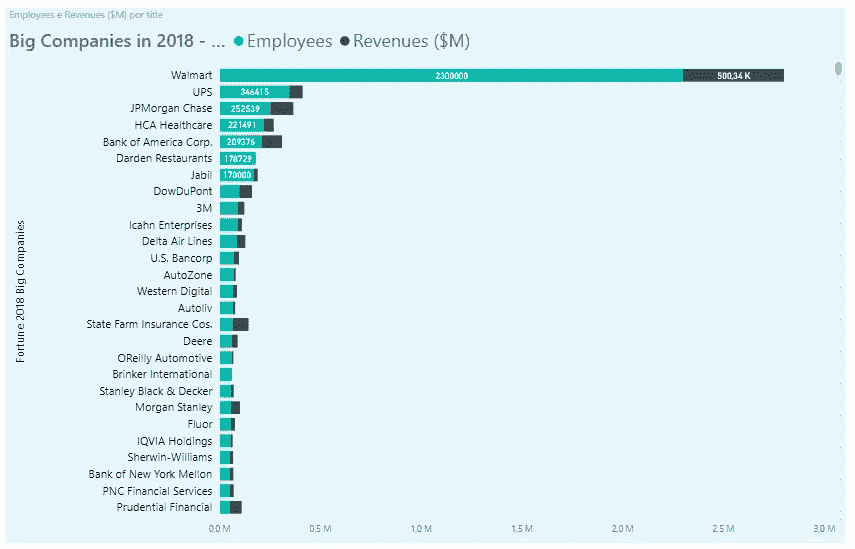
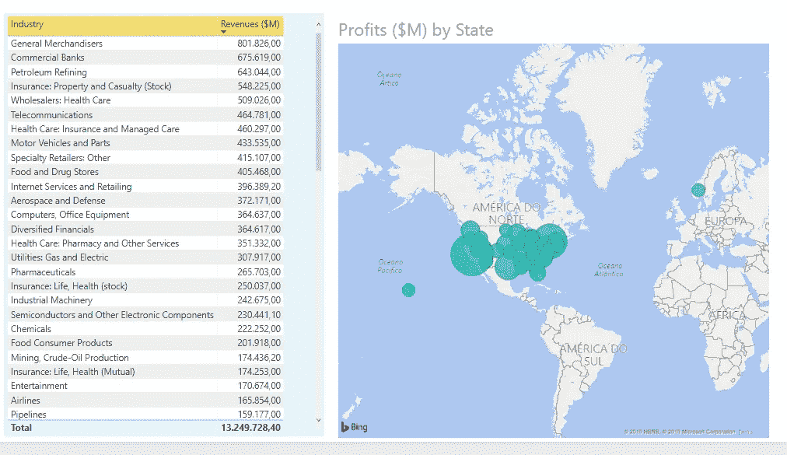
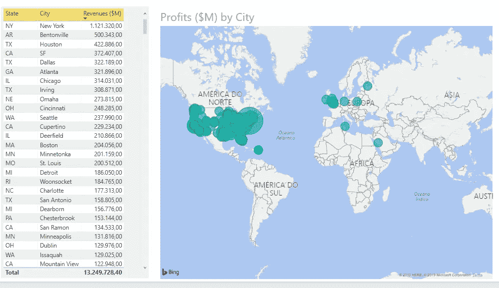
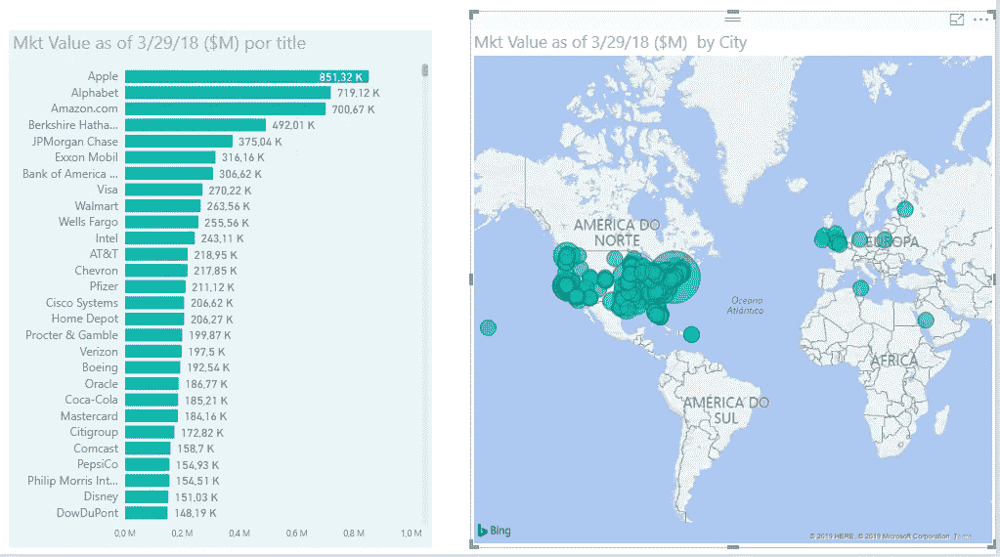

# 2018 年的大公司

> 原文：<https://medium.datadriveninvestor.com/big-companies-in-2018-f2cecc75e08?source=collection_archive---------20----------------------->

[http://fortune.com/global500/list/](http://fortune.com/global500/list/)

U sing [财富资讯](http://fortune.com/global500/list/)2018 年有大公司统计我探究了微软 [PowerBI](https://powerbi.microsoft.com/pt-br/) 的特点。一个优秀的数据准备和可视化工具，对用户免费。

我测试的版本虽然是免费的，但没有省略很多功能。主要的区别是，我不能在网上发布信息，但我可以导出到 PDF 格式的高质量的演示文稿。

PowerBI 工具既强大又简单。所有的技术问题连接表，替换值，连接新的列和地理地图的信息的简单连接。有地理地图的信息可以通过经纬度坐标获取，也可以通过州市获取。

该工具提供各种形式的数据输入。最基本的是 excel 或 csv，因为这是他们获得列表数据的简单方法。

Some types to obtain data to PowerBI

另一个很棒的特性是，当您对表或数据应用更改时，会自动创建脚本。通过这种方式，每当更新源表中的数据时，系统都会应用数据脚本的修改和更正，以便可以查看这些数据。

A script to change the type of the column after import da CSV data

可视化提供了各种各样的图形可能性，从条形图、饼图、堆积条形图、图形到地理地图。

Some types of data visualization

图形的颜色可以定制，并且系统根据列的值呈现位置，以这种方式允许在具有更大值的特征中给出更大的可视化。

现在，我使用 2018 年《财富》杂志发布的信息，展示一些包含这些信息的图表。所有作品和 CSV 表格信息均可在 [Github 中查阅。](https://github.com/MRobalinho/FortuneList2018/blob/master/README.md)

Information from Fortune 2018 in [http://fortune.com/global500/list/](http://fortune.com/global500/list/)

Information from Fortune 2018 in [http://fortune.com/global500/list/](http://fortune.com/global500/list/)

Information from Fortune 2018 in [http://fortune.com/global500/list/](http://fortune.com/global500/list/)

Information from Fortune 2018 in [http://fortune.com/global500/list/](http://fortune.com/global500/list/)

Information from Fortune 2018 in [http://fortune.com/global500/list/](http://fortune.com/global500/list/)

Information from Fortune 2018 in [http://fortune.com/global500/list/](http://fortune.com/global500/list/)

## 参考资料:

来自[http://fortune.com/global500/list/](http://fortune.com/global500/list/)财富 2018 的信息

https://powerbi.microsoft.com/pt-br/