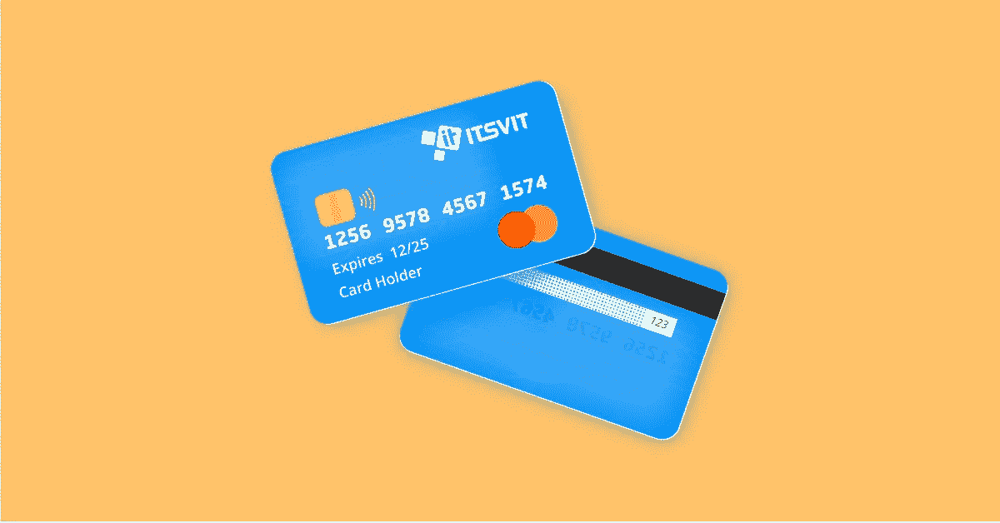
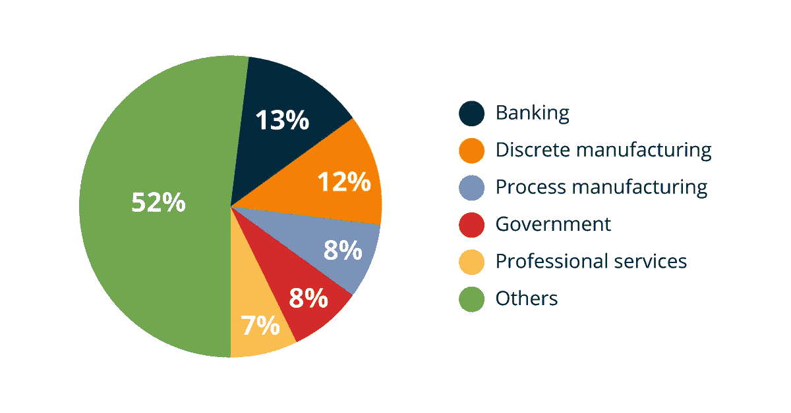
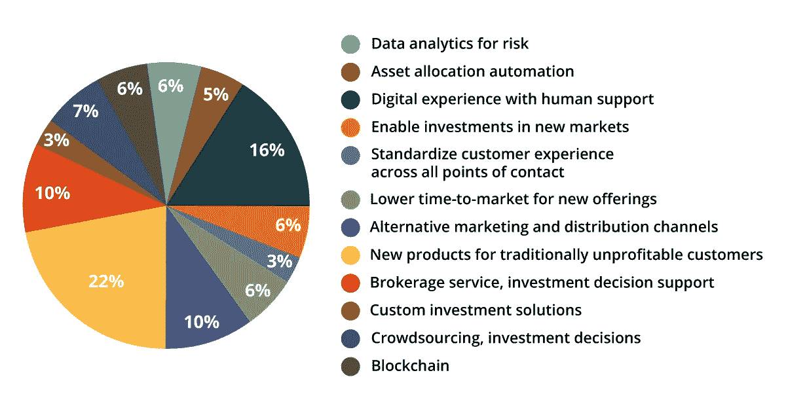
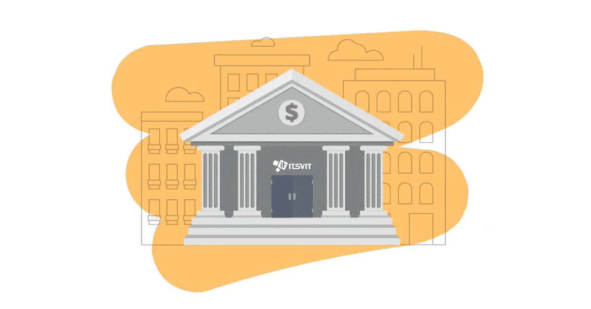

# 银行业的大数据分析

> 原文：<https://medium.datadriveninvestor.com/big-data-analytics-in-the-banking-sector-b7cb98d27ed2?source=collection_archive---------0----------------------->

大数据分析可以成为银行业创新的主要驱动力，而且它实际上正在成为一个驱动力。我们列出了大数据可以帮助银行提高绩效的几个领域。

根据 IDC*2016 年半年度大数据和分析支出指南*，2016 年银行业大数据分析投资总额**208 亿美元**。这使得该领域成为大数据服务的主要消费者之一，也是对大数据架构师、解决方案和定制工具需求不断增长的市场。

正如 2016 年 3 月出版的普华永道*全球金融科技报告*所示，在这些投资财富中，资金分配主要针对客户支持、风险评估、决策支持和研究新的盈利机会，以及投资新市场、缩短上市时间和资助区块链项目。

这一趋势正在增长，在 2017 年，这些数字只会变得更大。根据 GDC 的预测，到 2020 年，每秒产生的数据量将增长 700%。金融和银行数据将成为大数据洪流的基石之一，能够处理这些数据意味着在银行和金融机构中具有竞争力。

正如我们在列举[IT 部门使用的大数据工具类型](https://itsvit.com/blog/types-big-data-tools-svit-uses/)时所阐述的那样，真正的大数据流可以用 3 v 来描述:多样性、速度和容量。以下是这些与银行的关系:

*   **多样性**代表处理的数据类型丰富，银行确实要处理大量各种类型的数据。从交易细节和历史记录到信用评分和风险评估报告，银行拥有大量此类数据。
*   **速度**表示新数据添加到数据库的速度。对于一家受人尊敬的银行来说，达到每分钟 100 笔交易的门槛很容易。
*   **Volume** 表示存储该数据所需的空间量。像纽约证券交易所(NYSE)这样的大型金融机构每天都会产生数万亿字节的数据。

然而，正如我们在关于[大数据可视化原则](https://itsvit.com/blog/big-data-visualization-principles/)的文章中所解释的那样，如果不能得出第四个值**，那么这三个值是没有用的。对于银行来说，这意味着他们可以实时应用大数据分析的结果，并据此做出业务决策。这可应用于以下活动:**

*   **发现顾客的消费模式**
*   **识别交易的主要渠道(ATM 取款、信用卡/借记卡支付)**
*   **根据客户资料将客户细分**
*   **基于客户细分的产品交叉销售**
*   **欺诈管理和防范**
*   **风险评估、合规性和报告**
*   **客户反馈分析及应用**

# **下面，我们将详细介绍在银行业的这些领域中使用大数据的例子。**

****

# **顾客消费模式**

**银行可以直接访问大量关于客户消费模式的历史数据。他们知道你每个月的工资是多少，你的储蓄账户有多少，你的公共事业提供商有多少，等等。这为进一步分析提供了基础。应用节日和宏观经济条件等过滤器，银行员工可以了解客户的工资是否稳定增长，支出是否充足。这是风险评估、贷款筛选、抵押评估和保险等多种金融产品交叉销售的基础因素之一。**

# **交易渠道标识**

**银行通过了解他们的客户是否在发薪日以现金提取所有可用金额，或者他们是否喜欢将钱留在信用卡/借记卡上而受益匪浅。显然，可以向后一类客户提供投资高利率短期贷款等。**

# **客户细分和特征分析**

**一旦对客户消费模式和首选交易渠道的初步分析完成，就可以根据几个适当的概况对客户群进行细分。容易花钱的人、谨慎的投资者、快速还贷的人、赶时间的还贷者……了解所有客户的财务状况有助于银行评估下个月的预期支出和收入，并制定详细的计划来确保底线和实现收入最大化。**

# **产品交叉销售**

**为什么不向谨慎的投资者提供更高的利息回报，以刺激他们更积极地消费呢？向一个已经很难偿还债务的挥金如土的人提供短期贷款值得吗？对客户财务背景的精确分析确保银行能够更有效地交叉销售辅助产品，并通过个性化的优惠更好地吸引客户。**

# **欺诈管理和防范**

**了解一个人通常的消费模式有助于在发生一些离谱的事情时发出危险信号。如果一个谨慎的投资者喜欢用他的卡支付，试图通过 ATM 从他的账户中取出所有的钱，这可能意味着卡被盗并被欺诈者使用。银行打来电话请求批准此类操作，有助于轻松了解这是合法索赔还是持卡人不知道的欺诈行为。分析其他类型的交易有助于大大降低欺诈行为的风险。**

****

# **风险评估、合规性和报告**

**在交易股票或筛选贷款候选人时，可以使用类似的程序进行风险评估。了解客户的消费模式和以前的信用历史有助于快速评估发放贷款的风险。大数据算法还可以帮助处理合规、审计和报告问题，以简化运营并消除管理开销。**

# **客户反馈分析及应用**

**客户可以在与客户支持中心联系后或通过反馈表留下反馈，但他们更有可能通过社交媒体分享自己的意见。大数据工具可以筛选这些公共数据，并收集银行品牌的所有提及，以便能够快速、充分地做出响应。当客户看到银行听取并重视他们的意见，并按照他们的要求做出改进时，他们的忠诚度和品牌主张会大大提高。**

# **关于在银行业使用大数据的最终想法**

**现在用老方法做事情太冒险了。如果想要成功，公司必须发展并掌握新技术。采用大数据分析并将其融入现有的银行部门工作流，是在数字千年快速发展的业务环境中生存和发展的关键要素之一。**

**我们都习惯于认为银行是巨大的建筑，有凉爽的大理石大厅，在那里职员和顾客一起工作。在过去的 10 年里，这些银行投入巨资实现其服务的现代化，并提供对其服务的移动访问。在接下来的 5 年里，他们必须学会用大数据分析、人工智能/人工智能算法和其他高科技工具来支持他们的运营。**

**最初，这个故事发布在我公司的博客上——https://itsvit.com/blog/big-data-analytics-banking-sector/**