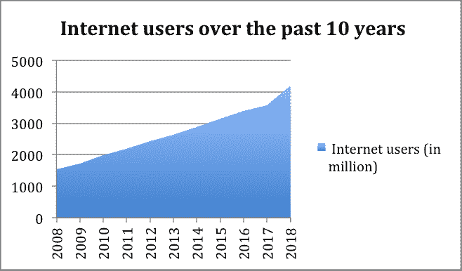
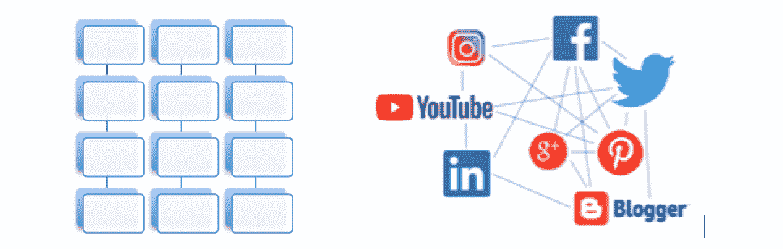

# 公司中的大数据和人工智能方法

> 原文：<https://medium.datadriveninvestor.com/big-data-and-ai-approach-in-companies-dceda1d55c19?source=collection_archive---------9----------------------->

Big Data and AI

大数据和人工智能是当今的热门话题。越来越多的公司开始采用和研究这些方法。但是什么是大数据和流行的人工智能方法机器学习和深度学习，以及公司如何使用这些方法。本文将介绍这些话题以及对大数据的批评和担忧。

互联网上有很多关于大数据和人工智能的内容，这些方法的改进速度如此之快，以至于你在互联网上找到的超过 3 年的内容都可以被认为是旧的。

让我们从过去 10 年的互联网用户和他们的互动开始。根据[互联网世界统计](https://www.internetworldstats.com/emarketing.htm)，十年前，有 15 亿互联网用户。今天，世界人口有 77 亿，互联网用户有 42 亿。在过去的十年里，互联网用户增加了 280%。

Internet users over the past 10 years

用户互动数字更加惊人。2017 年每天有 52 亿次谷歌搜索。2017 年，每天有 50 亿视频被观看。2018 年第一季度，脸书拥有 21.9 亿月活跃用户。Instagram 在 2017 年 9 月拥有 8 亿活跃用户，每天有 9500 万条帖子被分享。

# 大数据的 3v

互联网上的所有用户交互都被收集和存储，称为大数据。但是大数据不仅仅是体积。理解大数据的一个好方法是先看看 Gartner 分析师 Doug Laney 在 2001 年发表的“大数据的 3v”。这是通常用来定义大数据的三个维度。

*   *卷*。通过网站、社交媒体、在线应用程序、智能设备等产生的大量数据。这包括搜索、在线购物、状态更新以及分享和喜欢等事件；这些都是储存的。收集的大数据量非常大，无法用传统的数据库管理工具进行处理和管理。
*   *品种*。这是指可以由人类或机器生成的结构化和非结构化数据。结构化数据的一个例子是可以用关系数据库(SQL)管理的文本。非结构化数据的例子有电子邮件、录音、视频和照片。由于数据的类型，不需要关系数据库(noSQL)来处理这种数据。80%的企业数据是非结构化数据。据估计，95%的数据将永远不会被人类的眼睛看到，这是机器对机器(MtM)的数据。MtM 是物联网(IoT)的主干。
*   *速度*。速度是指数据生成的速度和速率。例如，Snapshot 上每秒有 6000 条推文，每秒有 2000 张照片被分享。必须快速收集和处理所有这些数据，以免产生瓶颈。

*Example of* structured *and unstructured data*

# 大数据和人工智能方法

根据 [BBC 文章](https://blog.microfocus.com/how-much-data-is-created-on-the-internet-each-day/)，没有人真正知道大数据中到底有多少数据，因为数据量增长如此之快。据估计，当今世界上大约 90%的数据是在去年创建的，而且这一数字还在快速增长。根据大数据专家 [Bernard Marr](https://www.bernardmarr.com/default.asp?contentID=766) 的说法，到 2020 年，数字信息量将从 5 兆字节增长到 50 兆字节。1 吉字节是 10⁹太字节。[思科博客](https://blogs.cisco.com/sp/the-zettabyte-era-officially-begins-how-much-is-that)帮助我们可视化了 1 个 Zettabyte " *如果一个 Zettabyte 中的每个 TB 是一千米，那么它将相当于往返月球 1300 次(768800 千米)*。

原始形式的大数据并不重要。当它在人工智能等方法中被分析和使用时，它就有了一些意义和价值。这些人工智能方法的主要特点是它们能够自主学习。机器学习和深度学习是由大数据支持的人工智能方法，越来越受欢迎。*机器学习*从数据中学习，并根据所学内容做出决策。*深度学习*是机器学习的一个子领域，灵感来源于大脑的结构和功能。它模仿人脑处理数据和创建决策模式的工作，因此被称为“人工神经网络”。大数据对人工智能的成功至关重要。由于这些方法需要数据来“学习”，AI 拥有的数据越多，它就会变得越准确。

# 大数据和学习算法用在哪里

大数据和学习算法正被企业有效地用于理解消费者行为、预测营销和推荐引擎。它还用于自动驾驶汽车、聊天机器人和虚拟助手，如 Siri 和 Alexa。未来，它将在医疗保健、教育和政府部门得到更有效的应用。随着对医疗保健领域的大数据和人工智能的更多投资，流行病和疾病可以预测。北卡罗来纳大学教授兼作家 zey nep tüfeki 在她的 [TED 演讲](https://www.ted.com/talks/zeynep_tufekci_we_re_building_a_dystopia_just_to_make_people_click_on_ads)中提到，学习算法甚至可以在临床症状之前从社交媒体帖子*中找出躁狂症的发作。*

# 公司的大数据方法

New Vantage Partners 在 60 家领先公司的财富 1000 强高管中进行的 2018 年年度调查“[大数据高管调查](http://newvantage.com/wp-content/uploads/2018/01/Big-Data-Executive-Survey-2018-Findings-1.pdf)”显示，97%的受访者提到他们的公司正在投资某种大数据和人工智能项目。即使投资不大，73%的人声称他们的公司已经从投资中获得了可衡量的结果。40%的人提到这些投资帮助他们的公司为未来做好了准备。调查的一个有趣结果是，数据驱动型文化的障碍不是技术，而是文化挑战，他们指的是人和流程。在 [HBR 的文章](https://hbr.org/2017/04/how-companies-say-theyre-using-big-data)中提到，“*在大数据发展的这个阶段，大多数公司面临的挑战与技术无关。采用的最大障碍与文化挑战有关:组织一致性、抵制或缺乏理解，以及变革管理*。[大数据事实](https://analyticsweek.com/content/big-data-facts/)文章也承认了这一点，其中提到只有 0.5%的数据被分析和使用。大数据和人工智能以及人的因素之间有很大的差距。没有足够多的人知道如何处理这些数据以及该做些什么。大学和在线认证正试图通过提供这些领域的认证和教育来弥补这一差距。

# 大数据和人工智能实践

在早期，公司通过他们的会员卡保存客户记录。收集的数据大多限于诸如顾客的年龄、性别、年收入、购买的产品等。这些信息受限于顾客在会员资格期间提供给公司的信息，以及在积分卡上注册的产品。通过这种方式，公司可以发送性别或年龄特定的促销信息，或者为优先客户提供特别优惠。收集的数据包括关于客户做了什么以及向客户提供了类似产品的数据。如今情况大不相同了。利用大数据和学习算法，甚至在客户自己意识到之前，就可以预测客户可能喜欢什么。许多公司为此使用预测分析。预测分析包括统计、机器学习和人工智能，以分析当前数据，对未来做出预测。学习算法可以预测客户的兴趣，使报价更加个性化。它可以预测和建议产品和服务，甚至在客户知道他/她需要它之前。

星巴克就是一个很好的例子，它通过使用大数据和人工智能来提供更多定制优惠和奖励忠诚度。星巴克移动应用拥有超过 1700 万用户，奖励计划拥有 1300 万活跃用户。在传统的会员计划中，存储的信息可能应该是客户正在购买的产品类型。但是通过使用人工智能，可以存储更多的信息:他们购买咖啡和补充产品的内容、地点和时间，包括天气、假期和特别促销。通过收集这些咖啡购买习惯，它将根据当天的天气、是假日还是周末以及顾客所在的位置推荐新产品和促销活动。更多详情请见伯纳德·马尔在《福布斯》上的文章。

YouTube 正在使用深度学习算法为用户推荐视频。YouTube 有 13 亿用户，每天有超过 3000 万访问者，每天观看 50 亿个视频。通过使用深度学习，YouTube 找出用户接下来可能有兴趣观看的视频，并创建一个推荐列表，定义为“接下来是什么”。该算法会查看用户的历史记录、视频观看者的 id、搜索查询令牌和人口统计数据，并推荐视频子集。算法细节可以在[这里](https://static.googleusercontent.com/media/research.google.com/en//pubs/archive/45530.pdf)找到。它还将用户的设备考虑在内，比如在移动应用上为用户推荐较短的视频，在 YouTube 的电视应用上推荐较长的视频。这种算法的效果是巨大的。超过 70%的人观看视频的时间是由算法推荐驱动的。YouTube 以 76 种语言向用户推荐 2 亿个不同的视频。到目前为止，人们在 YouTube 上花费的时间比以往任何时候都多，准确地说，是 3 年前的 20 倍。

网飞在全球拥有 1.5 亿用户，他们也在使用学习算法。网飞正在收集用户在看什么，他们之后在看什么，他们之前看了什么，他们看了一个节目或电影多长时间等数据。有了这些信息，他们可以显示个性化的推荐列表。人们在网飞上观看的 80%以上的节目都是通过推荐系统发现的。甚至节目和电影的图像都是个性化的。根据顾客的观看历史，每部电影和节目都有不同的图像。例如，如果观看历史包括浪漫电影，那么下一个推荐电影将显示浪漫图像。对于具有不同观看历史的人来说，相同的电影将具有不同的图像。但是算法学习得越多，这些图像也会发生变化。因此，电影的图像可以在第二天改变。更多关于网飞算法的信息可以在[这里](https://www.wired.co.uk/article/how-do-netflixs-algorithms-work-machine-learning-helps-to-predict-what-viewers-will-like)找到。

# 批评和关注

对于如何处理、存储和使用大数据，人们有一些批评。主要的批评和关注是:

*   *不匿名*。数据匿名化是一种删除个人标识符(如姓名和地址)以保护隐私的方法。但是也有批评说不可以匿名。2006 年，研究人员 Arvind Narayanan 和 Vitaly Shmatikov 证明了这一点。网飞提供了一组匿名数据，包括 48 万名客户对电影的评级。纳拉扬和什马蒂科夫通过获取匿名数据集，并将其与 IMDb 网站上发布的非匿名电影评级联系起来，可以通过姓名识别人们，从而揭开了一些网飞用户的面具。
*   *隐私*。无法控制个人信息将如何被第三方使用和共享。欧盟法律中的一项法规于 2018 年 5 月生效， *GDPR* (通用数据保护法规)，旨在保护欧盟居民的数据和隐私。
*   *可信的*。数据可能损坏或不完整。
*   *安全*。数据存储的安全性是一个大问题。

# 结论和总结

所有研究人员都表明，大数据和人工智能方法在未来几年将变得至关重要。投资于此的公司将会生存下来。重要的是不仅要收集所有的数据，而且要知道如何处理数据。

必须以道德的方式收集和处理大数据。这必须是当务之急。为了获得信任，公司必须对客户透明。他们必须分享他们收集的数据和目的。

1000 名福布斯高管提到，文化是在这些领域取得成功的一大障碍。公司必须让员工了解这些方法；如何使用它，如何合乎道德地处理数据等等。因此，这些方法将成为员工的共同价值观。教育员工不应仅限于技术部门。企业和其他部门也应该有这方面的知识。也许在未来的 5 年里，我们的日常生活中会有方法。在各行各业都牢记这些概念的公司将比他们的竞争对手领先一步。

*   [LinkedIn 学习大数据基础:技术和概念](https://www.linkedin.com/learning/big-data-foundations-techniques-and-concepts/)本文使用了其他资源，文中提到了最重要的资源。