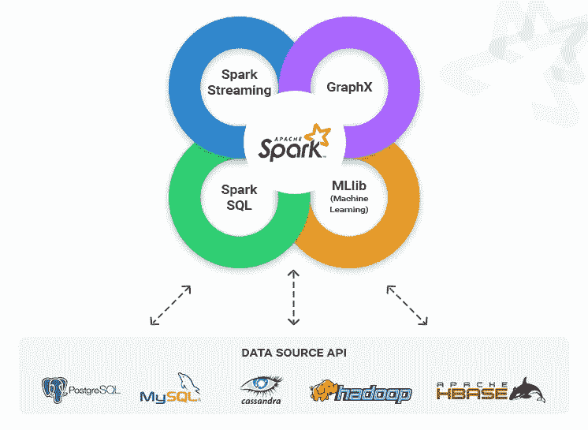

# 大数据环境

> 原文：<https://medium.datadriveninvestor.com/big-data-environment-471dfee113?source=collection_archive---------12----------------------->

现在，大数据的计算环境已经扩展到包括各种系统和网络。由于更强大的服务器的扩展，计算资源由集群为大规模计算单元提供。我们谈论的是拥有数千个数据中心的仓库大小的计算机。在本文中，将解释 MapReduce 和 Apache Spark 的框架。此外，还将讨论“扩展大数据挖掘基础设施:Twitter 体验”这篇论文，因为它很好地展示了大数据分析。

**MapReduce:大型集群上的简化数据处理**

MapReduce 是一个用于通过两个任务处理大型数据集的框架——映射和缩减。理解这个过程的一个很好的例子是做三明治。假设我们想做三种三明治——火腿三明治、火鸡三明治和意大利三明治。在 Map 阶段收集所需成分的列表。每种成分的总量在洗牌和减少阶段确定。通常，Map 中的输入数据存储在 Hadoop 文件系统(HDFS)中，Reducer 进程后的输出集存储在 HDFS 中。通常，成千上万的机器使用 MapReduce 处理万亿字节的数据。它管理数据处理细节，比如发布任务、验证任务完成情况，以及在节点之间和集群周围进行复制。大型分布中 Map 任务的并行化确保了每个记录(键值对)只被处理一次。分区器同样确保每个记录只传递给一个缩减器。Shuffle 组合来自 Map 任务的中间键和值，并将其发送到目标 Reduce 任务进行进一步处理，从而输出零个或多个键值对。在多阶段计算工作流中，Reduce 输出可能会被输入到另一个 Map 阶段，但该输出在单个 MapReduce 应用程序中是最终的。因为它使用数千台机器来帮助处理非常大的数据，所以它必须容忍机器故障。在 Hadoop 中，主进程将在 Map 任务失败后重新调度到包含输入数据副本的机器上；一项任务最多可以重新调度 4 次，直到被认为已经失败。由于清理编码很麻烦，所以在 MapReduce 中调试问题对于分布式系统来说也很麻烦。组合器是在映射之后但在混洗阶段之前的有利功能，因为它将减少混洗中的数据量和减少阶段的计算负荷。它可用于交换和关联归约操作，如 sum 或 count(例如，对一系列和求和)，但对一系列平均值求平均将会得到错误的结果。在 Hadoop 中，MapReduce 是处理的核心组件。

**阿帕奇火花**

Apache Spark 是一个开源的集群计算框架，用于大数据工作负载，如批处理应用程序、流、迭代算法和交互式查询。适用于处理网络中的实时数据和较大的数据。与 MapReduce 相比，Spark 对于一些使用内存原语的应用程序的执行速度快 100 倍，访问速度快 10 倍。星火项目的组成如下。Spark 核心和弹性分布式数据集(RDDs)是提供基本输入/输出和分布式任务的基础。rdd 是逻辑上跨机器划分的数据集合，它们可以包含任何类型的 Python、Java 或 Scala 对象。它们可以通过并行化现有集合或引用外部数据集来创建；这些转换一个例子是归约、连接、过滤和映射。DAGScheduler 对*惰性* RDD 变换操作的性能进行了优化，它使用阶段进行变换。Spark SQL 驻留在 Spark Core 之上，它引入了 SchemaRDD，这是一种新的数据抽象，支持半结构化和结构化数据。Spark Streaming 利用 Spark Core 的快速调度，以小批量接收数据，并对其执行 RDD 变换。Spark 中的另一个组件是机器学习库(MLlib)，这是一个分布式框架，运行速度比基于 Hadoop 磁盘版本的 Apache Mahout 快 9 倍。最后但并非最不重要的是 GraphX，它是一个分布式图形处理框架，为 Pregel 抽象提供了一个具有优化运行时的 APIPregel 是一个用于大规模图形处理的系统。与 rdd 一样，DataFrames 是组织到命名列中的不可变数据分布，可以过滤、分组或计算聚合，旨在更轻松地处理大型数据集。DataFrame API 可通过 Python、Java、Scale 和 r 访问。Spark SQL 是一个结构化数据处理模块，可运行 SQL 查询和 DataFrame API。Catalyst Optimizer 是 Spark SQL 的核心。因为它简化了优化技术并扩展了优化器，所以它有助于比 RDD 更快地运行查询。由于数据集是数据的分布式集合，因此数据帧是有组织的数据集，速度更快。总之，当比较 Hadoop 生态系统和 Apache Spark 时，每种类型的数据都可以使用 Spark 进行处理。性能如下:批处理、结构化数据分析、机器学习分析、交互式 SQL 分析和实时分析。优点是:速度，因为它支持流处理和交互式查询；组合，因为它涵盖并组合了不同的工作负载和处理类型，以便于工具管理；Hadoop 支持，因为它可以从 Hadoop 分布式文件系统(HDFS)或其他支持的存储系统中的任何文件创建分布式数据集。

**大数据处理的统一引擎**

随着数据量的急剧增长，单台机器已经无力处理。计算需要扩展到多个节点。远离“一刀切”的系统，一个系统，结合和功能不同的处理类型被发现。2009 年，Apache Spark 项目设计了一个用于分布式数据处理的统一系统。它可以被看作是 MapReduce 的增强版本，被用作一种称为 RDD 的数据共享结构。以前，需要单独的引擎来处理一系列分布式工作负载。现在，它们可以作为具有公共引擎的库来运行。使用统一的 API 来处理不同的任务将会提高效率。它可以避免将数据写入存储并将其传递给另一个引擎。一个很好的例子是智能手机:它结合了相机、手机和 GPS 的功能，所以我们可以使用一个设备三个功能。rdd 是通过对数据的“转换”创建的，比如 map、filter 和 groupBy，Spark 通过转换创建高效的执行计划。它的另一个有用的特性是容错，这允许 rdd 通过数据复制或检查点自动从故障中恢复。rdd 之间的依赖关系记录在 Spark 中一个名为“沿袭”的图表中。容错和 RDD 谱系图用于重建丢失或损坏的分区，因此得名弹性分区。这样可以节省时间和存储内存，而不是复制数据密集型工作负载。包括的四个主要库是 SQL 和 DataFrames、Spark Streaming、GraphX 和 MLlib。SQL 包含分析数据库的关系查询，DataFrame 包含表格数据的抽象，两者都使用编程方法进行过滤、操作列和聚合。离散化流(d Stream)是 Spark 流的基本模型，Spark 流是输入数据的 rdd 流，被分成小批。如前所述，GraphX 是一个用于图形和图形并行计算的 API，它实现了一个带有附加到顶点和边的属性的多重图。MLlib 是 Spark 的库，通过 50 多种常见的分布式数据算法，使机器学习更具可扩展性和效率。批处理通常用于大型数据集，用于将原始数据转换为结构化格式，也用于离线 ML 训练。作为数据抽象的库中的处理任务可以在应用程序中合并。由于 Spark 的广泛应用，各种不同行业的公司都在使用它。Spark 用于交互式查询、实时流处理和科学应用。它是部署在不同环境中的统一数据处理引擎。Apache Spark 库是开源的[1],可以了解更多细节。

**扩展大数据挖掘基础设施:Twitter 体验**

本文提供了大数据挖掘基础设施方面的知识，这些知识是助理教授林志颖(他从 2010 年到 2012 年在 Twitter 度过了一段很长的休假期)和 Dmitriy Ryaboy(他先是 Twitter 的技术主管，然后是基础设施的工程经理)根据他们在 Twitter 的经历撰写的。描述的两个主题是模式和异构性。首先，对于数据科学家来说，仅靠模式是不足以全面理解数据的。Scribe 是一种日志传输机制，Twitter 使用它来“以健壮、容错、分布式的方式聚合大量的流日志数据”[2]。另一个主要挑战是生产工作流程中必须集成的各种组件的异构性。正如林志颖在一次演讲[3]中提到的，数据清理和数据咀嚼占用了 80%的时间，由于这占用了数据科学家的大部分时间，他为未来的数据科学家分享了他的经验。他说，“模式是不够的！我们需要数据发现服务！”通过数据访问层(DAL)可以更容易地找到数据，而不是通过复杂的路径，DAL 是一个通过元数据知道如何访问数据的加载程序。然后，异构组件通过“管道”进行同步，因此数据运行顺畅。这些组件通过不同的通道连接在一起，并且质量必须良好以防止堵塞。成功的大数据分析平台是通过平衡速度、效率、灵活性、可扩展性、健壮性等来实现的。

[1][http://spark.apache.org/](http://spark.apache.org/)

[2]扩展大数据挖掘基础设施:Twitter 的经验——林志颖和德米特里·里亚博伊；2012 年 12 月

[3]https://www.youtube.com/watch?v=T5ZjSFnOxys 的陈述:
T3