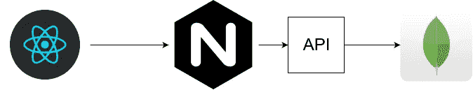
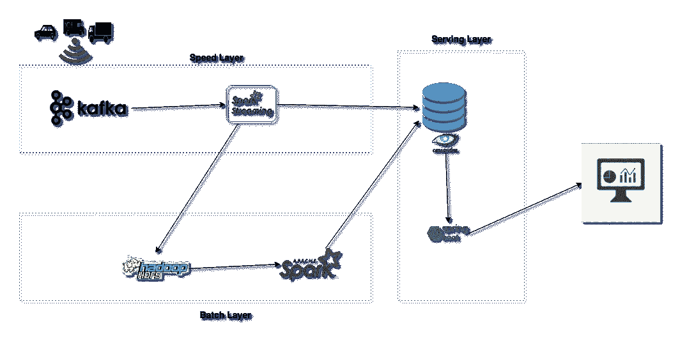
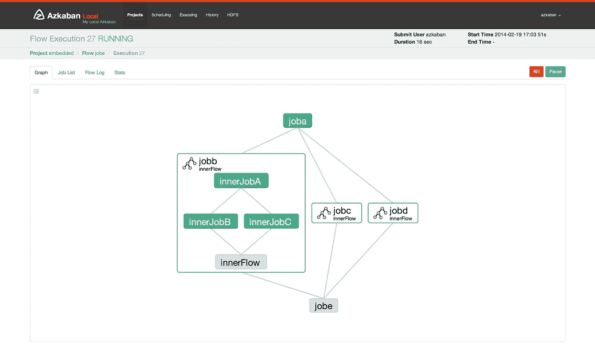

# 面向软件开发人员的大数据

> 原文：<https://medium.datadriveninvestor.com/big-data-for-software-developers-8bbdbf475b34?source=collection_archive---------7----------------------->

当你是一名软件开发人员时，你需要考虑与用户的交互和高可用性 API。这总是一个优先事项，因为内容需要为用户尽快刷新，有时你有很多用户。

我们现在就来谈谈数据工程师。他们会担心你所有的用户数据是如何被存储和访问的。不是用户，而是仪表板或数据科学家。

 [## 数据科学和软件工程哪个更有前途？数据驱动的投资者

### 大约一个月前，当我坐在咖啡馆里为一个客户开发网站时，我发现了这个女人…

www.datadriveninvestor.com](https://www.datadriveninvestor.com/2019/01/23/which-is-more-promising-data-science-or-software-engineering/) 

为了理解其中的区别，让我们从一个 Web 开发人员挑战的例子开始。想象一个网页收到成千上万的请求和架构。可能是这样的:

*   前端[向用户交互](https://reactjs.org/)应用；
*   一个带 [Nginx](https://www.nginx.com/) 缓存的 API，优化用户响应速度；
*   像 [MongoDB](https://www.nginx.com/) 这样的数据库来获取页面数据。

Traditional WEB Architecture

现在，对于数据处理，我们需要类似于 [Lambda 架构](http://lambda-architecture.net/)的东西，它支持传统 JSON APIs 无法处理的大规模数据流量。这种架构的一个例子可以在[这篇文章](https://towardsdatascience.com/lambda-architecture-how-to-build-a-big-data-pipeline-part-1-8b56075e83fe)中稍微解释一下，它的图像作为解释非常有用:

Lambda Architecture

评论该图中的组件:

*   一个速度层，数据以最快的速度从 Kafka(它就像一个非常有弹性的经纪人)那里传来，然后由像 Spark Streaming 这样的流媒体作业进行处理；
*   一个批处理层，其中数据转换速度较慢，可能需要更多时间来使用 [Spark 批处理作业](https://spark.apache.org/)进行处理，并且 [Hadoop HDFS](https://hadoop.apache.org/) 将数据存储在一个安全的复制文件系统中；
*   一个服务层，其中有一个像 [Cassandra](http://cassandra.apache.org/) 这样的数据库(主要是分布式数据库)和一个服务数据的 API 应用程序(在这种情况下是 [Spring Boot](https://spring.io/projects/spring-boot) )。

Lambda 架构具有弹性和容错能力，能够在数据到来时进行处理，而不用担心会丢失什么。它需要像[阿兹卡班](https://azkaban.github.io/)这样的指挥者来启动工作并保持流媒体系统的运行。阿兹卡班本身有 2 种 API 来制作新的作业，但是可以用[傲罗](https://github.com/globocom/auror-core) Python 项目抽象出来，定义一些作业流程。

Azkaban Flows

流程显示了流程应该采取的方向。它有一些作业，这些作业可能有其他作业依赖关系。因此，要启动作业 C，您需要完成作业 A，作业 E 需要作业 B、作业 C 和作业 D，等等……所有这些流都有时间启动，并且可以被调度为 unix cron，但是遵循 [Quartz 模式](http://www.quartz-scheduler.org/documentation/quartz-2.3.0/tutorials/crontrigger.html)。

对于大多数开始使用大数据的软件开发人员来说，这种架构非常陌生，因为不需要 API 或缓存，但您需要注意:

*   Spark 作业的执行程序的处理器和内存数量；
*   并行度级别；
*   卡夫卡主题和分区；
*   层的同步和维护(批次和速度)；
*   Hadoop HDFS 复制数量或数据块大小；
*   诸如此类…

*感谢* [*佩德罗·舒瓦特*](https://www.linkedin.com/in/pedro-schuwarte-a2b716127/) *的英语复习。厉害了老师！*