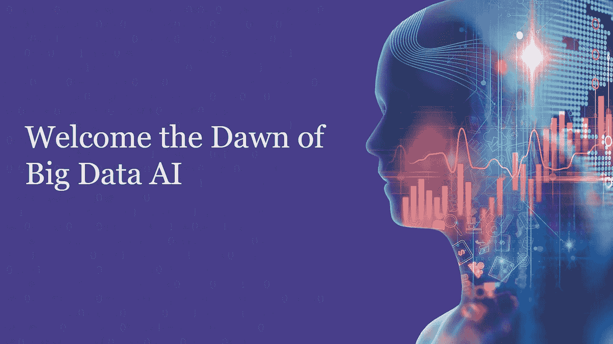

# 大数据没有死亡:让我们现在迎接大数据人工智能的黎明

> 原文：<https://medium.datadriveninvestor.com/big-data-is-not-dead-let-us-now-welcome-the-dawn-of-big-data-ai-73ab21c7d310?source=collection_archive---------10----------------------->

B ig 数据和人工智能，明天数字未来的两大块。大数据人工智能(AI)现在已经成为科技组织的开拓者，这难道不令人惊讶吗？大数据曾经是昨日黄花，但这并不意味着它已经死亡或消失。如果有什么不同的话，大数据空间只会变得更大。

在深入探讨数字革命的未来之前，我们首先需要了解所走过的旅程。

让我们回到大数据行业的历史，专注于事实。自 2005 年以来，大数据就一直存在。围绕大数据的讨论已经有一段时间了，你可能听说过“**”大数据专业人员将是最受欢迎的工作角色。这个时代就在此时此地。**

**最早记载数据用途的记录发生在 7000 年前的美索不达米亚。当会计被引入来记录庄稼和畜群的生长时，这种情况就发生了。1663 年，John Graunt 记录并研究了伦敦发生的死亡事件，发现遵循的会计原则继续改进。这是统计分析的第一次记录，约翰的观察提供了对死亡原因的深刻见解。难怪格兰特被称为统计学之父。**

** [## 为什么数据将改变投资管理|数据驱动的投资者

### 有人称之为“新石油”虽然它与黑金没有什么相似之处，但它的不断商品化…

www.datadriveninvestor.com](https://www.datadriveninvestor.com/2019/01/25/why-data-will-transform-investment-management/) 

接着是 20 世纪，1943 年，第一台数据处理机(由英国人开发)出现，它被用来破译二战期间的纳粹密码。此后，当“大数据”一词由 O'Reilly Media 的 Roger Mougalas 于 2005 年首次提出时，我们进入了 21 世纪。

随着数字化的飞速发展，我们现在正走向下一个前沿，在这个前沿，数据正以难以形容的海量产生。随着人工智能今天的到来，已经证明大数据和人工智能是未来的强大工具。

# **数据，今天赋能 AI 的燃料。怎么会？**

就交付潜在结果而言，这两种技术都扮演着重要的角色。这里有几个例子可以考虑

👉**人工智能和大数据有可能统治世界**

大数据人工智能作为一种组合赋能商业世界。毫无疑问，为什么人工智能专家**会是技术市场最需要的。这里有一个令人信服的例子。在最近的一次温布尔登网球锦标赛上，组织者向不是数百而是数千人发出了参加这一赛事的邀请。除此之外，他们还在两周内向全球数百万人直播了这一过程。现在，这种引人注目的事件需要持续的安全。**

**这就是数据发挥作用的地方——它帮助活动取得了成功，没有出现任何重大问题。**

**作为温布尔登的官方技术合作伙伴，IBM 据说自 90 年代(1990 年)以来已经收集了近 6280 万个数据点。**

**o 数据信息包括比赛照片**

**o 拍摄球员在球场上的位置。**

# ****AI 在这次活动中是如何实现的？****

**IBM 开发了一个聊天机器人，允许这些球迷获得更多关于预定比赛的信息，甚至是他们最喜欢的球员的信息。在后端，IBM 将 AI 应用于实时直播镜头，委托 AI 分析球员做出的表情。**

**根据人工智能的发现，温布尔登的代表们分析了比赛中最精彩的部分，然后就到此为止。**

**根据记录，温布尔登球场上大约有 10 个球场，从这些球场的所有视频片段中挖掘数据可能很有挑战性，也很耗时。这就是人工智能发挥重要作用的地方。**

**👉**“大数据”能否成为更有可能的“相关数据”？****

**虽然现在预测大数据人工智能崛起的结果还为时过早。然而，人工智能有可能赋予大数据权力。此外，从大数据中获益所需的时间也可以缩短。在人工智能的帮助下，用户搜索数据和从各种平台找到模式可以很容易地减少。在人工智能的帮助下，只会显示与用户最相关的数据。因此，人们可能会花更少的时间来查看数据进行分析，因为人工智能会首先投影最相关的数据。**

**话虽如此，大数据已经比人类在没有数据的情况下工作的速度快得多。但是，效率可能会提高。**

**👉**应对风险评估****

**当涉及到是否应该向客户提供保险时，公司已经进入了风险评估领域。他们需要分析并找出向客户伸出援手对品牌来说是好是坏。**

**例如，如果一家公司提出过多的索赔，它可能面临更高的风险，导致该公司支付高额保费作为赔偿。嗯，即使在 [**大数据行业**](https://www.dasca.org/world-of-big-data/article/big-data-business-model-maturity-index) 中，某些公司也会帮助做出风险评估决策。他们使用专有技术来缩短得出结论的时间，让用户在评估客户时看到数据。**

**一家名为 Cytora 的公司就是一个很好的例子，它已经在欧洲和澳大利亚市场运营。这家公司有一个内置的人工智能数据引擎，可以从新闻、文章甚至政府门户网站等多个来源收集信息。****