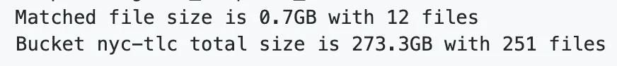
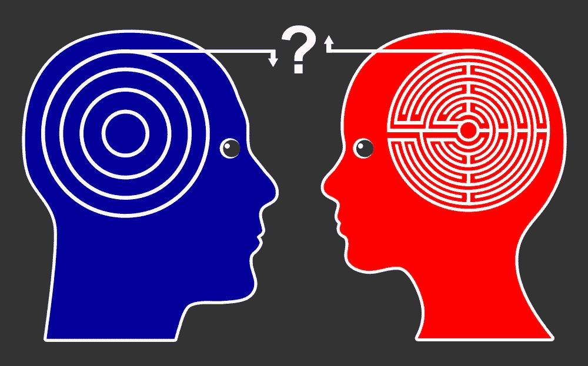

# 大数据及其大偏差问题

> 原文：<https://medium.datadriveninvestor.com/big-data-its-big-bias-problem-a7ec955abdb7?source=collection_archive---------9----------------------->

数据正日益成为管理我们周围大多数决策过程的事实上的媒介。从医疗保健到金融服务，从零售到公共决策，数据分析正在真正改变我们的生活。在过去的 9 周里，我有机会处理一些真正的“大”数据(下面附上一个样本截图，其中不包含任何图像/视频/音频)。

[Souce](https://github.com/aws-samples/aws-open-data-analytics-notebooks/tree/master/exploring-data)

我越深入，就越意识到数据驱动决策的局限性(和力量)。数据驱动假设或决策制定的根本缺陷是，收集、测量和分析数据的方式可能导致有偏见和不完整的信息，从而严重影响预期结果。比如以下节选自 ***盖茨笔记:2019 版*** 。在这篇文章中，我的目标是深入细节，强调数据收集和人工智能中的伦理和人的考虑。

> 在这开始之前你可能想喝点咖啡！！

[Source](https://www.gatesnotes.com/2019-Annual-Letter)

> **数据收集**

技术使得收集/生成数据比以往任何时候都更容易。虽然许多人认为这是一种恩惠，但事实可能证明并非如此。围绕收集数据的过程、数据的内容以及内容是否适合相关利益相关者，存在许多问题。让我们用一个例子来理解——最近，我所在的奥里萨邦遭受了一场名为[***Fani***](https://en.wikipedia.org/wiki/Cyclone_Fani)***的致命飓风的袭击。它造成了严重的破坏，导致该州几个地区停电。社交媒体成为传播信息和意识的重要工具，比如某些发电站开始运转，某些自动取款机开始工作，或者某些商店有发电机。***

然而，问题在于信息传播的不一致性。不是每个人对社交媒体的理解都一样。一些人关注了一些规定的/流行的标签，比如***【fanicycloneupdates】和#cyclonefani。但是考虑到这场灾难的性质和围绕它的不确定性，一些类似的标签开始出现——***#fanicycloneffect 和# fanicyclone。现在，如果中央政府想要分析整个社交媒体运动的爆发和传播，他们会从哪些标签开始？ ***所有的*** 应该都是你猜的。******

但是，从哪里以及如何开始呢？你会选择所有带有“旋风”和“fani”的标签吗？你怎么知道你已经覆盖了所有的标签呢？让我们假设你做到了，但是如果有人发布了关于停电或有人受伤的新闻或分享了关于停电或有人受伤的图片/视频剪辑(这在本质上往往有点严重) ***而没有*** 标签会怎么样呢？目击者的描述呢？我们如何捕捉 ***那*** 位关于那些情况的宝贵数据呢？

在这个时间点上，一个脆弱但合乎逻辑的结论可能是——那些在数据集中更明显的人最终得到了更多的帮助，但可悲的是，他们也是更有特权的人。 [***比尔和梅林达·盖茨***](https://www.gatesnotes.com/2019-Annual-Letter)*对缺乏关于妇女和女孩在健康和发展等敏感问题上的数据做了类似但更详细的描述。*

****结论:*** 如今，研究和分析中涉及的数据量相当偏向于那些了解数据收集平台复杂性的人。*

****解？*** 建立更通用的模型，以适应不同的情况。例如，记住一个地方缺水可能是由于飓风切断了该地区的电力，也可能是由于地下水位下降。不评估各种可能性就匆忙下结论是错误的。*

> ***数据消耗和算法“偏差”***

*虽然算法可以实现倡导和问责，但算法偏差可能会产生严重影响。考虑一个假设的角色和一种情况——x 先生。在批准他的汽车保险索赔之前，他的社交媒体活动将受到监控。X 先生只在他的社交媒体手柄上上传他在旅行中时速 130 公里的美好回忆，并在他的展示图片中展示一辆快速跑车的图片。现在，X 先生卷入了一场真正的事故，需要处理一项索赔。但在分析了他的社交媒体反馈后，保险公司将他的一条状态更新与他展示图片中的一辆跑车联系起来，认为他是一名鲁莽的司机，并取消了他的索赔。X 先生感到震惊，因为他没有上传关于他的轿车上的短而稳定的旅行的无数账户到他的社交媒体手柄。*

*让我们考虑另一个更相关的例子。如果你住在印度，并且是千禧一代，你可能听说过 Ola 信用卡或 Paytm 邮资已付。这些公司利用你在他们的应用上的消费模式来确定你的信用评分，并最终给你(千禧一代，没有任何信用评分的历史)后付费或类似信用卡的产品。对于我们(我是千禧一代)来说，这是一个接触金融产品的好方法，否则我们就不会有了。然而，有一个小问题——并非所有千禧一代都是活跃的会员。因此，我在这些平台上的交易都是用我父母的钱。所以在某种程度上，这些公司是在用我从父母那里拿到的钱，在他们的平台上消费，来给我分配一个信用评分。不确定是否有任何后台机制来检查这一点，但即使有，也不确定他们的指标有多准确。*

> ***趣闻:**与使用 iOS 的朋友相比，我的 Paytm 后付费余额较少，因为我是 Android 用户。我们俩都从父母那里拿钱买了那些设备。*

**

*[Source](https://2s7gjr373w3x22jf92z99mgm5w-wpengine.netdna-ssl.com/wp-content/uploads/2016/01/shutterstock_bias_Sangoiri.jpg)*

*用算法离决定不远了(口述？)在我们生活的很大一部分时间里，采取措施了解数据中代表了谁以及如何代表是至关重要的。想象一下，自动驾驶汽车被算法教会在发生事故时杀死/拯救谁。现在，如果我使用历史数据进行训练，那么总会有某些群体，比如少数民族，系统会对他们持有固有的偏见。*

****结论:*** 由于算法只知道你向它们展示了什么，所以重要的是放置检查数据中代表了谁以及如何代表的机制。*

****解？:*** 当前最先进的机器学习技术——神经网络——就像是黑匣子，即使对于开发它们的研究人员来说也是如此。虽然神经网络自动化了特征提取的过程，但我们需要更好地理解它们，这将有助于我们证明和解释它们的决定。还有很多人没有注意到的潜在的一面。今天的大多数人工智能都部署在复杂的环境中。一个模块的输出成为另一个模块的输入，如果出现问题，这将造成大量的故障排除混乱，因为您不一定知道问题是从哪里产生的。在那之前，人类和机器需要协同工作。*

*[https://cdn.technologyreview.com/v/images/ab01.gif.mp4?sw=550](https://cdn.technologyreview.com/v/images/ab01.gif.mp4?sw=550)*

> ***道德含义和用户敏感性***

*这次我们举一个真实的例子来说明这一点。2012 年《福布斯》的一篇文章中有一个爆炸性的标题，关于 ***目标*** [如何在她父亲做](https://www.forbes.com/sites/kashmirhill/2012/02/16/how-target-figured-out-a-teen-girl-was-pregnant-before-her-father-did/#206ef90c6668)之前确定一名少女的怀孕。让我们先试着理解他们为什么这样做，然后再深入研究如何做。*

*对于像塔吉特这样的零售巨头来说，营销是防止客户流失的有效策略。对于消费者来说，购买习惯会随着重大生活事件而改变——结婚或买新房后，你可能会购买更多的家具/器皿。因此，如果你是营销团队的一员，并且你能够预测到客户何时会经历一次改变人生的事件，你就可以有效地定位你的广告，赢得他们的忠诚度，也许就能离你一直想要的梦想促销更近一步。*

*现在让我们了解他们是如何做到的。他们查看了那些在他们的大量商店中有婴儿登记的妇女的数据，将这些数据与顾客人口统计数据合并，并确定了一个 25 种产品的列表，当这些产品被组合购买时，可能意味着该妇女怀孕了。更好的是，根据一个人购买的产品类型，Target 确定了怀孕的三个月，从而预测了婴儿的大致预产期。反过来，这将允许你根据到期日销售特定的产品。Andrew Pole 在[预测分析世界大会](https://www.predictiveanalyticsworld.com/dc/2010/agenda.php#day1-8a)上描述了这一点。*

*现在，合法目标没有非法违反任何隐私法。它使用内部平台上可用的客户数据，并将其与外部公开可用的数据进行匹配。事实上，你可以了解到你的客户站在法律的正确一边，但这并不意味着这在道德上是合适的。*

**

*[Source](http://faqhow.com/wp-content/uploads/2015/9/how-target-predicted-a-girls-pregnancy-before-her_1.jpg)*

****结论:*** 你*能*做到，不代表你*也应该。**

****解？:*** 试着把这个卖给营销团队的分析师，很可能你已经惹恼了他。你如何确保你不会吓跑你的客户，并利用你的员工的聪明策略？要含蓄！如果你要预测像这样敏感的事情，在你使用这些信息和与客户沟通的方式上要尽量微妙。塔吉特确实做过类似的事情。他们开始用完全不相关的东西伪装婴儿用品优惠券(从而确保顾客不会使用它们)。顾客们也喜欢使用优惠券，只要他们相信(或者塔吉特让他们相信)？)公司不知道任何隐私。*

> ***结束语***

*技术正在大步前进，并将继续前进。在这个过程中，希望它最终能让我们的生活变得更好。然而，有些事情非常重要，但却被忽视了。一是我们需要更加关注数据生成过程。随着系统开始不断学习，思考我们是如何获得数据集的就变得更加重要了——在决定收集什么、从谁那里收集、在哪里存储以及如何分析和表示它的背后是什么决定。另一件重要的事情是我们定义的 ***指标*** 。你如何衡量像谷歌这样的搜索引擎的“相关性”？你考虑花在网站上的时间和点击量吗？但是在很多情况下，这些活动不一定反映任何形式的相关性。你怎么定义客户满意度，更不用说衡量了？我们如何衡量它的差距肯定会影响某些群体。*

*我当然不是专家，但每一个挑战都是一个机会，我想提出一些意见，尽自己的绵薄之力，真正改变局面，实现双赢。*

*击掌声，👏，按钮，如果你想鼓励一个 22 岁的作家。请记住，您需要登录才能计算您的掌声。*

*— — — — — — — — — — — — — — — — —*

*这里表达的观点是我自己的，并不反映我的任何雇主的观点，无论是现在还是过去。*