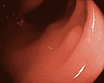
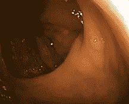
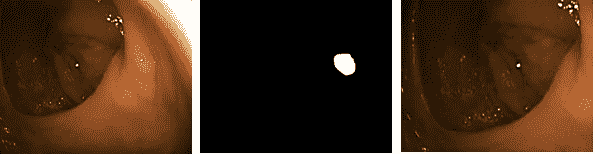
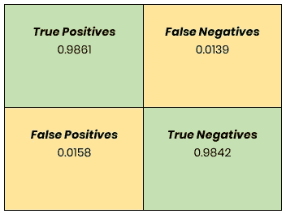

# 大数据、医学成像和人工智能

> 原文：<https://medium.datadriveninvestor.com/big-data-medical-imaging-and-artificial-intelligence-29dd5cf4a32c?source=collection_archive---------6----------------------->

(*大词折成一个项目*)

How do you take an idea from Pillow Talk and turn it into a viable product

工程师和企业家将大数据、医学成像和人工智能结合到一个项目中的情况很少见。但这正是我的遭遇。

让我给你介绍一下珊瑚虫。如果你不知道什么是息肉，那么这可能意味着你没有被怀疑有某种增长。

这是一个关于我决定如何处理这些珊瑚虫的故事，也是一个关于珊瑚虫的卧室讨论(稍后会详细介绍)如何引导我开发一个产品的故事。那么，你问息肉是什么？它们是生活在你腹部的小生物。当你读到这些文字时，它们就在那里。在某些情况下，它们会发展成恶性肿瘤，对人的健康构成威胁，最终演变成通常所说的癌症。

众所周知，世界上死亡的主要原因是癌症。癌症有多种形式，但由胃肠息肉发展而来的胃肠癌是最常见的癌症。

 [## 大笔资金和尖端技术:人工智能/人工智能投资将如何革新医疗保健…

### 在过去几年人工智能(AI)和机器学习(ML)的显著发展中…

www.datadriveninvestor.com](https://www.datadriveninvestor.com/2018/03/22/big-money-and-cutting-edge-technology-how-investment-in-ai-ml-will-revolutionize-the-healthcare-industry/) 

在这一点上，我需要公开我嫁给了一个医生。这种幸福的结合让我产生了许多想法，这些想法后来变成了产品。每天，当我妻子穿上手术服的时候，她都在和这些小生物战斗。从早上到晚上，她开始寻找它们，以防止并有希望治愈她的病人的疾病。当她回家时，我们交流我们日常生活的细节，从孩子怎么样到家里需要做什么，我们也将注意力转向改善胃肠道手术中息肉检测的方法(与你的配偶一起尝试，看看你能做到什么程度)。

任何疾病诊断的准确性都取决于医生的经验。医生也是人，人也会犯错。在我们的病例中，医生可能会遗漏息肉。息肉的错误检测可能意味着恶性肿瘤可能在患者的后期发展。

**作为一名计算机爱好者和一名连续创业者，我很快得出结论，计算机辅助息肉检测系统可以帮助降低息肉误检率，并帮助医生找到需要仔细检查的最重要区域。**

这就是为什么我开发了一个名为**夏洛克** — *的系统，能够检测胃肠息肉并帮助早期发现胃肠癌。*

在完成研究阶段并权衡可供我使用的选项后，我的出发点是将我的工作建立在这样一个假设上，即只有深度学习模型才能对我试图解决的场景产生影响。我开始收集息肉图像的大量数据集。由于我的配偶拥有该领域的知识和趋势信息的无尽来源，我很幸运，我更容易获得关于什么是息肉和什么不被认为是息肉的相关信息，以及验证我的假设所需的其他临床信息，这将引导我走向可行产品的道路。

然而，即使有大量的数据可供我处理，除了寻找息肉的基本需求之外，我也不能百分之百地清楚我在寻找什么。我了解到存在多种形式的息肉——扁平息肉、腺瘤息肉、增生息肉等等。为了简单起见，我选择寻找任何息肉，任何大小和形状，如果它类似息肉。我还考虑了我所知道的该领域一些最好的医生的临床假设，但是，这些超出了我的故事范围。

So, this is what a polyp looks like

你能认出息肉吗？

And how about this image?

说实话，息肉很难被发现。尤其是当在每秒产生 30 帧图像的视频流中观看时。我们不要忘记 GI 过程不是静态的。内窥镜一直在运动，其速度变化取决于操作内窥镜的医生。

将“大数据”融入其中。我的下一步是训练一个深度学习模型。这是如何实现的？通过向模型“输入”无限数量的图像，让模型完成其所需的任务。但是，为了在训练中取得成功，这是一个大的“秘密”，我需要准确地告诉模型我在寻找什么，以及在图像本身的哪里找到它。这个步骤的技术术语叫做 ***“物体分类”*** 这是通过注释图像来实现的。注释是手动完成的。为什么？因为如果这是一个自动的过程，这将意味着一个产品已经存在！

我最终研究了 1000 个息肉。为了支持深度学习机制，我必须为每个息肉处理至少 10 个视频帧。因为没有一个过程是相似的，我不得不与不同程度的照明、内窥镜或器官位置以及许多其他变量作斗争。我处理了超过 10，000 张需要注释的图片。原谅我的双关语，但是你明白了吗？在该领域，从学习技术的医学学生到最有经验的医生，注释都是由医生执行的。不小的成就。

下一步是开发标注工具来标记息肉。由于整个项目是关于如何发现息肉，注释必须非常准确。这是一个标记息肉遮罩的示例:

Now can you spot the polyp?

在与深度学习专家进行头脑风暴时，我偶然发现了一篇有趣的文章，描述了为 HBO 的“硅谷”计划开发的*“hot dog not hot dog”*应用程序和项目。这个项目最初是一个笑话，当时有人发明了一个应用程序，可以捕捉“热狗或不是热狗”的图像捕捉图像的人需要分享它(将它发送到服务器)并将其标记为“热狗”图像。这个项目成为深度学习模型的基础，该模型公开了热狗检测的图像。我找到了无数描述这种现象的文章。他们都得出了同样的结论。**当你用预期预测的负面背景来训练你的模型时，它会提高整体预测的准确性。**

下一步是创建背景框架。背景帧由捕获的息肉的相同位置和场景组成，但是没有息肉本身。我实际上使用各种方法从图像中取出息肉，从简单地涉及帧的重新定位，到基于图像处理技术的其他方法，使用对象的**拉普拉斯金字塔**提取方法。

an example of full annotation cycle

我开始用两个标签(“对象分类”)将上面显示的图像“馈送”到深度学习模型:“息肉”——标记图像中显示的息肉区域；整个场景都是“没有息肉”。

数据收集、数据注释和准备预处理训练算法的整个过程耗时超过 18 个月！在此期间，我观察了分类器(一个成熟的深度学习模型的名称)如何发展成为一个非常强大的工具，提供持续准确的预测。

我继续用从各种来源获得的新图像和程序来测试这个模型。这允许系统在连续的基础上被重新训练和重新测试，更重要的是增加了对预测结果的信心。最后，我能够通过提供一个在医学领域被称为**“混乱矩阵”的东西来结束我的工作**这个矩阵提供了深度学习模型测试结果的粗略描述，用模型的灵敏度和准确度解释了成功和失败点。

Confusion Matrix

这听起来可能很迷人，但最终产生一个好的算法只为我和我自己服务(以及那些晚上和我妻子的枕边谈话)。我不得不面对这样一个事实，即我在实验室条件下取得的成就需要在手术过程中实时发生，手术台上有一个病人。我需要确定我能实现息肉的自动检测。和我交谈过的大多数医生一样，我的主要顾问(我的妻子)非常怀疑，并要求我将整个过程向前推进一步。他们声称这个探测器在理论上是好的，但已经有一个虚构的侦探了。夏洛克·福尔摩斯。不知不觉中，我的妻子命名了我的下一个产品。**夏洛克。**

挑战在于将整个实验转化为可行的产品。

学到的一个主要教训是，算法的后处理计算消耗了大量的 CPU 能力，这意味着许多计算都是基于从卷积神经网络(在深度学习中，卷积神经网络(CNN，或 ConvNet)是一种深度神经网络，最常用于分析视觉图像)中导出的统计数据。我必须考虑到我正在处理视频内容，并且在手术过程中必须尽可能接近实时地检测和检查每一帧。我的主要挑战是减少 CPU 过载。

经过大量实验后，我得出结论，如果我能够降低概率和置信水平，我就能够以更快的速度生成预测区域。将置信水平降低到 80%意味着如果算法怀疑特定区域有 80%的概率是息肉，则应该标记和显示该区域。在与我手下的医疗专家交谈中，我了解到在野外条件下(即医疗检查)，这已经足够了。

进一步的工作使我增加了另一个成为产品主要部分的特性。我把它命名为**“哔哔效应”**当检测到的息肉区域出现在视频中并标记为白色或红色矩形时，由于在检查过程中操作了内窥镜(通常非常快)，这些矩形会快速闪烁。因此，如果息肉是由夏洛克发现的，并且其在屏幕上的持续时间不到一秒钟，医生将很难注意到。于是，我加了一个“哔”。提醒医生注意某一特定区域。

开发这个功能本身就是一个项目。哔哔声的时间需要微调。每次息肉概率出现时使用该特征是没有用的。我担心这会造成“狼来了”的效果。这个系统会过度保护。此外，对以前发现的息肉“哔哔”是没有用的。识别息肉和平衡哔哔声的素性是另一个项目(素性测试是一种算法，用于确定输入数字是否是质数。在其他数学领域中，它被用于密码学。与整数因式分解不同，素性测试一般不给出素因子，只说明输入数是否为素)。开发“哔哔声效应”的一个有趣的结果是，医生在听到哔哔声时，直觉上减慢了对患者的检查，对该区域进行了更彻底的扫描。这大大提高了检测率。

这项工作的成果是一个名为**“夏洛克”**的可行产品，以纪念那些与我妻子的深夜枕边细语。该系统仍在学习、检测和改进中。对我来说，这是一个激发我对大数据、深度学习(虚拟现实一览)和医学成像的热情的好方法。

以防你想知道我妻子和我是否停止了深夜枕边细语？再猜。

你知道你的舌头会讲故事吗？稍后会详细介绍。