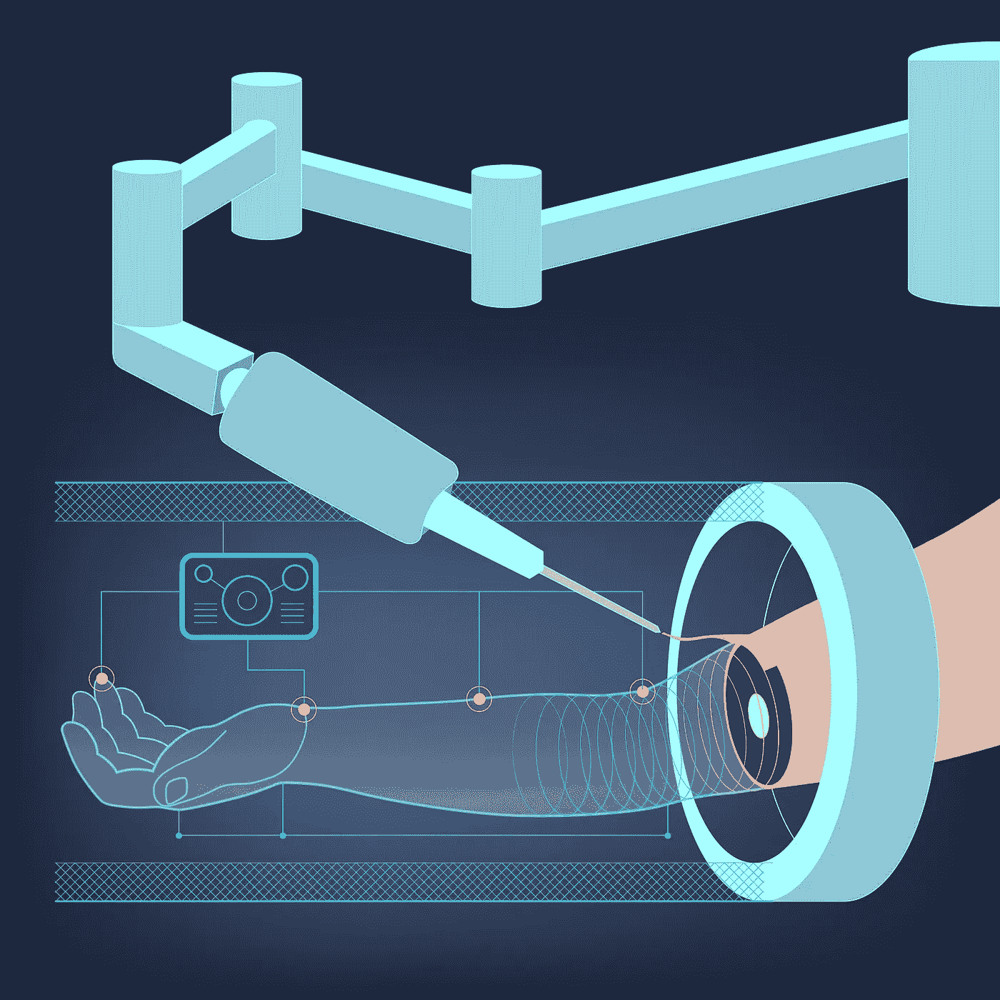
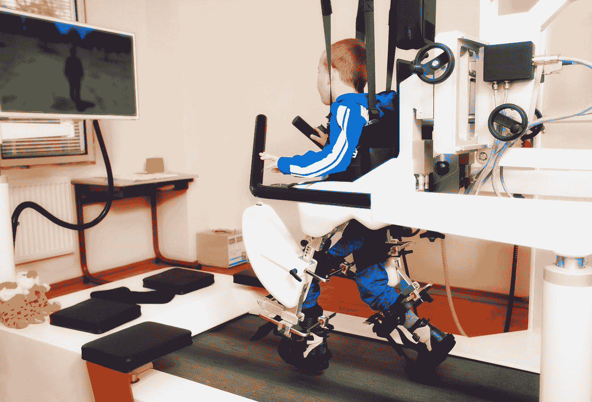

# 巨额资金和尖端技术:人工智能/人工智能投资将如何彻底改变医疗保健行业

> 原文：<https://medium.datadriveninvestor.com/big-money-and-cutting-edge-technology-how-investment-in-ai-ml-will-revolutionize-the-healthcare-b15af3163a7c?source=collection_archive---------3----------------------->

在过去几年中，人工智能(AI)和机器学习(ML)的显著发展之一是初创公司的增加，这些公司吸引了来自一些世界领先企业和个人投资者的大量资金和支持。包括谷歌、脸书和英特尔在内的有影响力的组织已经投身于 AI/ML 工具、产品和项目的开发。这凸显了人工智能(AI)和机器学习(ML)在塑造产品和服务开发和交付方式以提高生活质量方面的重要性。

人工智能是 ML 和深度学习(DL)技术的更大主体。这些成长中的技术经常被讨论和互换使用，尽管它们的应用相对来说是多种多样的。医疗保健部门一直是 AI/ML/DL 发展的主要受益者，帮助重新定义了获取、评估和提供医疗服务的方式。在经历了一段无可争议的艰难实验期(以几次错误的开始为特征)后，AI/ML 开始取得令人羡慕的进步。这次讨论提出了两个基本问题:(1)医疗保健相关的人工智能/人工智能项目投入了多少资金？(ii)这种投资和努力是否值得，它将如何帮助改善医学领域，特别是癌症治疗？

# 投资医疗保健相关的 AI/ML 相关项目。

考虑到动态性和频繁的周转，精确量化对人工智能/人工智能项目的投资并不容易。然而，对相关项目的资本注入明显增加。总部位于纽约的银行 TM Capital 表示，专注于人工智能/人工智能医疗技术的创业公司在 2017 年筹集了高达 6.9 亿美元的资金。2016 年，在与医疗保健人工智能技术相关的 90 项交易中，投资了 7.94 亿美元。自 2012 年以来，[人工智能/人工智能初创公司已经筹集了超过 50 亿美元。2012 年至 2016 年间成功完成的风险投资(VC)交易从 20 笔增加到约 70 笔，这一趋势可能会在未来几天获得势头。](https://www.axial.net/forum/ai-and-ml-are-boosting-the-healthcare-startup-scene/)

据预测，到 2020 年代中期，人工智能/人工智能医疗保健技术的投资将超过 200 亿美元。2017 年底，微软宣布了一项 350 万美元的人工智能创业公司竞赛。通过微软风险投资，这家科技巨头报告称，它已经投资了超过 40 名杰出的人工智能创新者，其中包括医疗保健初创公司 Livongo，该公司正在使用高级分析来推动慢性病管理的变革。

Deep Genomics 是一家旨在为世界带来拯救生命的基因疗法的公司，该公司于 2017 年 9 月宣布获得了 Khosla Ventures 等风投公司 1300 万美元的股权投资。

2014 年，谷歌以大约 5 亿美元的价格收购了总部位于英国的人工智能初创公司 DeepMind。通过 DeepMind Health，该公司已经[利用人工智能技术](https://techcrunch.com/2017/03/16/advances-in-ai-and-ml-are-reshaping-healthcare/)来帮助提供更快、更有效的信息，以帮助拯救生命。其首次推出的产品之一是 Streams 应用程序，如果患者的状况恶化，该应用程序可以向医疗保健提供商发送预警。虽然 [DeepMind 据报道因高额的法律费用和研究项目而损失惨重](https://qz.com/1095833/how-much-googles-deepmind-ai-research-costs-goog/)，但母公司谷歌仍然愿意探索所有选择来实现其全部潜力。谷歌的开发者关系项目经理 Malika Cantor 断言这一承诺，称人工智能和人工智能是该公司解决人类面临的最大挑战的动力的一部分。随着首席执行官 Sundar Picahi 强调谷歌的未来将基于人工智能，毫无疑问，在 AI/ML 方面的更多投资将会到来。

# 这种努力值得吗？它将如何帮助改善医学领域？

公司和个人投资者愿意在这些技术上投入大量资金，这一事实掩盖了他们所拥有的潜力。令人鼓舞的趋势进一步证实了这一点，其中大多数公司(尤其是医疗保健发展领域的公司)都是年轻的初创公司和/或大型公司的附属公司和子公司。

这些公司的一个潜在使命是，他们希望改变解决医疗保健问题和寻找解决方案的整体方法。这种以人为本的方法使得他们的努力比任何可以投资在他们身上的钱都重要。

# 令人鼓舞的里程碑。

最近，俄勒冈州立大学的研究人员能够使用深度学习技术简化乳腺癌细胞的分类。这个过程被称为基因表达数据，是癌症治疗中许多高度复杂的诊断程序之一。向前迈出了一大步。

位于旧金山的初创公司 Atomwise 正在开发旨在增强药物开发流程的超级计算机，以取代试管。在制药过程中，细胞类型、基因组合和其他生物过程的测试耗费大量时间。平均而言，药物需要 12-14 年才能完全上市。加快这一进程将提高效率和节省时间。进步。

一个中国研究小组还使用深度学习来区分良性和恶性乳腺肿瘤，在对 200 多名患者进行的手术中准确率达到 93%。癌症威胁是全世界最头疼的问题。这样的成绩简直太棒了。

# 这一切通向哪里？

人工智能/人工智能和深度学习在医学领域的优势在改革行业方面具有无限的[潜力。](https://www.techemergence.com/deep-learning-in-oncology/https:/www.techemergence.com/deep-learning-in-oncology/)从药物制造到特定和专门的任务，如成像和肿瘤学，人工智能现在是并将继续是一个重要的组成部分。抛开商业的利润方面，涉足这一领域的公司几乎一致表示，他们致力于寻找世界上一些最神秘的健康问题的解决方案。

*原载于 2018 年 3 月 22 日*[*【www.datadriveninvestor.com*](http://www.datadriveninvestor.com/2018/03/22/big-money-and-cutting-edge-technology-how-investment-in-ai-ml-will-revolutionize-the-healthcare-industry/)*。*