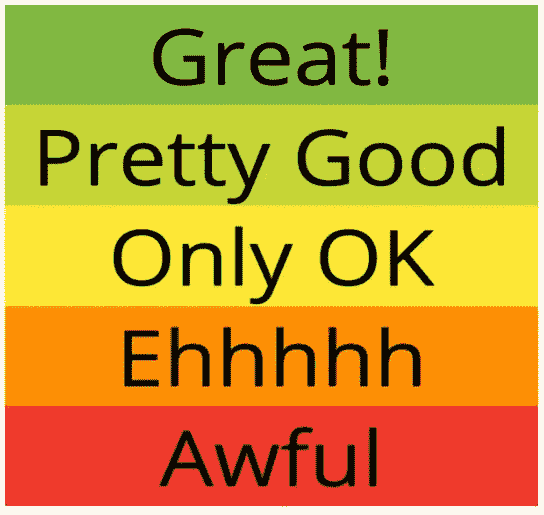
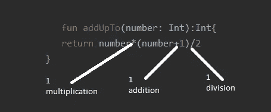
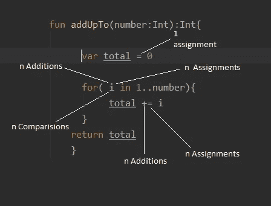
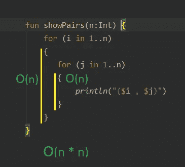
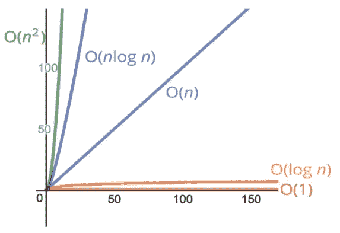
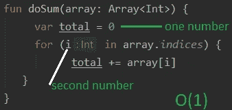
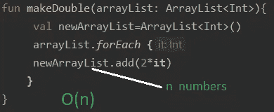

# 全局中的大(O )(算法)

> 原文：<https://medium.datadriveninvestor.com/big-o-in-a-big-picture-algorithms-ad1ebe40925b?source=collection_archive---------2----------------------->

本文通过 Kotlin 示例提供了对 big(O)符号的全面理解。


# 目标

大(O)的动机

大(O)符号？

处理大(O)表达式

了解时间和空间的复杂性

评估多种算法的时间和空间复杂性

浅谈对数

# 大 O 背后的理念是什么

> “假设我们有一个单一功能的多个实现”

假设一个问题有两种可能的解决方案。两种解决方案都运行良好。它们不仅在名称、参数、变量名或其他方面不同，而且两种解决方案在方法上完全不同。一个使用列表，另一个使用数组来完成相同的任务或使用任何结构。

[](https://www.datadriveninvestor.com/2019/03/22/the-seductive-business-logic-of-algorithms/) [## 算法诱人的商业逻辑|数据驱动的投资者

### 某些机器行为总是让我感到惊讶。我对他们从自己的成就中学习的能力感到惊讶…

www.datadriveninvestor.com](https://www.datadriveninvestor.com/2019/03/22/the-seductive-business-logic-of-algorithms/) 

我们如何确定哪一个是“最好的”？。这就是大 O 发挥作用的地方。大 O 都是这种情况。它是一个系统，或者说是一种概括代码的方式，谈论它，将代码和它的性能与其他代码进行比较。

让我们举一个更有意义的例子。 ***让我们编写一个函数，将一个字符串作为输入，并对该字符串进行反转。我给出了这个问题的两个解决方案，但是*** *我们有这个功能的许多实现，使用不同的方法来完成相同的任务。*

**解决方案 1**

```
fun reverse(str: String): String? {
    var new = ""
    for (i in str.length - 1 *downTo* 0) {
        new += str[i]
    }
    return new
}
```

这种方法是可行的，但是我们有另一种方法来完成同样的任务，比如

**解决方案 2**

```
fun reverse(str: String): String? {
    val new = StringBuilder(str.length)
    for (i in str.length - 1 *downTo* 0) {
        new.append(str[i])
    }
    return new.toString()
}
```

第二种解决方案更有效，因为它提供了对 Kotlin 中字符串不变性的更多理解，并且不像解决方案 1 那样在循环的每次迭代中构造新的 String 对象。你可以谷歌一下更多的实现。

这里的想法是，通过使用大 O 符号，我们可以给我们的代码分配通用的标签，就像这个代码片段中给出的那样。



labels to rank something

因此，我们可以用数字来表示代码的性能，而不是说代码很棒或很糟糕。*所以，这就是大 O 要给我们的，而不是颜色和文字，比如伟大和可怕*。这可能看起来涉及一点数学，但它是非常简单的。

# 我们为什么关心？

假设我让你编写一个函数，它接受一个字符串并返回它的反向副本，你得到了一个可行的解决方案。这只是一个解决方案，可能是你带来的“最佳”解决方案，但不是必需的。这取决于你的项目或你给出解决方案的背景，通常“最佳”的解决方案是你能着手工作的方案。

当我们谈论面试、技术面试、代码挑战或在一家大公司工作时，如果你要处理大量数据集，比如说数亿条数据，其中一个算法实现每次运行比另一个算法实现节省一个小时。在这一点上，性能很重要，应该有一个最佳算法或最佳解决方案。

*。应该有一种方法用精确的词汇来描述我们的代码是如何执行的。*

*。这也有利于讨论不同方法之间的权衡。*

*。当我们试着调试我们的代码时，识别在我们的应用程序中变慢、崩溃和低效的代码部分。*

*。不同的问题被问到大(O)*

# 我们的代码计时

让我们举一个有两个不同实现的函数的简单例子。**假设我们想写一个函数来计算从 1 到 N 的所有数字的和。**

我首先想到的最常见也是最简单的解决方案是创建一个总变量，从 1 开始循环..n，将每个数字相加，当循环结束时返回，就像这样

```
fun addUpTo(number:Int):Int{
    var total=0
    for(i in 1..number){
        total += i
    }
    return total
}
```

当我在我的机器上执行这个函数来累加一个很大的数( **1000000000)** 时，需要下面给出的时间**。**

**1.2469414 s**

这里是第二个函数(可能不止这两个函数)。但是我用这两个是因为它们说明了我的观点。

```
fun addUpTo(number: Int):Int{
    return number*(number+1)/2
}
```

当我在我的机器上执行第二个函数来累加相同的数( **1000000000)** 时，需要不同的时间**。**

0.0059213 年代

在第二种方法中，我们只使用一个数学公式。不需要循环，不需要总数变量来跟踪前一个总数并将其添加到下一个总数，就像在第一种方法中一样。

两者都是可行的解决方案，但哪一个更好呢？

***。*** *更快？:完成所需的时间更少*

***。*** *内存消耗少？:创建了多少个变量*

*。更简洁易读？:易读*

# 时间测量问题

*- >不同机器测量的时间不同，即使是一台机器也可以为同一功能测量不同的时间。*

*- >因此，对于超快速算法来说，速度测量可能不够精确*

*- >我们笼统地谈论哪个代码更好，而不测量它在机器上的执行时间，这就是大 O 符号发挥作用的地方。*

# 计算操作次数

正如我们上面讨论的，时间在不同的和相同的机器上是不同的。然后，我们不是计算一个解的秒数或毫秒数，因为它们是可变的，而是计算机器必须执行的简单操作的数量，因为无论我们使用哪台计算机，这些操作都是不变的。



counting operations

二次函数中有三种运算(乘、加、除),数字是多少并不重要。如果数字是 5 或者是 10 亿，那么只有三种计算在进行。



counting operations

现在，在第一个函数中有多少运算，我们对这个函数怎么说。我标记了简单的操作，如上面的代码片段所示。它不是一个静态的数字，也不像前面的函数那样是一个常数，只需要 3 次运算。那么，*我们如何概括这些运算呢？。很难统计所有的操作。因此，最小操作数可以是 2n(总变量加法和赋值)，最大操作数可以是 5n+1。我们对计算手术的确切次数不感兴趣。我们感兴趣的是了解执行时间的总体趋势，在这种情况下，当“n”改变时，操作的数量与“n”成正比。*

# 大(O)符号

大 O 符号允许概括模糊计数。这种符号提供了一种更一般地谈论算法的执行时间如何随着输入的增长而增长的方式。因此，它给出了一种方法来描述函数的输入和运行时间之间的关系，或者当输入增加时，函数的运行时间如何变化。

在大 O 符号中，我们讨论函数运行时间的上限。函数的运行时间可以在一般趋势中进行估计，因此，具有“n”个输入的函数“f”可能具有不同的运行时间，如

*。f(n)可能有线性运行时间(f(n)=n)*

*。f(n)可以有恒定的运行时间(f(n)=1)*

*。f(n)可能有二次运行时间(f(n)=n* *)*

*。f(n)可以有不同的运行时间(log n，n log n..etc)*

我们只对大趋势感兴趣(常数、线性、二次..等等)，不在细说。因此，我们的第一个涉及循环的 n 个数字相加的解决方案具有线性运行时间，因为它的循环执行 n 次，并且它可以用大 O 符号来表示，如 **"O(n)"** 随着输入的增长，函数运行时间线性增长。同一问题的第二种解法没有重复操作。因此，它的运行时间是常数，可以表示为**“O(1)”**。

让我们再举一个例子，它可以帮助我们理解大(O)符号问题。这是一个打印所有可能配对的函数，从 1 到给定的数字 n。如果 n=2，那么(1，1)，(1，2)，(2，1)，(2，2)。



function with time complexity O(n*n)

在这个函数中，我们使用了嵌套循环，这意味着在 O(n)个操作中有 O(n)个操作，因为循环执行了 n 次。如果我们试图用大 O 符号来概括这个执行运行时间趋势，我们得到 **O(n * n)** 即 **O( *n* )** 二次。这意味着随着输入的变化，运行时间以平方的速度增长。这是当输入大小改变时谈论算法效率的一种概括方式。我希望它有意义。

# 简化和评估大 O 表达式

我们已经讨论了算法的计数操作，但是计数操作很复杂，精确的计数并不重要。所以我们的第一个函数 5n+1 的大 O 符号可以简化为 O(n)。这意味着这个函数的运行时间是线性的。因此，当 n 加倍时，运算的次数也将加倍，这与 2n、5n、100n 或 500n 无关。在简化表达的同时，尽量少记一些东西。
**不要专注于常数。**T9**。** O(5n) = > O(n)
**。**O(100n)=>O(n)
O(250)表示函数每次执行时有 250 次运算，不依赖于输入大小，所以可以简化为 O(1)表示函数有恒定的运行时间，如果运行时间计为 O(27 *n* )，现在我们忽略这个常数，运行时间就变成 O( *n* )(二次)。因此，我们得到简化的表达式，如 O(1)，O(n)，O( *n* )这些符号提供了算法运行时间的一般趋势。
**不要专注于小术语**
O(n + 27)只需忽略 27，将表达式简化为 O(n)。
O(278n +105)不要注意常数和第二项值只要把它简化成 O(n)就可以了。这个表达式包含了两个 n 项。如果我们检查这个表达式，然后得出结论，表达式包含一个大项“n 的平方”( *n* )，它将显示二次总趋势。当我们谈论大项“ n 时，20n +50 与 n 的平方相比是没有意义的。现在将它简化为 O( *n* )，它展示了运行时的大画面。
**注**
- >加、减、乘、除等数学运算是常数
- >给变量赋值也是常数
- >数组元素在索引处的访问也是常数
- >循环时间复杂度是“该循环的长度”乘以“该循环内的代码复杂度”

让我们举一个例子来说明这种简化

```
fun printAtLeast7(n: Int) {
    for (i in 1..*max*(7, n)) {
        *print*(i)
    }
}
```

上面的函数打印从 1 到 7 或 n 的值。当 n 等于或小于 7 时，我们最多打印出 7。基本上我们关心当 n 增长时会发生什么，如果 n 增长，那么“输出”将依赖于“n ”, 7 将变得没有意义。所以这个函数的运行时间是 O(n ),因为随着 n 的增加，循环长度也会增加。

让我们再举一个例子

```
fun printAtMost7(n: Int) {
    for (i in 1..*min*(7, n)) {
        *print*(i)
    }
}
```

这个函数打印从 1 到 n 或 7 的值，如果我们输入 3，它会打印 1 2 3。这里需要注意的是，随着 n 的增加，当 n 大于 7 时，输出不会改变。这意味着循环长度不依赖于“n ”,并且该函数具有恒定的运行时间 O(1)。与其说运行时间是 O(7)，不如说它是 O(1)。

# 可视化总体趋势

让我们把不同的符号放在图上，试着理解它们的复杂性和趋势。



在图表中，我们可以看到 O(n)是平的，这意味着它不关心输入大小，如果我们的运行时间为 O(1 ),那就太好了。但在高级算法中很少出现时间不变的情况。现在通过向图表中的 *n* (正方形)前进，时间复杂度增加。我们可以说 O(n)比 O( *n* )要好得多。

# 让我们采取下一步，谈谈空间复杂性。

以上所有的材料都集中在一个算法的运行速度或运行时间上，这就是所谓的时间复杂度。现在讨论算法所占据的空间会发生什么。现在的问题是我们如何得到算法的空间复杂度。我们可以使用大(O)符号吗？。是的，当然，我们可以用 Big(O)来说明一个算法的空间复杂度，通过使用相同的形式语法来描述所发生的事情。

如果输入增长，假设它增长到无穷大，那么输入本身的大小也在增长，我们将忽略这一部分，只关注辅助空间。这是算法所需的空间，不包括输入占用的空间。所以，我们关心算法，关注算法内部发生的事情。
**注**
*- >原始数据类型，如 Int、Boolean、Float、double、null…等，有常量空间
- >字符串的空间是 O(n)，其中 n 表示字符串的长度
- >引用数据类型一般需要 O(n)空间，其中 n 是大小(数组)或类的字段*

让我们举个例子，计算一个函数的辅助空间



该函数有两个不同的原始类型变量，这意味着它们的空间复杂度是常数。这些变量被重新赋值多少次并不重要。这个函数的辅助空间计算为 O(1+1) == O(2) => O(1)。

***让我们考虑另一个例子***



在这个函数中，我们创建了一个新的 arrayList，我们将输入 arraylist 的每一项乘以 2，然后添加到 new arrayList 中。这里的要点是，函数体内的新数组列表的大小，取决于输入数组列表的大小。现在，这个函数的辅助空间与输入大小成正比。据此，辅助空间的输入大小将是多大或多小。所以，辅助空间是 O(n)。

# 浅谈对数

*   我们正在讨论对数，因为一些算法的运行时间或 Big(O)并不像我们上面讨论的那样简单，如 O(1)，O(n)，(n *)。
    - >有一些大 O 表达式涉及到一些比较难的数学和不太常用的表达式。*
    **日志？**所以，如果我们取 2 的某次方，那么什么次方会给我们 16。所以，2x2x2x2=16，如果我们把 2 的幂提高到 4，那么我们得到 16。
    log₂16 = 4———→2 ⁴=16
    log₂值=指数————>2ᵉˣᵖᵒⁿᵉⁿᵗ=值
    也有以 10 为底的 log，log E 但 log 2 在计算机科学中最常用。
    我们关心大局，打算省略基数 2
    比如 log ===log ₂。基数并不重要，因为如果我们比较恒定时间 O(1)和二次时间 O( *n* )和 log(n)时间的图形，那么无论 log 的基数是 2、3 还是 10，它都会给出一般趋势。对数是一种数学运算，如果没有底数，我们就不能对一个数取对数。所以我们需要 2 或 10 这样的基数。在大(O)符号中，简写就是 log。如果我们想计算 log，那么我们有经验法则。一个数的二进制对数衡量的是在我们得到一个小于或等于 1 的值之前，这个数被 2 除了多少次。
    **让我们有 10 个**
    10/2 = 5
    5/2 = 2.5
    2.5/2 = 1.25
    1.25/2 = 0.625
    我们将 10 除以 2 四次，得到一个小于 1 的值，因为我们粗略地计算了一下，所以答案是 4，但实际答案是 3.3219，它们之间没有很大的差异，它们彼此非常接近。
    **对数的复杂度**
    *- > log n 时间复杂度很大
    - >搜索算法的复杂度是对数的
    - >一些高效的排序算法也涉及对数时间复杂度。
    - >递归的空间复杂度有时涉及对数。*
    **重述**
    “大(O)可以让我们在高度抽象的层面上理解算法的时间和空间复杂度”