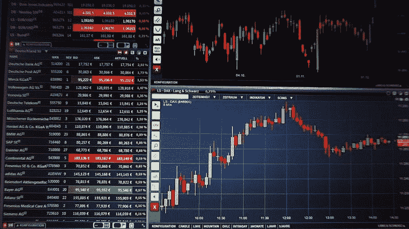
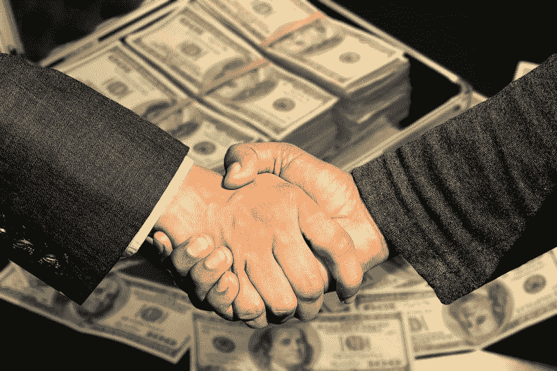
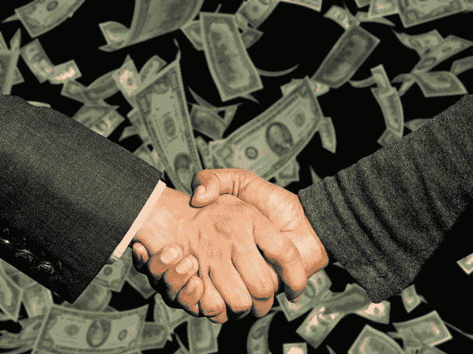
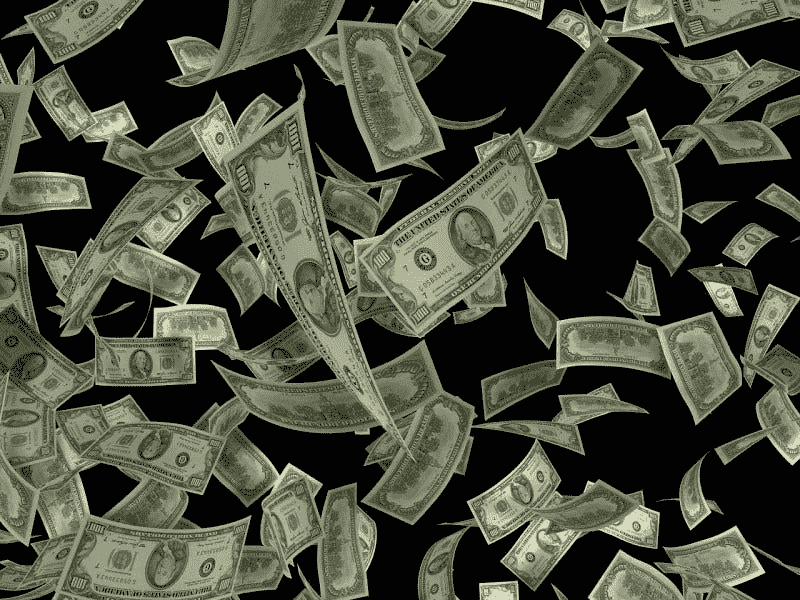
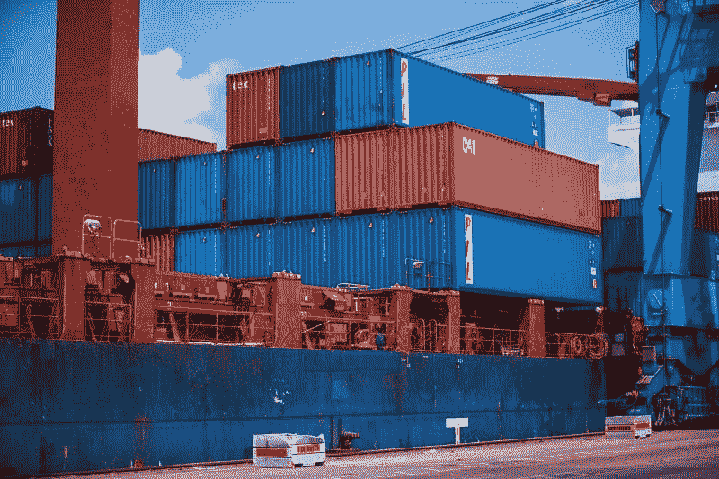
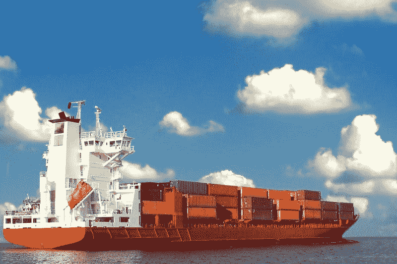
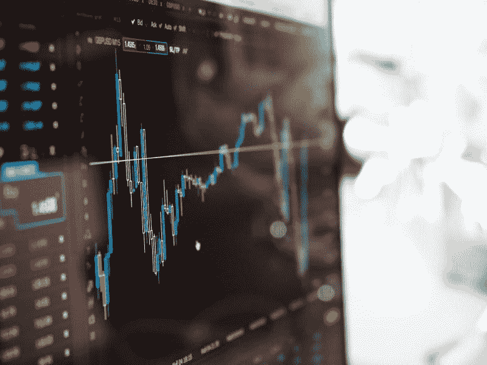

# 大空头投资者预测指数基金崩溃，可能摧毁退休账户-市场疯人院

> 原文：<https://medium.datadriveninvestor.com/big-short-investor-predicts-index-fund-meltdown-that-could-destroy-retirement-accounts-market-4a5775967aad?source=collection_archive---------9----------------------->

“大空头”投资者迈克尔·伯里预测指数基金的崩溃可能会摧毁数百万美国人的退休账户。

现在，伯里称被动投资热为泡沫，市场内幕人士 T2 报道。“通过交易所交易基金和指数基金进行被动投资的泡沫，以及资产管理公司规模过大的趋势，已经在全球范围内孤立了较小的价值型证券，”伯里告诉彭博。

 [## 算法交易的机器学习|数据驱动的投资者

### 当你的一个朋友在脸书上传你的新海滩照，平台建议给你的脸加上标签，这是…

www.datadriveninvestor.com](https://www.datadriveninvestor.com/2019/01/30/machine-learning-for-stock-market-investing/) 

# 到 2021 年，美国一半的投资资产可能是泡沫

被动投资泡沫的破裂可能是灾难性的，因为穆迪投资者服务公司估计被动基金在 2016 年控制了美国股市的 29%。

路透社[透露](https://www.reuters.com/article/us-funds-passive/index-funds-to-surpass-active-fund-assets-in-u-s-by-2024-moodys-idUSKBN15H1PN)，令人震惊的是，穆迪预测“被动投资将在 2021 年至 2024 年间超过主动市场份额”。此外，穆迪现在预测被动基金将在 2021 年超过主动基金，新闻稿[宣布](https://www.moodys.com/research/Moodys-Adoption-of-passive-investing-on-track-to-overtake-active--PBC_1165197)。

详细来说，路透社估计美国人在 2016 年投资了 5060 亿美元的被动基金。被动基金之所以受欢迎，是因为它们便宜。例如，一些基金收取 3 美元来管理高达 1 万美元的资金。

此外，路透社写道，穆迪声称，到 2024 年，被动指数投资将占美国管理投资的一半以上。因此，如果 Burry 的水晶球起作用，美国超过一半的管理资产可能会处于泡沫之中。

# 为什么你应该听迈克尔·伯利的

作家迈克尔·刘易斯因他的书《大短篇》而出名。2015 年，他们根据这本书改编了一部电影，这部电影让他们名声大振。特别是，克里斯蒂安·“蝙蝠侠”·贝尔在电影中扮演了一个虚构的投机者，从而提升了伯里的英雄形象。

据《市场内幕》报道，目前，Burry 的投资公司 Scion Asset Management 正在兜售市场先生忽视的孤立小盘股。因此，伯里正在推广本·格雷厄姆的经典价值投资策略，即购买不受重视的公司。

这些股票包括 **GameStop Corp(纽约证券交易所:GME)** 、 *Markets Insider* claims。然而，我认为 GameStop 的股票是垃圾，因为它通过实体店销售视频游戏的商业模式已经过时。

# 大空头投机者是在预测退休大灾难吗？

指数基金泡沫可能是灾难性的，因为 2017 年美国个人退休账户(IRA)中持有的 7.85 万亿美元中有很大一部分是被动投资的。具体来说，Statista [估计](https://www.statista.com/statistics/187894/traditional-ira-total-assets-in-the-us-since-2000/)2017 年美国个人退休账户有 7.85 万亿美元。

因此，Burry 预测泡沫可能会消灭数千万美国人的退休储蓄。因此，数以百万计的美国老年人会发现他们除了社会保障以外一无所有。

此外，市场疯人院[估计，2019 年 6 月，社会保障领取者平均每月领取 1471 美元，或每年 17652 美元。因此，数以百万计的美国人退休后可能生活在贫困线以上。](https://marketmadhouse.com/social-security-is-the-key-to-democratic-victory/)

# 大空头投机者的指数泡沫可能会加剧收入不平等

因此，如果伯里的被动投资泡沫破裂，美国可能会经历一场堪比 1929 年股市崩盘的经济活动崩溃。

此外，大空头 II 可能会加剧收入不平等，因为富人更有可能积极管理自己的资金。富人更有可能拥有股票和大量现金。

因此，大空头 II 可能会让富人更富，让普通美国人更穷。在政治上，受益者将是像乔·沃尔什这样的民粹主义者和像美国参议员伯尼·桑德斯(佛蒙特州共和党)、杨安泽(纽约州民主党)和美国参议员利兹·沃伦(马萨诸塞州民主党)这样的左派人士。

左派将会受益，因为他们想向富人征税来支付更多的政府福利。有趣的是，沃伦对经济崩溃的预测与伯里的预测相似。

具体来说，沃伦认为债务泡沫会随时打破普通美国人的陷阱。可以预见的是，投资媒体在奉承巴瑞的同时，也在嘲笑沃伦的警告。

# 为什么沃伦·巴菲特在囤积现金？

很明显，美国最精明的经济观察家之一；沃伦·巴菲特正在囤积现金。

具体来说，**伯克希尔哈撒韦公司(纽约证券交易所代码:BRK。B)** 在 2019 年 6 月 30 日有 1223.8 亿美元的现金和短期投资，Ycharts [估计](https://ycharts.com/companies/BRK.A/cash_on_hand)。伯克希尔的现金从 2019 年 3 月的 1141.7 亿美元和 2018 年 6 月的 1111.0 亿美元增加。

巴菲特囤积现金，以便在经济低迷时期股价便宜时收购公司。例如，伯克希尔**哈撒韦公司(纽约证券交易所代码:BRK。a)**2009 年以 260 亿美元收购了伯灵顿北圣达菲铁路公司，*《纽约时报》DealBook* [报道](https://dealbook.nytimes.com/2009/11/03/berkshire-to-buy-rest-of-burlington-northern-for-44-billion/)。

这些现金表明，巴菲特可能同意沃伦和伯里的观点，即经济崩溃迫在眉睫。然而，我不认为这次崩溃会是一次衰退；如媒体所料。

# 为什么企业会囤积现金？

令人害怕的是，沃伦叔叔并不是唯一囤积现金的大公司或亿万富翁。令人不安的是，马克·扎克伯格和 Alphabet(纳斯达克股票代码:GOOG)的一帮人也持有大量现金。

**字母表(纳斯达克股票代码:GOOGL)**；例如，截至 2019 年 6 月 30 日，该公司拥有 1210.6 亿美元的现金和短期投资。令人不安的是，前谷歌的现金持有量从 2019 年 3 月的 1134.9 亿美元增长到 2018 年 6 月的 1022.5 亿美元。

与此同时，Ycharts 估计，脸书的现金和短期投资从 2018 年 6 月的 421.3 亿美元增长到 2019 年 3 月的 452.4 亿美元，再到 2019 年 6 月的 486 亿美元。我不禁要问，为什么亿万富翁们都在囤积现金？

# 脸书和 Alphabet 如何从现金中获利

值得注意的是，Alphabet 和脸书长期以来一直用现金收购可能有利可图的困境公司。字母表；比如[在 2016 年以 16.5 亿美元收购了](https://www.nytimes.com/2006/10/09/business/09cnd-deal.html) YouTube。

与此同时，脸书在 2014 年花了 196 亿美元买下了 WhatsApp。WhatsApp 不赚钱，但 Statista 估计，2019 年 7 月，加密的 messenger 应用程序拥有 16 亿用户。此外，我认为，WhatsApp 可以成为扎克伯格的[项目 Libra](https://marketmadhouse.com/can-telegrams-ton-compete-with-facebooks-project-libra/) 加密货币计划的基础。为了解释，扎克伯格理论上可以向全球 16 亿 WhatsApp 用户分发他的 Libra 令牌。

因此，我不得不好奇 Alphabet、巴菲特和扎克伯格打算用所有这些现金买什么。此外，我还想知道崩盘会把 Alphabet、Berkshire Hathaway 和脸书的股票推到什么高度。

有趣的是，Berkshire Hathaway、Alphabet 和脸书的股票可以很好地对冲即将到来的崩盘。解释一下，这些现金充裕、积极管理的股票可以提供比 Burry 所批评的指数基金更多的保护。

# 贸易战怎么办？

奇怪的是，我不怕的一个灾难是美国和中华人民共和国之间的贸易战。

解释一下，唐纳德·j·特朗普总统(纽约州共和党)的贸易政策一直都是推文，没有行动。例如，特朗普将 2019 年 8 月 14 日对许多中国进口商品征收 10%关税的承诺推迟到 2019 年 12 月，*纽约时报* [报道](https://www.nytimes.com/2019/08/14/us/politics/china-tariffs-donald-trump.html)。我认为特朗普推迟关税是为了避免在至关重要的 2019 年假日购物季冒犯选民。

“我们在圣诞节期间这样做，以防一些关税会对美国客户产生影响，”特朗普说，然后转向他的一贯立场，补充说，“到目前为止，他们实际上没有任何影响。”因此，特朗普本人承认关税影响甚微。

值得注意的是，中国的官方政策现在是无视特朗普的贸易长篇大论，《卫报》报道。此外，我怀疑北京会忽视特朗普，直到 2020 年 11 月 3 日美国总统大选之后。

# 特朗普会如何伤害股市

然而，特朗普的行为可以通过加剧美中紧张局势来影响股市， *Vox* [观察到](https://www.vox.com/policy-and-politics/2019/8/29/20835087/trump-tweets-stock-market-china-trade-war)。在这种情况下，我认为最大的危险是市场先生对特朗普反应过度。

奇怪的是，巴菲特、扎克伯格和 Alphabet 都押注于这种过度反应。解释一下，巴菲特和其他人可能希望市场先生对特朗普压低股价反应过度。因此，他们可以趁虚而入，低价买入股票或公司。

如果特朗普加大贸易战的言论，以抵御前美国众议员乔·沃尔什(R-Illinois)的总统初选挑战，这种特朗普修正可能会发生。解释一下，沃尔什是一名国家保守派，他正在以经济民粹主义为平台挑战特朗普。

《纽约时报》作家彼得·韦纳[推测](https://www.nytimes.com/2019/08/28/opinion/joe-walsh-trump.html)，沃什特别希望吸引那些对特朗普未能履行其贸易和移民承诺感到失望的选民。因此，如果沃尔什在民意调查中表现出色，他可能会影响股市。

# 恐惧市场和大空头 II

归根结底，我认为股市处在一个有趣又危险的地方。

Burry 的观察是正确的，大量资金投入了很少有人理解的被动投资，而市场先生低估了许多公司的价值。然而，这种情况是史无前例的，没人知道当被动基金泡沫破裂时会发生什么。然而，巴菲特、扎克伯格和 Alphabet 的经理们在对冲一些东西。

只有时间才能证明像巴菲特、伯里和扎克伯格这样的反向投资者对大空头 II 的看法是否正确。然而，看着写着会很有趣。

*原载于 2019 年 8 月 30 日*[*https://marketmadhouse.com*](https://marketmadhouse.com/big-short-investor-predicts-index-fund-meltdown-that-could-destroy-retirement-accounts/)*。*