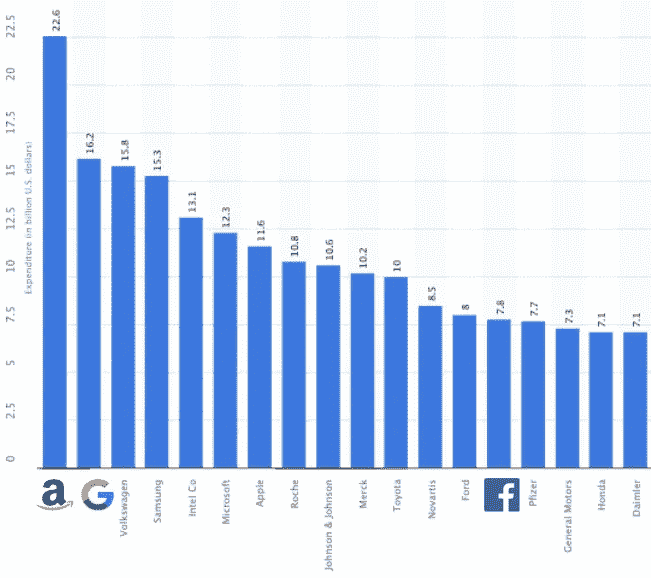
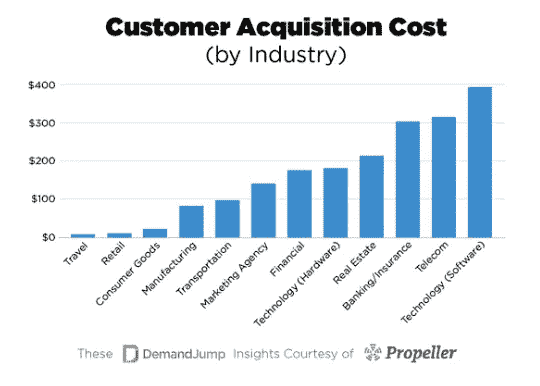
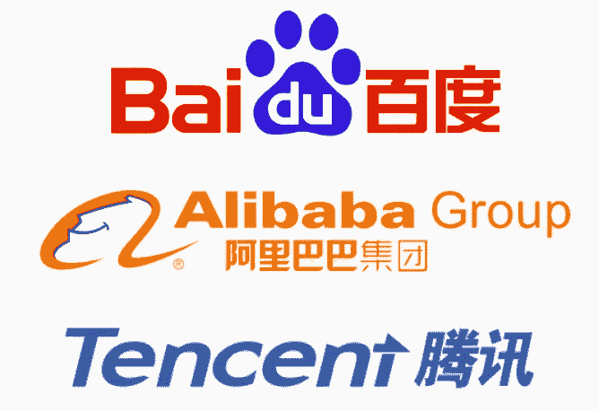

# 大科技——光明的一面

> 原文：<https://medium.datadriveninvestor.com/big-tech-the-light-side-a443f1e01dd1?source=collection_archive---------12----------------------->

Photo by [Rahul Chakraborty](https://unsplash.com/@hckmstrrahul?utm_source=medium&utm_medium=referral) on [Unsplash](https://unsplash.com?utm_source=medium&utm_medium=referral)

今天，Alphabet 股价下跌了 6%，脸书下跌了 7.5%，亚马逊下跌了 4.5%。为什么会这样？Alphabet 的谷歌搜索业务遭到了反垄断调查，投资者担心其科技兄弟也会遭遇类似的命运，这似乎是理所当然的:这则新闻引发了一场自 2016 年美国大选以来一直在激烈讨论的公共辩论，内容涉及大型科技公司的权力和反垄断立法的必要性。一场辩论，似乎几乎一致同意这些公司应该被解散。因此，从逻辑上讲，这些公司应该已经被拆分了，但它们并没有。这是为什么呢？除了“政府腐败/无能”的推理之外，实际上还存在多种真正的论点来保持大型技术的完整性，我们将在下文中对此进行探讨。

# 研究与开发(research and development)

Top R&D Spenders 2018 (Chart based off Statista)

到目前为止，2018 年 R&D 最大的支出者是亚马逊，Alphabet 位居第二，脸书勉强进入前 15 名。这是让这些占主导地位的公司保持完整的第一个理由:一个由许多小公司组成的市场，创新要少得多:每个参与者都需要专注于维持现有地位或在短期内巩固这一地位，并获得更少的市场份额，从而导致投资于创新的资源少得多。另一方面，今天的技术巨头不仅在短期内在各自的市场中处于安全的位置，而且由于他们控制的市场比例很大，他们手中有数十亿美元，这意味着他们可以负担得起在进入壁垒高和短期内盈利机会低的项目上投资(在启动这样的风险投资时)。例子包括自动驾驶汽车、高级人工智能系统和框架以及全球互联网连接。

 [## 大科技很抱歉！-数据驱动型投资者

### 大科技很抱歉。在几十年来很少为任何事情道歉之后，硅谷似乎突然开始道歉了…

www.datadriveninvestor.com](https://www.datadriveninvestor.com/2018/06/17/big-tech-is-sorry/) 

除了启动此类项目，这些公司不必担心带着此类投资匆忙进入市场并对消费者造成潜在伤害，因为它们不仅要维护形象，而且还拥有必要的资源，通过推迟进入市场直到技术成熟。最后，一个有许多小公司的竞争市场会产生这些公司通过向 R&D 投入大量资源创造的同样的“登月”技术吗？是的。与前一种情况相比，是否会花费更多时间和/或损害消费者安全？大概吧。

# 自然垄断

一般来说，当我们谈到自然垄断时，我们会想到发电厂或净水设施:垄断，政府故意保持不变，唯一的原因是让多家公司建设基础设施来运营这样的业务将是对资源的巨大浪费——想象一下，10 家公司为美国的每户家庭铺设管道，而每户家庭只有一家使用。今天的科技巨头就属于这一类:

对于一个软件公司来说，获得一个额外客户的平均成本是巨大的；将近 400 美元。请注意这些数字是整个行业的平均值，这意味着较小的公司可能花费更多，而我们在这里看到的公司由于规模经济和网络效应花费更少。这有什么关系？这些服务中的每一项之所以如此有效，恰恰是因为它有如此多的用户来训练其机器学习模型，这意味着如果这些公司被拆分，它们的服务质量将会下降，因为它们的规模较小(例如，由于脸书和 Instagram 用户不再关联，广告商的表现更差，导致这些用户喜欢什么产品的可预测性更低)，导致客户寻找替代品。由于在线平台非常容易使用，这导致市场上的每家公司(在这种情况下，包括旧技术巨头的碎片)支付上述高得令人发指的客户获取成本。这些额外的资源从哪里来，或者说，不去哪里？如上所述，进行了深入的研究和开发。拆分这些公司将导致生产力的损失和资源的高成本，这使得自然垄断诉讼看起来几乎是为它们量身定做的。

# 全球竞争

Logos courtesy of Seeklogo

脸书、谷歌和亚马逊可能是西方世界最强大的三家公司，但它们无法与世界上最大的国家中国的同行相比。百度、阿里巴巴和腾讯分别相当于 Alphabet、亚马逊和脸书。除了经营相同的业务之外，它们都有一个共同的关键特征，那就是在各自的市场中占据绝对主导地位，并在用户数量、收入和创新方面拥有相似的数字。然而，与西方的技术之王相反，中国的巨头得到了政府的大量补贴。这种差异很关键，因为它相当明显地暗示中国不打算在短期内拆分这些公司。这一点很重要，因为中国和美国的科技巨头在本土市场似乎坚不可摧，但他们在全球舞台上找到了与他们实力相匹配的对手。这意味着，如果本文中提到的任何一家公司被反垄断法削弱，它们的东方对手将控制全球市场(除了该公司的大本营美国)。尽管听起来可能有悖常理，但在这种情况下，地方垄断是保持全球竞争力的必要条件。如果美国想要认真监管其科技巨头，它最好确保与中国步调一致。

# 结论

总之，这些论点是否足以证明保持这些超级公司的完整性？还是消费者和社会的代价太高了？没有人确切知道。尽管如此，我希望这篇短文向你展示了一个被广泛讨论的话题的另一面，并有助于你找到全世界目前都在提出的难题的答案:大型技术是否太大了？

尼古拉斯

如果你喜欢这个故事，请为它鼓掌，让更多的人看到它！

*如果你喜欢这个，请给我买杯咖啡:)*

以太坊:0x 190d 71 ba 3738 f 43 DC 6075 f 5561 e 58 AC 9d 4 e 3 DFC 2

比特币:1 brucwzs 2 vnrkfmbfs 14 zqerw 74 a1 h1 ke

lite coin:lbnfojftfvcj 7 gfaautwqhithjcj 3m 8y 3v