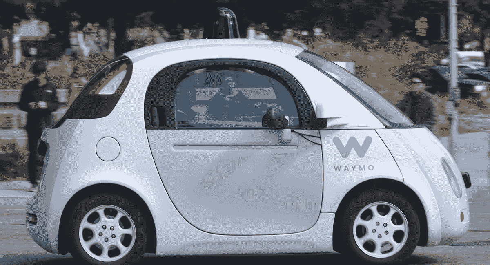

# 大型科技公司“快速行动，打破常规”的口号创造了一个新的美国阶层。我称他们为“被扰乱者”

> 原文：<https://medium.datadriveninvestor.com/big-techs-mantra-to-move-fast-and-break-things-creates-a-new-class-of-americans-215b6f20d18f?source=collection_archive---------24----------------------->

A Waymo self-driving car in traffic in Mountain View, CA. (photo credit: Wikicommons)

当[通用汽车](https://media.gm.com/media/us/en/gm/news.detail.html/content/Pages/news/us/en/2018/nov/1126-gm.html)宣布计划加入主导无人驾驶汽车市场的竞争时，我并不感到惊讶——这是一个大胆的举动，不仅将重新调整其生产，还将在北美削减多达 14，000 个工作岗位。

像许多人一样，我长期以来一直在思考这一不可阻挡的趋势的排列和后果，让我的头脑想象未来变革的巨大范围，尤其是谁知道有多少工人会普遍失业。

抛开痛苦的失业不谈，通用汽车还面临着来自硅谷初创公司的激烈竞争——这并不奇怪，比如 Alphabet、苹果、优步和科技巨星埃隆·马斯克(Elon Musk)的创意产品特斯拉。

虽然一些汽车公司已经在半自动驾驶汽车上投入了一些资源，但根据最近发表在《The Drive，[上的一篇报道，与硅谷](http://www.thedrive.com/tech/20408/wait-who-even-asked-for-)近乎强迫症般的“快速移动和打破东西”的需求相比，它们的移动速度非常缓慢

扰乱，扰乱，扰乱。

鉴于脸书和谷歌最近的争议，很明显，扎克伯格等人不仅坚持这一口号，而且自豪地——毫不谦虚地——把它像徽章一样佩戴，后果自负！

*(见我关于全能算法的有害影响的长篇文章* [*此处*](https://medium.com/datadriveninvestor/algorithms-bots-are-here-there-everywhere-7861934193bf) *)*

好吧，回到地球上，大多数人生活简朴，但对我们其他人来说，情况正在发生巨大的变化。

也就是说，不是白人，不是男人，年龄不在 20 到 35 岁之间，不在电脑屏幕前生活，也不建造用最新技术装饰的“智能”住宅的人。

要知道，即将失业的 14000 名通用汽车员工中的大多数(公平地说，据通用汽车称，白领员工也将被扫地出门)。

我喜欢把那些首当其冲的大型科技公司的自私和虚伪的创新称为“被破坏的”

俱乐部成员包括当地报纸、出租车司机、实体书店、工厂工人、黑人、妇女、中年专业人士，还有，恐怕我忘了，那个叫做美国民主的东西。