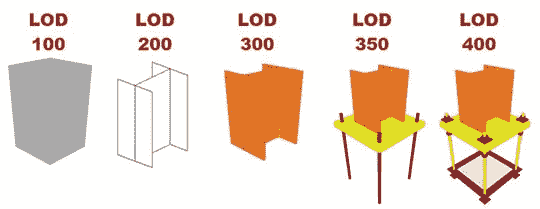
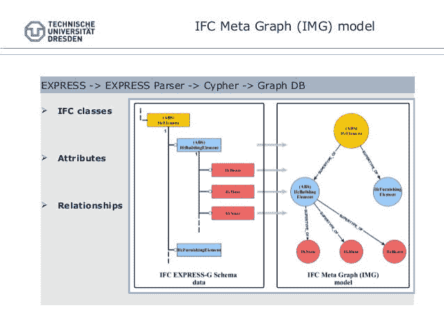
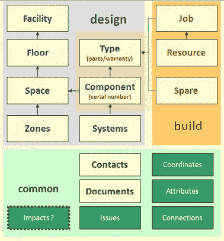
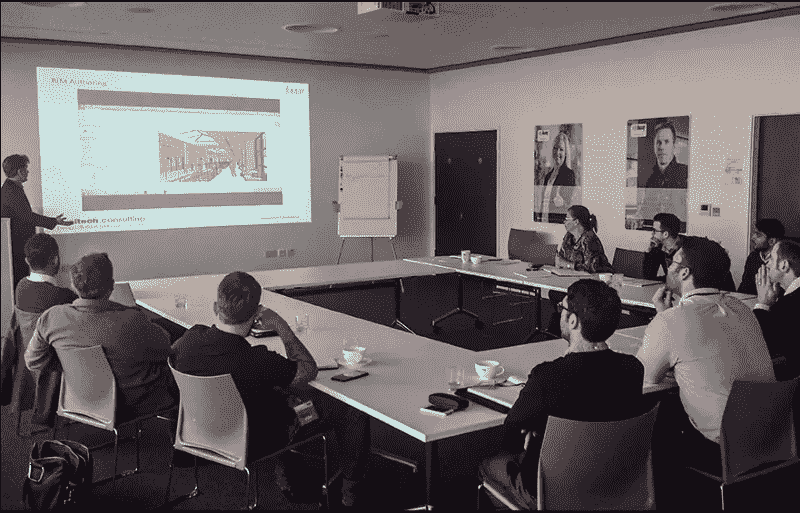
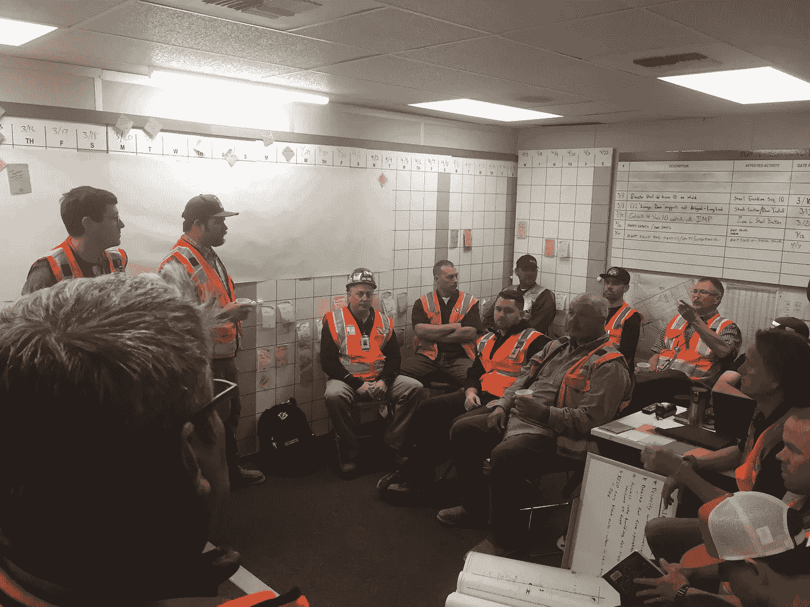

# BIM:好，坏还是丑？

> 原文：<https://medium.datadriveninvestor.com/bim-fa4e0be6584e?source=collection_archive---------1----------------------->

今天我将和你谈谈在建筑领域非常流行的 BIM(建筑信息模型)。BIM 只是一种工具，您可以使用它来数字化 3D 模型的施工数据。

人们普遍关注 BIM 的建模方面。但是这个概念的关键部分是“信息”。由于错误的方法，建模细节似乎是一个质量尺度。但是越详细的模型通常越让设施经理和项目经理头疼。

> BIM 中过多的细节可能是个坏主意。

# 我们如何为我们的项目找到最佳的 LOD？

这直接关系到你的目标。因此，BIM 执行计划(BEP)至关重要。你必须决定你的 KPI(关键绩效指标)。但是对于设施管理，不需要很高的 LOD。另一方面，对于预制构件，您可能需要较高的 LOD。所以不要强迫设计团队建模高 LOD 对象。你应该明白哪个细节适合你的项目。

另一方面，项目经理、成本经理、计划经理应该在一开始就决定不同的模型需求。如果承包商管理分包商，重要的是基于位置的进度管理，而不是实施细节。

此外，您应该记住建模是一个持续的过程。你不能用 LOD 规范解决你的问题。您应该为 BIM 流程创建适当的工作流程。

总之，不要沉迷于 LOD，尝试理解项目需求。在 BIM 对象中使用正确的属性、有效的标记、正确的族和系统命名惯例对于 BIM 项目的成功更为重要。

# 数据在哪里？

您已经听说过 IFC 和 COBie，它们是 BIM 的输出。问题是你将如何在你的项目管理中使用这个输出。

首先，这些输出与您加载模型的数据直接相关。因此，您可以在不同的施工阶段检查您的数据需求。所有 ifc 和 COBie 方案组织您的 BIM 数据。但是你应该有效地使用这些数据。您应该使用不同的工具检查 BIM 数据。此外，数据应该用于特定的目标，如能源分析、数量计算或设施管理。

下图显示了 COBie 属性关系。你可以把这个数据源想象成一堆 excel 表格。因此，您需要理解数据模式，并且您已经为数据管理开发了项目路线图。从这个角度来看，你可以把 BIM 看成一个数据管理问题。

几何图形很重要，但 BIM 的关键力量是面向对象的数据管理功能。因此，不要只关注视图，开始考虑如何管理项目目标的 BIM 数据。

但是请记住，BIM 不是魔法。因此，如果您的设计团队不创建数据，BIM 就不能作为一种工具来改变流程。如果您想在设施管理阶段使用保修信息，该数据应作为属性上传至 BIM。

> BIM 改变不了流程，你得改变心态。

# BIM 贵！

这只是你的观点。如果你从小处着手，有明确的目标，BIM 可以降低你的项目成本。但是，如果您的项目中没有适当的工作流程，BIM 可能只是浪费您的时间和金钱。

> 不要多，可以少拿。

有公司，他们希望 LOD 500 模型，4D，5D 和 6D 实施他们的项目。但是，当您开始询问他们的需求时，使用 LOD 300 模型进行碰撞检测可能是一个良好的开端。因为他们没有 4D、5D 和 6D 实施的流程和数据。LOD 500 模型对他们的项目没有任何贡献，它只是额外的建模工时。

公司应该知道自己的问题。如果机械系统在项目中如此复杂，那么与结构系统的冲突检测将是有价值的。但是对于一个标准的住宅项目来说，就不会那么关键了。

或者您的施工时间有限，那么 4D BIM 模拟可以在您的项目中发挥作用。在这种情况下，您应该使用适当的标记创建一个位置系统，以将模型链接到详细的明细表。

或者设施管理对您的项目至关重要。在这种情况下，您应该研究如何在设计和施工阶段创建与 FM 相关的数据。

> 你应该知道你的项目的问题。你应该知道如何利用 BIM 来解决那些问题。

“BIM 贵吗？”如果不做任何计算，就不需要计算器。但这并不意味着没有人需要计算器。所以，如果没有合适的流程和数据管理策略，就不需要 BIM。但这并不意味着你走在通往长期成功的正确道路上。

# 协调是关键

你听说了 BIM 会议。在一个有大屏幕显示器的房间里，不同的当事人在模型上谈论项目细节。

当然，这是一种很好的协调方式。而 BIM 给了一个重要的优势来谈视觉细节。但关键的是会议室里人们的态度。房间里的人应该是他们学科的决策者，他们应该了解如何使用 BIM 工具。在会议中进行所有的协调是不可能的。所以 BIM 团队应该通过在线协调来解决问题。这种类型的会议可能只是为了解决关键问题。在精益建造实践中，人们在不使用任何技术的情况下开会，如下图所示。

所以，BIM 的确是一个有效的工具。但是首先，施工团队应该学习如何满足协调最佳实践。

> 交谈对协调至关重要。所以，如果你想有效地使用 BIM，人们应该开始谈论模型。要做到这一点，你需要的不仅仅是模型，你还需要可理解的数据流。

# 过时的模型比“没有模型”更糟糕

模型应该实时更新。落后的模式会造成项目的时间和金钱损失。

> 这个模型应该是唯一的真实来源。

因此，建模活动应该在第一步就与设计活动集成在一起。不要等待 BIM 活动。BIM 应该是设计、施工和设施管理活动的中央数据库。如果你把 BIM 定位为支撑系统，很不幸，它会成为你项目的成本中心。

> 人们应该看到模型并讨论问题。

检查模型的最好方法不是模型检查器。如果各方都能达成模型，他们就开始对模型进行评论，这个过程将是最好的质量检查。此外，在轻松获得模型数据后，人们开始寻找使用模型的方法。

> 向模型提出正确的问题。

人们应该知道如何使用模型。这个模型可以提供很多关于这个项目的信息。但是你应该问正确的问题。您可以向 BIM 询问材料的数量，答案会让您的生活更轻松。但是如果你开始问关于非图形数据的问题，最好的方法是在一开始就创建数据标准。你想了解门的防火等级，但是如果你没有足够的防火等级信息，BIM 无法回答你的问题。

# 位置-对象-数据

如果使用位置、对象和数据之间的关系，就可以更有效地使用模型。

二楼有几扇门？

门= >对象，二楼= >位置

二楼有多少扇门将在未来两周内安装？

门= >对象，二楼= >地点，安装日期= >数据

当您向 BIM 模型提问时，请始终注意位置、对象和数据关系。

# BIM 是英雄吗？

BIM 可以成为英雄，如果你有合适的条件。否则，BIM 会成为你的噩梦和成本中心。因此，试着理解你的项目的问题，并设计你的最佳实践。

我们作为 [Botmore Technology](http://botmore.co.uk) 可以在 BIM 之旅中为您提供帮助。详情请联系我们。

点击下面的链接，安排与 [**艾登·费夫齐·奥兹切克**](https://app.ddichat.com/experts/aydin-fevzi-ozcekic) 的 DDIChat 会议。

 [## 艾登·费夫齐·奥兹切基奇-迪迪恰特

### 我在业务开发、技术策略创建、软件开发领域有 15 年的经验。我…

app.ddichat.com](https://app.ddichat.com/experts/aydin-fevzi-ozcekic) 

在这里申请成为 DDIChat 专家。
与 DDI 合作:[https://datadriveninvestor.com/collaborate](https://datadriveninvestor.com/collaborate)
点击此处订阅 DDIntel [。](https://ddintel.datadriveninvestor.com/)