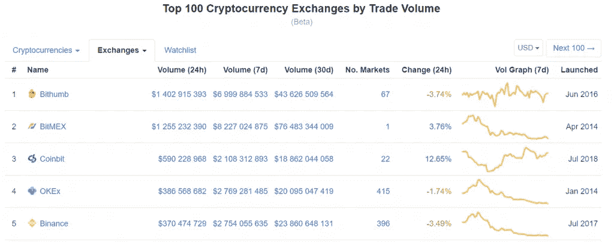
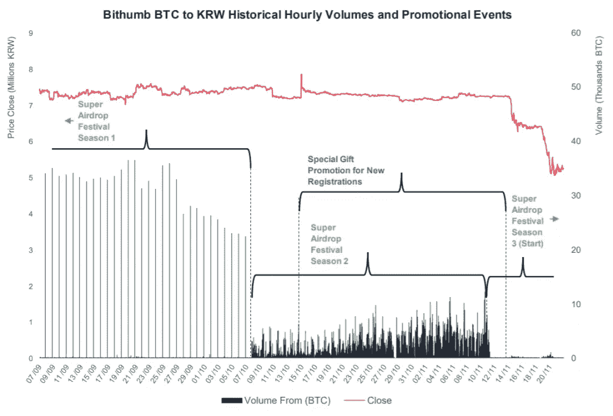
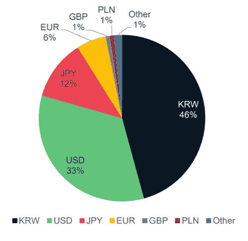
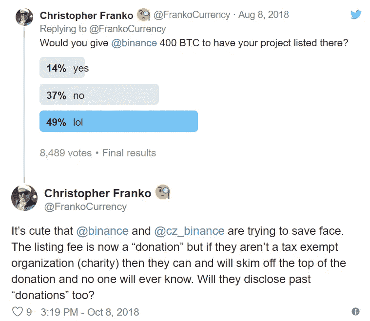

# 币安的领导地位受到质疑

> 原文：<https://medium.datadriveninvestor.com/binance-leadership-is-under-question-ad5330a7f338?source=collection_archive---------38----------------------->

现在很难相信币安成立于 2017 年，因为在很短的时间内，赵昌鹏的孩子成功地成为了世界上日交易量最大的加密交易所，并成功地保持了这一地位直到最近。根据 CryptoCompare 的[报告](https://www.cryptocompare.com/media/35308846/cryptocompare_exchange_review_2018_11.pdf)，Bithumb 的交易量超过了币安，在 11 月达到了 124 亿美元，而马耳他交易所的交易量为 6 . 41 亿美元。

如果我们看看[另一个流行的统计资源](https://coinmarketcap.com/rankings/exchanges/reported/)，现在不仅 Bithumb 超过了币安，而且其他交易所如 BitMEX、Coinbit 和 OKEx 也超过了他们报告的交易量。即使根据调整后的成交量指标来判断，OKEx 也将币安甩在了后面。因此，考虑到币安一直在不断推出新的发展，自然会出现以下问题:是什么原因使币安离开其王位，这种情况是否是暂时的，以及现有的统计数据实际反映了多少真实情况。

关于上述报告，与 9 月/10 月指标相比，Bithumb 的交易量增长了 284%,这主要是由于其被 BK 财团收购，这意味着向交易所投入了额外的资金，从而使其能够举办一系列空投比赛和抽奖活动，提供不同的折扣和促销活动，以激励用户(包括非韩国人)注册交易所并实施转费挖掘，鼓励用户更积极地交易以获得奖励。此外，该交易所正在制定与客户互动的不同机制，比如让客户有机会投票选择他们希望上市的股票。

从上面的图表可以看出，这些营销工具非常有效，因为它们不仅在 Bithumb 上创造了其他交易所中最高的交易活跃度，还使韩元成为 BTC 现货交易中最受欢迎的法币。

我们的专家 Seth LIM 是一家新加坡区块链公司的创始人，他认为，鼓励交易者进行更多交易的激励措施，如暂时降低交易费用，甚至是向交易量最大的交易者赠送特斯拉 Model S(一度由 Kucoin 持有),可以导致顶级交易所排名的变化，但这些变化是暂时的。*“在我看来，OKEx 是币安最强有力的竞争对手，因为 OKEx 的保证金交易选项“*，”我们的专家继续说道:*“保证金交易是一种更高级的交易选项，允许交易者用从 OKEx 借入的资金下单购买可用的数字资产，与现货交易相比，增加了杠杆或购买力”。*

除了保证金和杠杆的现货交易，OKEx 还在开发其衍生品。该交易所已经拥有自己的期货期权，最近推出了一个永久掉期，使用户能够推测加密货币的价格方向，这对交易者来说是一个有吸引力的机会，特别是在当前高度波动的市场条件下。从概念上讲，它类似于期货合约，只是它没有到期日，而结算是在每天的基础上进行的，这使得用户可以快速得分。

这种产品的多样化，加上对越南盾的支持和在美国 20 多个州的业务扩张，不能不吸引新客户到 OKEx，这可能是它超过币安的一个原因。然而，另一位专家 **Hussain ABOAZIZ** ，一家区块链支付平台的品牌大使，声称除了现货交易外，OKEx 还在其报告的交易量中计算其期货和滑点被动订单的交易，并没有向*“任何人重新计算”*提供数据来源，因此将它的表现与币安进行比较没有意义:*“交易所通过不同的方法计算每日交易量，这些方法并不可靠”。*此外，今年早些时候，当 OKEx 被评为交易量排名第一的交易所时，它已经被[指控](https://medium.com/@sylvainartplayribes/chasing-fake-volume-a-crypto-plague-ea1a3c1e0b5e)捏造了 93%的交易量。

*“大多数加密货币排名/跟踪网站，如 Coinmarketcap、MyToken、CoinGecko，使用一种通过加密交易所 API 的方法来报告每种交易的加密货币的最后价格和 24 小时交易量。然而，Seth LIM 指出，交易所运营商完全有责任坚持道德标准，通过他们的 API "*"提供每日交易量的准确快照。该专家坚持认为，数据准确性问题可以简单地通过在跟踪 API 中实现算法来验证所报告数据的真实性来解决，因为这只是纯粹的统计:*“例如，使用交易算法的 API 可以忽略每天交易少于 50 笔买卖订单的加密货币对的交易量。另一个例子是检测算法，以防止交易机器人建立假量。当太多的买入/卖出订单在短时间内具有相似的规模范围时，将触发检测“*”，我们的演讲者建议。

币安也因虚假交易量而受到调查，但在该案中没有发现可疑活动，这可能表明该交易所的透明报告，因此在市场悲观情绪加剧的情况下，其交易量出现了相当自然的下降。但是，除了竞争对手变强，市场整体下行之外，它的表现更差还有其他原因吗？

**Hussain ABOAZIZ** 提到最近关于币安清单费用的传言:*“他们列出任何能支付费用的项目，不管项目好不好”。在 8 月份向交易所提交上市申请后，区块链 platform Expanse 的联合创始人 Christopher FRANKO 被告知将收取 400 BTC 的费用，据他所说，当时相当于 260 万美元。随后，币安[宣布](https://medium.com/binanceexchange/binance-listing-fee-update-d512982722ce)该公司将不再规定费用金额，也不再规定最低费用，所有上市费用都将被称为捐款，并被转移到慈善组织，尽管主要是转移到其自己的区块链慈善基金会，该基金会使该公司有机会从其内部慈善部门返还资金。*

考虑到币安已经上市了超过 160 种硬币，如果他们有足够的钱，运营商也有可能接受 shitcoins，这可能会破坏用户对交易所的信任。

研究和分析公司 Weiss Ratings 最近的批评性评估也影响了币安的受欢迎程度，因为它认为该交易所不适合机构投资者，而币安正努力通过其新的子账户功能吸引这些投资者。分析人士坚持认为，该交易所不符合机构评级标准，因为它的运营尚未经过任何审计机构的审查。尽管币安搬到了马耳他，而且今年秋天早些时候[的新法律](https://bitnewstoday.com/news/regulation/in-pursuit-of-another-billion-three-new-bills-will-fulfill-the-maltese-dream/)开始生效，要求区块链的项目通过审计并获得许可，但政府可能会为币安在岛上工作创造最有利的条件，从而推动马耳他进一步发展成为区块链的国际中心。

这些问题以及加密交易所之间的整体竞争日益加剧(这始终是行业发展的良好迹象)，可能是币安落后一点的原因，尽管仍然缺乏准确评估运营商业绩的工具，因此在权力分配方面领先地位可能不是很明显。

在这里阅读最好的加密新闻分析！【bitnewstoday.com】T4 比特币、投资、监管和其他加密货币

*原载于*[*bitnewstoday.com*](https://bitnewstoday.com/news/binance-leadership-is-under-question/)*。*