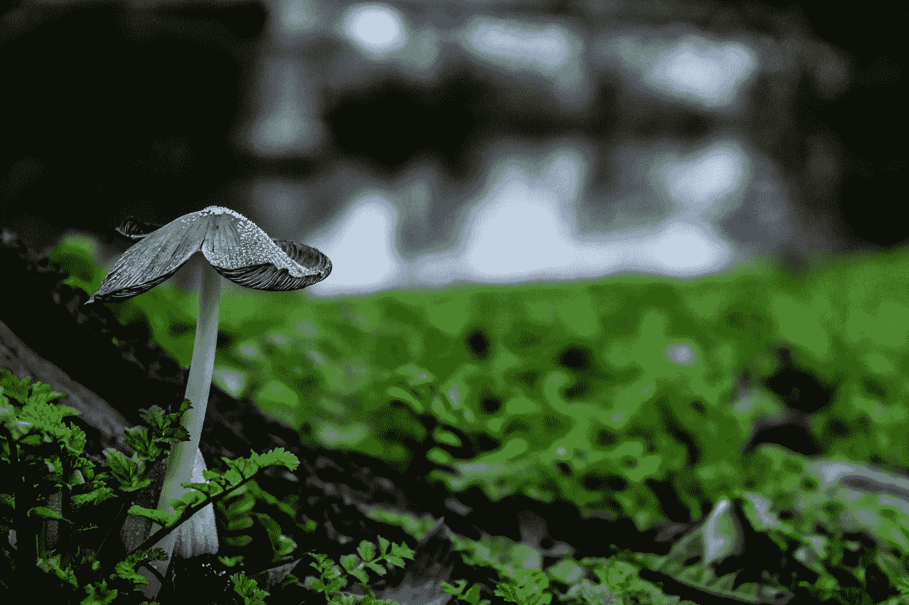

# 仿生与信息技术

> 原文：<https://medium.datadriveninvestor.com/biomimicry-and-information-technology-f93027852fe4?source=collection_archive---------11----------------------->

在[仿生学](https://youtu.be/sf4oW8OtaPY)中，我们讲述了生命拥有 38 亿年研发经验的故事。纵观地球的历史，生物进化出了有助于其物种繁衍的特性。为了说明丰富的进化历史，我们用一个日历年的[类比。想象一下我们的星球在 1 月 1 日和今天的午夜，新年前夕形成。生命第一次出现在二月底。多种因素的结合启动了一个物质和能量的正反馈循环，反复重新安排物质。正如我们所知，它导致了地球上生命的多样性，以及 99.9%以上的其他生物已经灭绝；他们的新兴设计在我们地球的条件下是不可持续的。进化也给人类带来了创造力和文化，在我们历史上的地球日历年的最后两秒钟，导致了工业革命。当前的经济带来了许多好处，但我们也正经历着它们设计中的重大缺陷，对我们所依赖的生态系统的](https://biomimicry.net/earths-calendar-year-4-5-billion-years-compressed-into-12-months/)[结构性破坏](https://www.footprintnetwork.org/resources/data/)、破坏性的气候变化[以及不可持续的不平等。我们需要改进文明的设计，仿生学和信息技术(IT)的最新发展(如数据科学、人工智能、区块链和物联网)的结合正在为此做出贡献。](https://www.ipcc.ch/sr15/chapter/summary-for-policy-makers/)

Photo by [Rots Marie-Hélène](https://unsplash.com/@machestla?utm_source=medium&utm_medium=referral) on [Unsplash](https://unsplash.com?utm_source=medium&utm_medium=referral)

# 人类设计与生态系统相结合

仿生学一直影响着从建筑到产品设计和社会创新的设计。我们可以从形状(从宏观到纳米尺度)、过程(物理和化学)和生态系统(不同参与者的涌现属性)中学习。虽然来自自然的灵感与智人一样古老，但在仿生领域，我们刻意追求可持续的设计，并通过将它们的表现与自然解决方案进行比较来评估它们。它允许我们设计，以便我们可以更好地与生态系统融合；滋养和保护它们，同时照顾我们的需求。我们看到，一旦人们意识到可以在生物学中找到复杂的解决方案，他们对自然的态度就会完全改变。这些例子我们不仅可以了解，还可以借鉴。应用来自动物、植物、真菌和所有其他生命形式的最佳实践，正在改善我们利用物质和能量的方式，使我们受益，同时不减少其他生命繁荣的条件。

# 它连接生态系统和经济

信息技术中加速社会变革的补充发展是一些更新的技术，它们从根本上增强了我们在数字世界中的能力。区块链允许我们以全新的方式执行和记录交易，甚至创建数字自治组织。物联网通过从物理世界收集越来越多的数据，使我们能够与我们的环境联系起来。人工智能让我们能够处理比我们能够处理的更多的数据，并将帮助我们做出决定和采取行动，因为我们设计了取代平凡劳动的数字代理或支持更具创造性的人类任务的助理。它可以以数字形式实现，如机器人流程自动化，也可以以物理形式实现，如无人机和机器人，它们可以在我们共享的物理世界中行动。我们已经看到生态系统成为保护它们的法律实体，现在它可以使它们以数字方式连接到我们的经济，决定如何保护自己，甚至通过雇用人。

# 促进全球进步的生物启发软件？

我们可以用这些方法来创造不平衡经济的更好版本，或者完全重塑社会。已经有很多研究自然算法甚至商业应用的例子。我的目标是探索仿生学和最新信息技术之间的互利共生。我喜欢与企业家交流，探索如何将无人机和人工智能用于森林保护或仿生解决方案，将区块链用于气候适应性农业。请分享你的例子，问题和建议。

接下来，我将探索我们称之为生命原则的自然深层模式如何应用于评估我们的社会，作为一套完整的指标，而不是像 GDP 增长这样的经济指标。

[*@ Codrin*](https://twitter.com/codrin)*[*krui jne*](https://www.linkedin.com/in/codrinkruijne/)*学的是信息科学，一直在刺激#社会和#可持续#创业，通过#仿生促进自然#创新。他加入了 Transfer Solutions，帮助公司创建实用的#人工智能解决方案。此外，他还探讨了如何应用来自#nature 的见解来改进 IT 设计，以及如何利用#IT (#AI、#ML、#IoT、#Blockchain)来培育生态系统。**