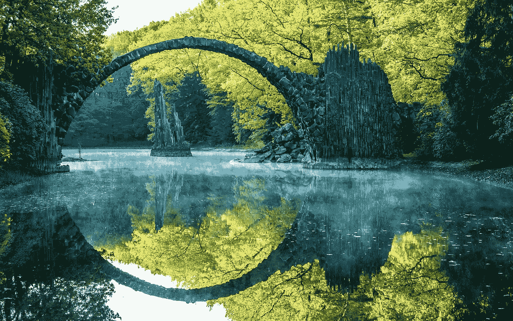
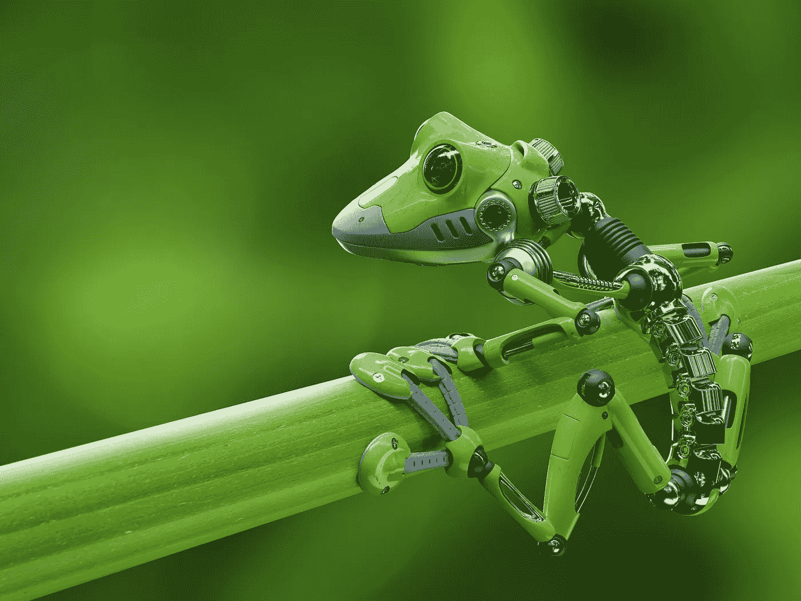

# 仿生学和订阅经济

> 原文：<https://medium.datadriveninvestor.com/biomimicry-and-the-subscription-economy-14c54ec251e?source=collection_archive---------22----------------------->

关于每周的洞察力和灵感——查看我的 [**时事通讯！**](https://apsis.substack.com)

不管我们喜不喜欢，地球上的化身都有一个订阅包。有一些特定的模式如此一致地出现，以至于我们的进化一直围绕着它们。地球绕地轴自转的昼夜循环导致了昼夜的变化。我们对此的适应是创造了一种昼夜节律，一种内在的计时机制。对许多人来说，四季是另一个套餐。随着季节的变化，我们内心的情感景观也在变化。

> 秋天是放手的季节，冬天是自我探索的季节，春天是重生的季节，夏天是富足的季节

秋天你播种，春天你收获。许多农业社团都是围绕这种订阅而建立的。我的主要论点是，当前的订阅经济是人类与世界互动方式的延伸。大自然赋予我们一致的模式，我们适应特定的心理-生理行为变化。

自然订阅套餐的关键是*毫无疑问*，我们知道自然会交付。除非你被大卫·休谟深深地腐蚀了，否则你不会质疑明天太阳是否还会升起。我们已经形成了根深蒂固的思维框架和基于自然节奏的整个身体系统。如果外部压力突然消失，我们将是受损的、不适应环境的商品。因此，当公司提供基于订阅的模式时，自然是终极范例。它展示了随着时间的推移，当有如此多的信任和规律，以至于我们的存在变得与潜在的模式交织在一起并成长时会发生什么。

超越我们陈旧的编程，我们现在处于一个可以选择新订阅的世界。无论是产品还是服务——我们现在在这个深刻变革的过程中有了代理。这就是为什么在决定我们允许哪些订阅进入我们的生活时，最大限度的警惕和正念是必需的。如果我订阅 Spotify 足够长的时间——拥有无限制的音乐访问将成为新的常态。你的默认模式是永恒富足。这本身并没有什么错——但是当你开始适应这种持续的富足时，放弃变得越来越难。

> 如果地球的昼夜节律被打断会发生什么？

两名洞穴探险者在完全黑暗的环境中度过了 80 多天，研究其对精神的影响。结果既有启发性又令人恐惧。他们对时间的感觉是如此扭曲，以至于他们忘记了几个月。研究人员称，他们通常会睡 30 个小时或更长时间，醒来时会以为自己打了个小盹。我们经常忘记我们的生理节奏是一种突发行为——我们自己和昼夜循环之间的一种交易。剥夺我们身体的光明——消除对这种原始订阅的刺激，会产生灾难性的后果。

> 我们有多少订阅不小心被取消了？

仿生学这个术语是由珍妮·本尤斯创造的。直接从网站上，它是这样描述的:

> “仿生学是一种创新方法，通过模仿大自然久经考验的模式和策略，寻求应对人类挑战的可持续解决方案。”

一个具体的例子是日本子弹头列车的设计。这是为了模仿几种不同鸟类的形态。这是一个美丽的视频，描述了生物仿生和火车的例子:【https://youtu.be/iMtXqTmfta0 

虽然模仿生物学是有用的——我们知道生物学简化为化学，化学又简化为物理。为什么不在最深层次上模仿自然——为什么不把物理学的基本真理融入我们的世界。我们的第一个例子来自热力学。当粒子交换能量时，不用担心有人会拿走不属于他们的东西。不存在信任问题——该系统的设计使欺诈成为不可能。

> 热力学第一定律— **在一个孤立的系统中，能量不能被创造或毁灭**

让我们考虑拿一个离地一米的球。我们说此时它有重力势能。你放开它，它会掉到地上，弹跳几下然后停下来。如果它不撞击任何其他物体，它消耗的能量与它最初拥有的能量直接相关。你听到弹跳的声音是因为一些能量以压力波的形式释放，一些能量以撞击时的热量形式释放。它在下落时获得动能(运动的能量)，并在反弹之前将其转化为弹性势能(球压缩地板时储存在球内的能量)。

所有这些能量都会回到这个世界。没有能量被浪费——一个单独的粒子不能决定为自己聚集所有的能量。压力波被你的耳朵记录为声音。摩擦/热量使球反弹的表面退化。这种声音也许会让我想起一段美好的旧日记忆——这让我对某个人表现出善意——而这种涟漪还在继续。

也许这种理想化的交换关系就是一个经济体系应该努力达到的水平。没有浪费能源——所有的东西都被重新利用，没有像*副产品*这样的东西。一切都变成了新输出的新输入。大自然是一个动态的、高效的、紧密相连的系统。我并不是说大自然已经完全优化了任何东西——但至少，它已经在我们身上存在了几十亿年。

参考

图片:[http://now . northropgrumman . com/biomimicry-architecture-is-influence-robot-design/](http://now.northropgrumman.com/biomimicry-architecture-is-influencing-robot-design/)

文章:[http://the science explorer . com/brain-and-body/isolation-dark-drives-humans-brink-anism-studies-find](http://thescienceexplorer.com/brain-and-body/isolation-dark-drives-humans-brink-insanity-studies-find)

[https://biomimicry.org](https://biomimicry.org)

