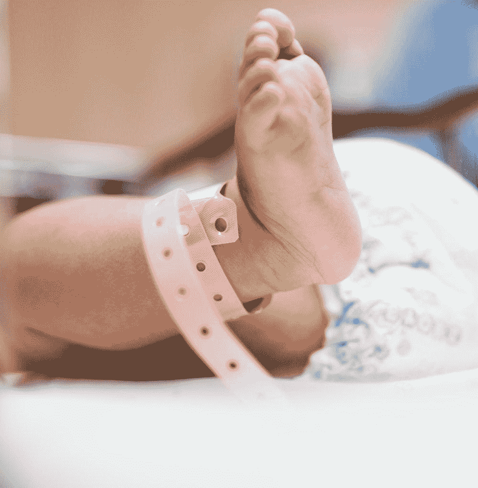

# 出生赤字与经济增长

> 原文：<https://medium.datadriveninvestor.com/birth-deficit-and-economic-growth-30372554399a?source=collection_archive---------8----------------------->

福蒂尼·马斯楚安尼

人口统计学家和经济学家都担心出生赤字。在我的国家(希腊)，我想在其他国家也是如此，出生赤字主要是用口号和荒谬来处理的，避免对这个问题及其与经济增长的相关性进行更深入的分析，尽管人口的年龄结构影响着经济。

因为出生赤字的定义是每个家庭少于 2.1 个孩子。需要注意的是，这些孩子中至少要有一个是女孩，才能弥补母亲的生育能力。尽管许多人强调希腊的出生赤字在经济危机时期尤为严重，但这并不符合现实。早在 20 世纪 50 年代，出生率就出现了下降趋势(每个家庭 2.3 个孩子)，1981 年，出生率正好达到了生殖极限(每个家庭 2.1 个孩子)，此后出生率一直在下降，但由于希腊移民和遣返者的回归以及经济移民的进入，出生率出现了小幅增长。希腊可能也是其他欧洲国家的典型。

出生赤字的一个重要因素是从农村到城市地区的国内移徙以及社会从农村向后工业的过渡。在传统的农村社会中，父母地位低、缺乏教育、封闭的社会环境、最大的居住区(带院子的房子)导致高出生率，而在后工业社会中，妇女地位及其教育水平的提高、她们更频繁地参与社会和经济活动、避孕方法、收入提高、职业生涯而不是家庭生活，降低了出生率。在城市环境中，生活空间的缺乏(见公寓)对家庭的建立有负面影响。

根据 Schultz (1973)，随着父母收入的增加，对更多孩子的需求减少。与此同时，向后工业社会的过渡伴随着死亡率的下降，从而导致人口老龄化和社会趋势的变化。为获得社会认可和自尊而获得后代的现象不再存在，而单亲家庭和单身家庭在增加，传统家庭在减少。

希腊和其他处于危机中的欧洲国家的出生赤字的一个关键原因是福利国家很少或根本没有提供支持。它在危机期间的彻底崩溃加剧了这一问题。国家不支持年轻人建立家庭，因为没有措施帮助他们将教育或职业生活与家庭结合起来。年轻人的家庭承担了应该由国家照顾的工作，并在力所能及的情况下向他们提供经济帮助，因为在我们经历的这场大危机中，家庭再也无法支持年轻人了。

希腊也不例外，但与西欧的低出生率不谋而合。
根据相关研究(李&张 2007，李 2015)高出生率对一个国家的经济发展有负面影响，尤其是在与富裕国家相比的贫穷国家。另一方面，有人认为，当一个国家有很大一部分人口处于生产年龄时，最高程度的生产力将导致经济增长。如果人口老龄化，那么现有资源的使用效率就会降低，结果是经济增长放缓。

改变经济增长的是不同年龄段人口的不同行为，即年轻人在教育和健身方面投资更多，而老年人则储蓄并关注更好的医疗保健。处于生产年龄的人口不同于年轻人和老年人，因为他们消费的比生产的多(Bloom 等人，2001 年)。

基于以上所述，希腊政府和其他南欧国家缺乏生育增长战略，这在很大程度上符合欧盟的要求。一方面，当出生赤字和工作年龄人口短缺时，现有的生产人口被推向移民。鉴于这些生产性人口也受过高等教育，他们的移民加强了其他经济体，如德国和其他经济体，而另一方面，南欧国家接受了大量年轻移民(主要是男性)，以填补移民留下的缺口。

这一事实完全违背了经济发展的经济学理论。一方面，有来自其他国家的大量移民，而有助于当地经济增长的国内生产人口被推向移民。这一政策很奇怪，而且肯定无助于危机中国家的经济增长。