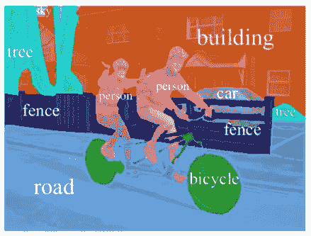

# 用于实时分段的 BiSeNet 第一部分

> 原文：<https://medium.datadriveninvestor.com/bisenet-for-real-time-segmentation-part-i-bf8c04afc448?source=collection_archive---------2----------------------->

在这篇文章中，我将向你介绍用于实时语义切分的双边切分网络。

Facebook’s AI team Detectron

在过去的两周里，我一直在阅读并从这篇有趣的研究论文中提取知识，这篇论文是我在 arXiv.org[上找到的，旨在提高准确性、推理速度以及我们最先进的模型方法在**语义分割**领域存在的许多其他问题。](https://arxiv.org)

**什么是语义分割&为什么要关心？**

**语义分割**是用于图像分析任务的计算机视觉中的基本研究领域。它的主要目标是给图像中的每个像素分配语义标签，例如(汽车、房子、人……)。

Example of semantic segmentation

> 换句话说，我认为语义分割是一种对象检测系统，可以分割/跟踪(分割)对象，并为来自图像或视频等输入的每个像素分配标签。

关于这个话题，我有另外一个帖子有更详细的信息。所以，如果你想了解更多，像领域**语义分割**可以应用，核心任务查看这个 [**帖子**](https://medium.com/@prince.canuma/spatial-path-context-path-3f03ed0c0cf5) 了解一下。

# **以前的方法**

They all are wrong, the difference is one is less wrong.

**语义分割**使用两个组件从输入图像/视频中提取重要特征，这两个组件是:

*   丰富的空间信息和
*   相当大的感受野

然而，现代方法通常包括空间分辨率和感受野以实现实时推理速度，这导致了较差的性能。

# ***这些或这两个成分中的任何一个对模型的预测有什么影响？***

最近在**语义分割**领域的论文/著作表明，有 **3 种方法可以加快模型推理速度**。

Just like Cap, they tried their best but they failed in the end.

[**ICNet**](https://arxiv.org/abs/1704.08545)&[**基于空间稀疏性的实时图像分割**](https://arxiv.org/pdf/1712.00213.pdf) 为例，重点构建一个实用的*快速语义分割* 系统，并具有相当好的预测精度。语义使**语义分割**运行得更快，降低了计算成本，同时不会牺牲太多的质量。

*   我上面提到的两篇论文使用了三种方法中的一种，试图通过裁剪或调整大小来限制输入大小以降低计算复杂度。虽然该方法简单有效，但是空间细节(特征)的丢失破坏了预测，尤其是在边界周围，导致度量和可视化的准确性下降。

> **限制输入大小** —限制输入图像的大小，即网络输入图像的大小被限制为 512x512，因此分辨率更高的图像将被调整大小/裁剪。

*   有些作品不是调整输入图像的大小，而是像**[**Xception**](https://arxiv.org/pdf/1610.02357.pdf)**等**修剪网络的通道**来提升推理速度，尤其是在基本模型的早期阶段。****

> ******修剪通道** —通道修剪直接减少特征图宽度，将网络收缩成更细的网络。它在 CPU 和 GPU 上都是高效的，因为不需要特殊的实现。****

****欲了解更多关于**修剪**的信息，请点击此处查看本文[。](https://arxiv.org/pdf/1707.06168.pdf)****

*   ****对于最后一种情况， [**ENet(高效神经网络)**](https://arxiv.org/pdf/1606.02147.pdf) 提出在最后一级去掉**下采样**操作，取而代之的是使用**上采样**操作，与**下采样**相反，导致判别能力差。在他们的 [**论文**](https://arxiv.org/pdf/1606.02147.pdf) 中，他们陈述了**缩减采样**图像有两个主要缺点。首先，降低特征地图分辨率意味着空间信息的损失。其次，全像素分割要求输出与输入具有相同的分辨率。然而，**下采样**有一个很大的优势。对缩减像素采样的图像进行操作的滤镜具有更大的感受野，这允许它们覆盖更大的对象。****

> ******下采样** —通过降低采样率或样本大小使数字音频信号变小。换句话说，减少图像的像素数量是图像重采样或图像重建的一种形式。****

****总的来说，以上所有方法都损害了速度的准确性。****

****研究人员还试图通过利用 **U 形结构**来弥补上述空间细节的损失。通过融合主干网络的层次特征， **U 形结构**逐渐提高空间分辨率，填补一些缺失的细节。然而，这种技术有两个弱点。****

*   ****完整的 **U 形结构**会因为额外的计算而降低模型的速度。****
*   ****在**修剪**中丢失的大部分空间信息不容易恢复。****

# ******上述问题的解决方案******

********

****Let me show you how it's done!****

****为了解决牺牲精度换取速度的困境，本文提出了由两部分组成的双边分割网络:****

*   ****空间路径****
*   ****上下文路径****

> ****我已经发了一个帖子**详细解释了**这两个部分以及它们是如何工作的点击 [**这里**](https://medium.com/@prince.canuma/spatial-path-context-path-3f03ed0c0cf5) 查看。****

****研究人员设计了一种步幅很小的 [**空间路径**](https://medium.com/@prince.canuma/spatial-path-context-path-3f03ed0c0cf5) (SP)来保存空间信息并生成高分辨率特征。他们还设计了一个 [**上下文路径**](https://medium.com/@prince.canuma/spatial-path-context-path-3f03ed0c0cf5) (CP)，采用快速**下采样**策略来获得足够的感受野，与 [**SP**](https://medium.com/@prince.canuma/spatial-path-context-path-3f03ed0c0cf5) **并行工作。为了在不损失速度的情况下追求更好的准确性，他们实现了两条路径的融合和最终预测的改进。他们提出了一个新的**特征** **融合模块** (FFM)来高效地组合特征&一个**注意力细化模块** (ARM)来细化每个阶段的特征。 **ARM** 在 [**CP**](https://medium.com/@prince.canuma/spatial-path-context-path-3f03ed0c0cf5) 中采用全局平均池来捕捉全局上下文并细化每个阶段的输出特征。不需要任何**上采样**操作。因此，它需要较少的计算成本。******

****

**Just like that, I rendered your work obsolete, BOOM!**

# ****总结****

**该架构在 Cityscapes、CamVid 和 COCO-Stuff 数据集上实现了速度和分割性能之间的平衡。具体来说，对于 2048×1024 输入，他们在一个 NVIDIA Titan XP 卡上以 105 **FPS** (每秒帧数)的速度在 Cityscapes 测试数据集上实现了 68.4% **均值 IOU** (交集/并集)，这明显快于具有可比性能的现有方法。**

**这就结束了本系列关于 **BiSeNet** 的**第一部分**，敬请关注更多精彩内容，以及**第二部分**的**代码**用于实现这篇最先进的**实时语义分割网络**研究论文。**

**感谢您的阅读。如果您有任何想法、评论或批评，请在下面评论。**

**如果你喜欢，请给我一点掌声👏👏 👏并且**与你的朋友分享**。**

# ****资源:****

 **[## arXiv.org 电子印刷档案馆

### 开放获取 1，431，489 份物理学、数学、计算机科学、定量生物学、定量…

arxiv.org](https://arxiv.org)** ** [## 空间路径和环境路径

### BiSeNet(双边分段网络)的成功秘诀。

medium.com](https://medium.com/@prince.canuma/spatial-path-context-path-3f03ed0c0cf5)  [## [1704.08545]用于对高分辨率图像进行实时语义分割的 ICNet

### 摘要:在本文中，我们关注于具有挑战性的实时语义分割任务。它发现许多实用的…

arxiv.org](https://arxiv.org/abs/1704.08545)  [## [1712.00213]通过空间稀疏性进行实时语义图像分割

### 摘要:我们提出了一种语义(图像)分割的方法，减少计算成本的一个因素…

arxiv.org](https://arxiv.org/abs/1712.00213)  [## [1610.02357]例外:具有深度方向可分离卷积的深度学习

### 摘要:我们提出了卷积神经网络中初始模块作为一个中间模块的解释…

arxiv.org](https://arxiv.org/abs/1610.02357)  [## [1606.02147] ENet:用于实时语义分割的深度神经网络架构

### 摘要:实时执行逐像素语义分割的能力在移动应用中至关重要

arxiv.org](https://arxiv.org/abs/1606.02147)**