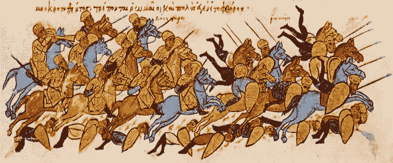

# 比特币作为博弈论和激励机制的大师作品

> 原文：<https://medium.datadriveninvestor.com/bitcoin-as-a-master-piece-game-theory-and-incentives-3b9f10ceb782?source=collection_archive---------1----------------------->

## 激励和博弈论在最著名的区块链中的作用。

The Chess Players — Sir John Lavery (1929)

在过去的十年里，由于**比特币**，**区块链技术吸引了学术界和工业界极大程度的关注**。

一般来说，区块链被认为是比特币背后的*技术。*

然而，**比特币区块链远不止科技**。

比特币*(点对点网络、不对称加密和数字时间戳)*利用的所有**三种主要技术**已经存在多年。**它们并不是比特币与众不同的原因。**

将比特币定义为纯粹的技术将是一个错误。事实上，它是技术、经济学、数学、博弈论以及最后但同样重要的哲学的杰作。本系列第一篇，我想重点介绍一下作为博弈论杰作的比特币**。**

# 但是首先...什么是博弈论？

> **博弈论** *研究的是* ***战略互动的过程*** ***两个或两个以上的******玩家*** *在* ***胜负*** *的情况下对于每个参与者* ***取决于***

Game Theory — Osmo Rauhala

实际上，**如果你是这种游戏**中的玩家**，在考虑你的策略时，你必须考虑到其他人的选择。**考虑他们的选择，你也应该意识到*他们也在考虑你的*。

## 博弈论基于这样一个假设，即所有的参与者都是理性的行动者，都试图从游戏中获得最大的收益。

[博弈论的研究以下列要素为特征:](https://www.investopedia.com/articles/financial-theory/08/game-theory-basics.asp)

*   *博弈:*任何一组**情况**，其结果取决于两个或更多决策者(玩家)的行动。
*   *玩家:*游戏背景下的**战略决策者**。
*   *策略:*一个完整的**行动计划**给定游戏中可能出现的一系列情况，玩家将采取的行动。
*   *回报:***支出**玩家在达到特定结果时获得**。支出可以是任何可量化的形式。**
*   *信息集:*游戏中某一给定点可用的**信息**当游戏有连续的组成部分时，信息集这个术语最常用。
*   平衡:游戏中双方都已做出决定并达到结果的时刻。

博弈论尤其适用于没有非黑即白的社交场合。那是因为，在相互交往时，人类是高度复杂的。预测一种行为可能和预测未来一样复杂，因为它是他们的策略、收益和信息集*相互作用的结果。*

让我们举个例子:

> 你和你最好的朋友在酒吧里，你在吧台看到两个女孩。其中一个是你喜欢的类型，另一个不是。这个游戏有**两个玩家**和**两个收益**，可以有**四种不同的结果**。**第一种结果**如下，**你和你的朋友都去找你喜欢的类型的人，**你们互相阻碍，**你们都没有得到那个女孩。**简单来说:**收益是 0** 。第二种结果也是如此，其中**你们都选择了不是你喜欢的类型的人。你们又一次互相阻挠，谁也没能得到那个女孩。同样在这个结果中，**收益是 0。** 另外两个结果是 **:
> 1。你得到你喜欢的类型，而你的朋友得到不喜欢的类型；
> 2。你的朋友喜欢他喜欢的类型，而你喜欢不喜欢的类型。有了这两种结果，你的收益将最大化，你将达到所谓的纳什均衡。也就是说，在这种情况下，所有参与者的策略都是一致的，每个人都选择了对其他人选择的最佳反应。因此，游戏的参与者应该遵循后一种策略。****

# 博弈论是如何应用于比特币的？

比特币的创造者[**【中本聪】**](http://align the interests of the actors and)**所做的是找到拼图中缺失的一块:如何确保分散网络中的所有参与者在互不信任的情况下正确行事，这个问题通常被称为*拜占庭将军问题。***

****

**[**The problem of Byzantine Generals**](https://medium.com/coinmonks/a-note-from-anthony-if-you-havent-already-please-read-the-article-gaining-clarity-on-key-787989107969)**

**简单来说，就是一个**协调的问题。**
*拜占庭人*试图攻克一座城市，但只有所有将领协同作战，共同进攻，进攻才会成功**。**
问题是如何保证所有将领都会按照计划行事，即使他们身处异地，互不信任。**

# ****比特币如何解决问题？****

**比特币区块链的玩家是网络的*用户和维护网络的*矿工。由于比特币是一个分布式网络，因此**矿工**对于网络的正常运行至关重要，因为他们**确认交易的有效性**。**

**简而言之，比特币使用**博弈论**和**物质激励系统**到**来确保理性行为者通过调整他们的利益**以某种方式行事。特别是，它们被用来影响网络中矿工的互动和行为。**

**首先，重要的是提出，使用
**工作证明算法** : *矿工必须运行计算昂贵的操作来开采比特币，导致大量电力成本。*这使得**计算变得昂贵**，以确保矿工不会偏离网络的规则。**

**为了鼓励矿工以诚实的方式行事，比特币提供了一种**激励机制**，以确保他们的自身利益与网络的良好运行相联系。**

# **向矿工提供了哪些激励措施？**

**每个新块中的**第一个交易**是一个所谓的***【coin base】*交易**，即**铸造新的比特币**
*(每个块 12，5)，*将交给块的创建者。**

**也就是说，给设法在其他人之前找到正确区块的幸运矿工。**

> **它堪比比特币网络的一个击掌:“非常感谢你用你的矿力维护网络，给你 12.5 BTC 作为奖励！!"。**

**这可能看起来很多，但是，如前所述，矿工不得不应对高昂的电力、硬件和维护成本。
此外，在其他矿工之前找到正确区块的**机会与控制的散列功率的百分比成正比，因此**——*——除非你是最大的矿池的一部分*——相当低。**

**这种**金钱奖励形式的物质激励**激励节点行为正直并支持网络，同时确保固定和持续的新硬币发行— *因为在比特币区块链没有中央银行这样做！***

**作为**额外的激励**，为比特币网络供电的矿工也**从区块中包含的交易中获得提成。** *所有这些激励措施都阻止了行为者恶意或试图攻击比特币网络。***

**攻击者能够损害或篡改比特币区块链的唯一方法是收集至少 51%的哈希能力。让我们说，一个恶意的演员正试图集结足够的力量来这样做。他首先必须找到昂贵的硬件— *因为这些硬件目前都被其他矿商拥有。*如果他最终成功，那么他将不得不危及网络，然而，**由于他已经在比特币挖矿硬件上投入了大量资金，他不会有这样做的动机。****

**如果他**设法攻击**比特币网络，这种**加密货币将立即失去重大价值***——因为它的前提之一是它的区块链不能篡改。***

**黑客的战利品将变得一文不值！**

**因此，黑客可能会发现遵守规则比试图破坏系统和他们的财富更有利可图。**

**每个演员都因遵守规则而变得更好。 不是因为他们被迫这样做，而是因为这确保了每个人都从网络中受益。**

**事实上，这是一个双赢的局面，这就是为什么我相信比特币是博弈论的杰作。**

**建立区块链系统的**有效经济激励和密码学**的设计被称为*密码经济学*。它的作用是提供一个框架，以确保强大和平衡的点对点网络的发展，并鼓励理想的行为。**

**值得一提的是，由于 T2 区块链的规模和安全性、T4 协议规则以及网络的固有特性，这些激励措施对比特币产生了作用。在鼓励或平衡网络参与者方面，应用于较小网络的相同逻辑可能不会提供相同的结果。**

# **作为博弈论杰作的比特币**

****

**总结一下:**

1.  **比特币没有变得像现在这样重要，只是因为它背后的技术。**
2.  **相反，**它的价值和美丽**来自于它**包含几个领域和学科的事实。****
3.  **等式*中**博弈论**的引入，使得网络能够正确运行，并将行动者的行为导向期望的结果。*通过利用一个激励系统，比特币设法**在一个**分布式网络中**不信任的参与者**的利益**对齐。****
4.  这在参与者的不同策略之间创造了一种平衡。也就是说:如果他们的策略协调一致，每个人都会获得最大的收益。这保证了**网络的正确运行**和**攻击的最终媒介**的减少以及**参与者攻击网络的可能动机**。

> 加入 Coinmonks [电报频道](https://t.me/coincodecap)和 [Youtube 频道](https://www.youtube.com/c/coinmonks/videos)了解加密交易和投资

# 另外，阅读

*   [CoinLoan 审核](https://coincodecap.com/coinloan-review)|[Crypto.com 审核](https://medium.com/coinmonks/crypto-com-review-f143dca1f74c) | [火币保证金交易](https://medium.com/coinmonks/huobi-margin-trading-b3b06cdc1519)
*   [Bybit vs 币安](https://coincodecap.com/bybit-binance-moonxbt)|[stealth x 回顾](https://medium.com/coinmonks/stealthex-review-396c67309988) | [Probit 回顾](https://coincodecap.com/probit-review)
*   [顶级付费加密货币和区块链课程](https://coincodecap.com/blockchain-courses)
*   [CBET 回顾](https://coincodecap.com/cbet-casino-review) | [库币 vs 比特币基地](https://coincodecap.com/kucoin-vs-coinbase) | [拜比特 vs 比特币基地](https://coincodecap.com/bybit-vs-coinbase)
*   [如何在加拿大购买加密货币？](https://coincodecap.com/how-to-buy-cryptocurrency-in-canada)

点击订阅 DIntel [。](https://ddintel.datadriveninvestor.com/)

请访问我们的网站:[https://www.datadriveninvestor.com](https://www.datadriveninvestor.com/)

在这里加入我们的网络:[https://datadriveninvestor.com/collaborate](https://datadriveninvestor.com/collaborate)