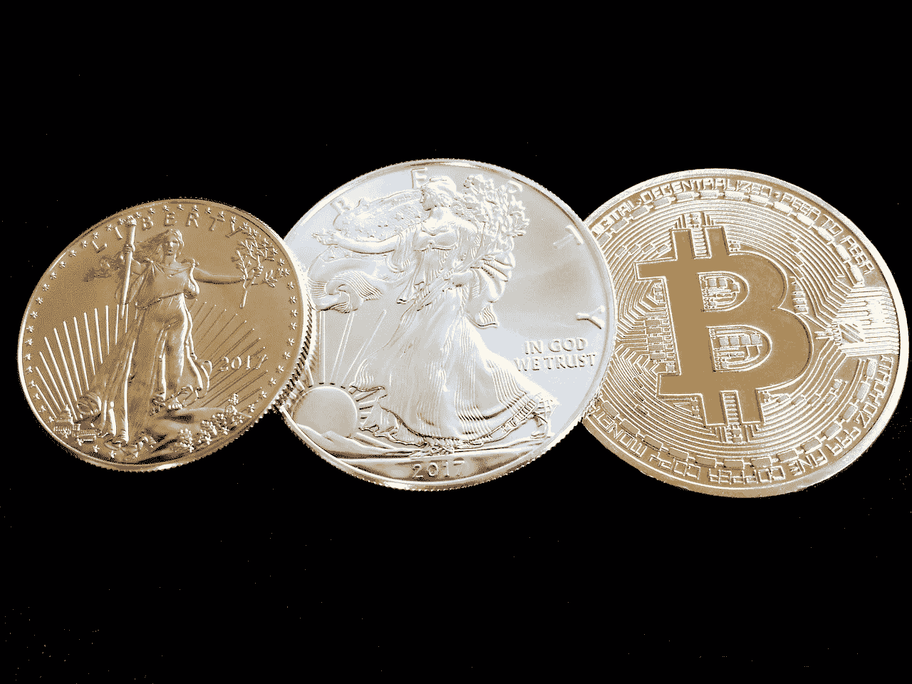
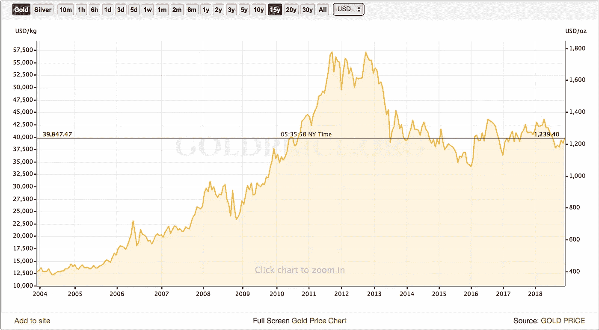

# 比特币作为避险资产:引入辩论系列

> 原文：<https://medium.datadriveninvestor.com/bitcoin-as-a-safe-haven-asset-introducing-a-debate-series-c3c738aba259?source=collection_archive---------19----------------------->

Source: [makingmilly](https://pixabay.com/en/users/makingmilly-4946262/)

这是关于比特币作为安全的价值储存手段的系列文章中的第一篇:比特币是一种可以对冲传统金融市场(股票、基金等)损失的工具，因为加密市场与这些市场不一致。这是一个由来已久的理论，甚至学术界也在讨论这种说法的准确性。Viewnodes 将研究这场辩论中的双方，而本文将通过定义安全港资产来搭建舞台，并给出更多关于这一概念的例子。

**什么是避险资产？**

鉴于债券、股票和基金价格之间的密切相关性，投资者通常会寻找最佳机会分散资产，以确保这些市场的调整或崩盘不会对他们的投资组合造成完全的灾难性影响，甚至有可能在其他人跟进时从中获利。有许多资产被认为符合这一描述，最显著的是贵金属、短期国库券和现金——以本国货币或外国货币(通常是瑞士法郎)表示。这些都被认为是低风险的，当传统市场下跌时，它们有可能充当救生筏。

[https://goldprice.org/](https://goldprice.org/)

**安全港的黄金标准**

事实证明，黄金是一种非常成功的避险资产，甚至与传统市场存在非常粗略的负相关性。正如我们在这张图表中看到的，从 2007 年传统市场开始陷入困境到 2013 年末金融危机平息和复苏进程开始，黄金价格经历了一次巨大的飙升。从这一点开始，美国传统金融市场出现了巨大的反弹，反过来黄金价格急剧下跌。每年约 2%的相对较小的供应增长和良好的交易量，这些因素结合在一起，使黄金成为动荡市场时期分散投资的强大资产。

**数字黄金？**

包括彼得·泰尔在内的一些知名人士已经提出了比特币实际上是在线黄金的观点。这是基于比特币供应有限、通胀率非常低且不断下降的想法。当然，[正如我们之前提到的，](https://medium.com/@viewnodes/models-of-cryptoasset-inflation-825faa974a30)比特币最终将会通缩，因为每天损失的比创造的多。在这方面，比特币无疑比黄金具有更高的稀缺性，事实上，它的历史高点是每盎司黄金的十倍以上(19600 美元对 1890 美元)。这导致人们猜测，比特币可能会像黄金一样，对传统市场起到对冲作用。

这种比较公平吗？Viewnodes 将对这一点进行辩论，提供支持和反对比特币是避风港资产的论点，就像黄金一样。请回来查看或关注我们的下一期，下周的支持论点的论点。

拜伦·墨菲的文章。有关 Viewnodes 提供的一些服务的信息，包括我们的 Tezos 代表，请点击[此处](https://www.viewfin.com/viewnode/tezos/#aboutus)。