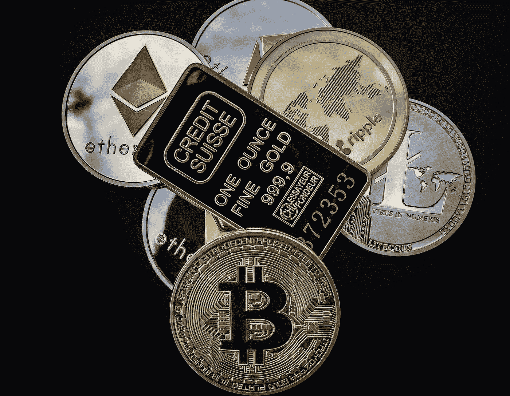
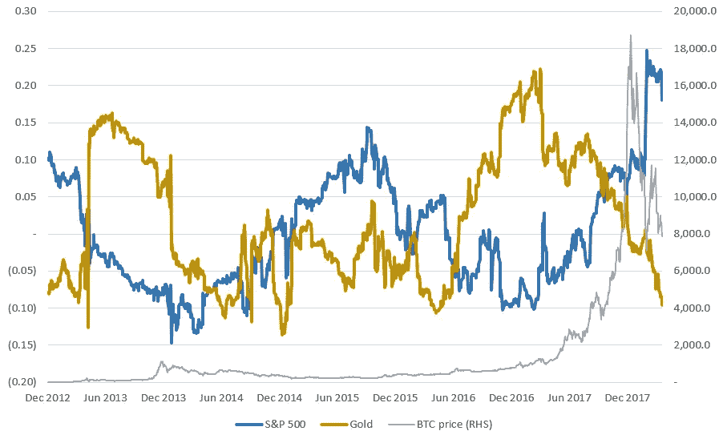

# 比特币作为避险资产的理由

> 原文：<https://medium.datadriveninvestor.com/bitcoin-as-a-safe-haven-asset-the-case-for-d65014cfe89b?source=collection_archive---------12----------------------->

上周，我们推出了一个关于比特币作为避险资产分类的辩论系列，这是一种可以用来对冲股票、基金、债券等传统市场的资产。这是本系列的第二部分，包括将比特币归类为避风港或“对冲”资产的五个论点。

Credit: [WorldSpectrum](https://pixabay.com/en/users/WorldSpectrum-7691421/)

**1。比特币和传统市场之间的相关性是虚假的**

我们碰到的第一个问题是，支持或反对这一系列论点的证据极其稀少。我们看到比特币在交易所流通还不到十年，在这段时间的大部分时间里，传统市场(至少在西方世界)一直在复苏，直到 2016 年美国传统经济开始大幅反弹至各种形式的历史高点。如果我们将它们重叠，这些图表将显示，自 2010 年以来，两者都经历了相当大的增长，这经常被用来反驳比特币作为安全的价值储存手段的潜力。然而，如果我们真的观察相关的尺度，很明显没有真正的相关性存在。

Comparison of S&P 500, gold and BTC shows the scale of incomparable growth (and, yes, crash) Bitcoin has seen. Source: [BitMex research](https://blog.bitmex.com/bitcoin-price-correlation-record-high-against-the-sp-500/)

例如，标准普尔 500 从 2009 年的低点 676 点恢复到 2018 年 9 月的高点 2940 点，增长了 430%。自 2010 年夏天开始交易以来，比特币的起价约为 0.008 美元，并在略低于 2 万美元的峰值水平上出名。鉴于从这一峰值开始的立即和持续的暴跌，让我们以 2018 年和 2019 年的低点 3400 美元作为参考点。不到十年，比特币的价值增长了 42，500，000%。这样一个数字的大小正是为什么 crypto 中的增益是用“x”而不是“%”来度量的。抛开低风险的传统投资不谈，认为这种增长与任何其他资产类别的增长之间存在任何关联，显然是荒谬的。这就是为什么大量的精选和图表扁平化被用来降低比特币作为安全港的分类。这也是为什么这里剩下的点与周线或月线无关，而是与资产本身的性质和交易方式有关。

**2。比特币交易是全球全天候交易**

任何有互联网连接的人都可以在一天中的任何时间，在交易所或 OTC 平台(如 localbitcoins)上几分钟内购买比特币。它被生活在严格资本管制下的人们所使用，如果他们与当局发生冲突，没有人可以没收或冻结这些资产。用户和菲亚特之间存在障碍，但总有解决办法(例如，现金销售)。总之——比特币交易是完全全球化和持续的，任何试图在刷新投资组合应用时睡觉的人都会证明这一点。

相比之下，包括股票、债券和基金在内的传统资产的交易时间类似于银行的营业时间，交易在周末关闭，而且国家股票市场对非公民可能有额外的障碍，需要特定的经纪公司。所有这一切的主要例外是外汇交易，这也是无国界的，每周 7 天，每天 24 小时。然而，这并不是毁灭性的，甚至也不是有害的，因为外汇可以而且确实是避险资产——最明显的是瑞士法郎。

**3。比特币相当稀缺**

不久前，我们发表了一篇文章，展示了比特币将如何[最终变得通货紧缩](https://medium.com/@viewnodes/models-of-cryptoasset-inflation-825faa974a30)——最终每日损失的将多于开采的。这是值得注意的，特别是因为比特币已经很罕见，通货膨胀率也很低——在 2020 年之前每年约为 1%，届时将降至 0.5%。稀缺性通常被吹捧为安全港的一个可取特征，轻微通缩的货币意味着价值不会因供应增加而损失。比特币的供应量增幅已经远远低于黄金，后者徘徊在 2%左右

**4。它不是中央控制的**

分散的加密货币是不依赖于中央决策者的罕见资产类别的一部分，比特币的价值不依赖于某个国家的经济表现良好，在特定市场领域的实力，甚至是可预测的经济条件。在这方面，它的功能与黄金有点类似，黄金主要在非洲、亚洲、俄罗斯、澳大利亚和加勒比开采，但其他地方也存在黄金开采业。比特币通常在电费较低的寒冷地区开采，但某种程度的开采在世界各地都有。这使得它能够抵御任何特定市场的动荡，并在任何特定地区变得不适合采矿或交易时快速适应。没有一个人或大型团体可以独立地对比特币的共识模型做出改变，这与传统金融产品截然不同。

**5。比特币除了充当价值储存之外还有其他功能**

除了易于投机的资产和相对于法定货币的潜在收益，比特币还被用于各种交易。虽然现实世界的购买仍然很少采用，但 BTC 绝对是用于进入 ico 和代币销售，在交易所购买替代硬币，支付交易所上市费和支付自由开发者的“奖金”。比特币也可以作为汇款市场的替代品，因为它以低得多的费用提供同样的功能。对这些功能的需求影响着流通供给和相关需求。

**没有挑战金牌，但这不是问题**

你会发现许多分析师坚持认为比特币永远不会取代黄金成为避险资产。他们正确地指出了黄金在这方面优于比特币的几个优势，尽管其中一些优势当然会随着时间的推移而改变——比如交易量，以每天交易的总供应量来衡量。与比特币的 0.5%相比，黄金的这一比例为 3%。黄金在珠宝和科技市场也有明显的额外用途，因为投机仍然是比特币的主要用途。这两个都是真的，而且不太可能在短期内改变。

然而，需要提出这样一个论点的事实已经说明了问题。黄金不是唯一的避险资产，比特币将取代黄金的地位的论断，也不能用来抹黑 BTC 本身作为对冲资产的地位。根据定义，安全港资产是那些不按照传统市场交易的资产——股票、基金、债券等等。迄今为止，比特币符合这一定义，因为它不符合任何传统市场的交易，无论是好是坏，也不依附于任何地点或组织。比特币作为避险资产的理由确实有其价值，尽管过去一年并没有让它变得特别成功。

Viewnodes 编辑拜伦·墨菲的文章。Viewnodes 帮助客户建立和维护当前支持的货币的主节点。要联系我们了解 masternode 服务的信息，请提交此[联系表](https://docs.google.com/forms/d/e/1FAIpQLSd6AXWZtPnmeklGFg-l4tAAKWsxHJ0LW-d0wFUxT4NRJ__e9Q/viewform)。

## 来自 DDI 的相关故事:

 [## 为什么数据会改变投资管理

### 有人称之为“新石油”虽然它与黑金没有什么相似之处，但它的不断商品化…

medium.com](https://medium.com/datadriveninvestor/why-data-will-transform-investment-management-4a60966c1c81)  [## 股票市场投资的机器学习

### 当你的一个朋友在脸书上传你的新海滩照，平台建议给你的脸加上标签，这是…

medium.com](https://medium.com/datadriveninvestor/machine-learning-for-stock-market-investing-f90ad3478b64)