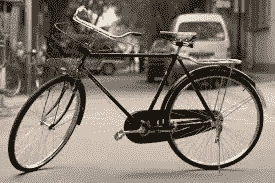
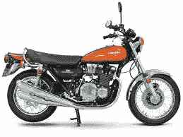
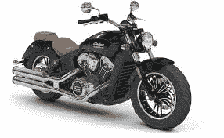
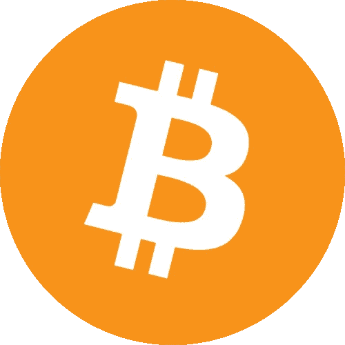
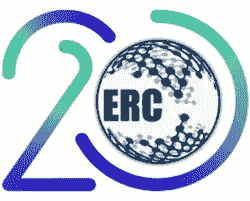
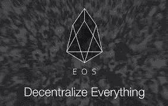

# 比特币区块链，据说是一种过时的技术

> 原文：<https://medium.datadriveninvestor.com/bitcoin-blockchain-supposedly-an-outdated-tech-c5b3e28925ad?source=collection_archive---------4----------------------->

我记得我的童年，那时我常常着迷地看着那些骑自行车的人，他们沿着马路划水，参观我猜想的地方。我长大了，最终拥有了我的第一辆自行车。我真的很兴奋，高兴地骑了一整天。那时没有什么比筋疲力尽和肌肉劳损/压力更大的了。(这篇文章是关于区块链的，相信我)

***那时，自行车是我自己的宇宙飞船，我真的相信再也没有比它更先进、更有价值的东西了。不管是什么，汽车从来没有让我如此兴奋过。随着时间的推移，我需要变得更“快”和更“技术”，我对摩托车产生了兴趣。我第一次是在我离开学校的时候，是的，是在放学后，不是在那之前。(没发现和比特币或者区块链有关的吗？你会的，我保证)***

因此，我有了我的第一辆自行车，一辆“不那么强大”的自行车，与我们今天所说的“自行车”相比，但她是我的“下一代”宇宙飞船。我曾经觉得我拥有了我想要的东西，而且再也没有比这更好的了。时间又过去了，我有了第二辆自行车。更强大，技术装备更先进。这个新的比第一个更强大，有更多非常有用的“功能”和“安全功能”，对于“长期运行”非常有用。(现在想想，如果能和‘那个’联系起来。如果你不能，请继续读下去，我们就要开始了。)

然而，随着时间的推移，那辆自行车过时了。我有第三个，我用它。它比之前的更好更强大，但我还有第二个。我对它进行了改装，它更像是根据我的喜好“定制”的自行车。现在，当我不得不“快速”和“安全”地到达某个地方时，我更喜欢最新的，但当我不得不随意旅行，没有时间窗要担心，没有人在等我时，我更喜欢“定制”的，因为我也有情感。(光秃秃的跟我在一起，你离我这么近)

***现在我在这里说一点。我从来都不是一个“汽车”人。我现在确实有一辆车，这也是因为现在汽车是必需品。如果一个人没有，他就不能成为社会的一部分。反正我从来没有对它这么有激情。不像我的自行车和自行车，我也没有感觉到与它有机地联系在一起。这是一个非常基本的，一点也不强大，只是让我坚持下去的东西。只是什么是社会和制度中不可或缺的。没有先进的功能，非常基本的，我必须说，为同名。*(就在那里)**

现在市场上有这么多新自行车，它们比我最新的一辆要“先进、安全、快捷”得多。但是‘进步’是没有止境的，我现在知道了。然而，我对我所拥有的一切感到满意，当然还有我所拥有的选择。我曾经感受到的那种魅力，那种肾上腺素激增的感觉，那种当我得到我的自行车时就有的兴奋，再也没有回来，现在我不值得拥有它，因为我已经经历了许多“进步和发展”，努力提升自己，并总是越来越“更多”。(恭喜你，你已经够耐心了。多读几行就明白了)

***现在，我想请你看一下下表，花点时间重新阅读上面的几行。相信我，上面的故事每一个字都是发自内心的，没有任何虚构。尽管如此，你会得到自己的定义和理解，这两个故事，用同样的话，只是以正确的方式替换，可能会适用于幻想。(这样做之后，我相信你会笑逐颜开！！谢谢你的支持)***

*自行车——BTC 区块链*

*第一辆自行车——以太坊*

*第二辆自行车——以太区块链硬币和代币。*

*第三辆自行车。— EOS、Cosmos、DFINITY、Tezos 区块链硬币。*

*汽车——正常的银行系统和投资模式。*

曾几何时，比特币是全球“最快、最安全、最适用”的交易方式。它已经被最新的技术和新硬币的应用抛在了“海里”的后面，新硬币基于几种区块链，根据“现代用户”的使用和偏好，它们更快、更安全、更灵活。

***现在以太坊带来了“智能合约”和更快的交易，区块链也变得“去中心化”，开采以太坊要遵循的 ERC20 规范，使得快速、简单和智能的合约一度成为“世界的需要”。***

(图片来源:can stock photo)

随后出现了几个基于 ERC20 的其他硬币，基于这些代币的 ICOs 借助于基于区块链的概念重新定义了获得货币利益的概念。随着时间的推移，即使这样，对人们来说也开始显得“昂贵”和“费时”。

现在这里是 EOS 区块链，声称一点也不贵，“闪得快”，“超级安全”。当然有可能，因为事情会变得更好，因为它们必须如此。具有无交易费用的独有功能，然后是可编辑的分类帐，由用户添加治理协议等。不可黑客攻击的系统，并且在一定的区块链下具有很高的“链外治理”效率，这肯定可以解决当前的区块链问题。

会有问题，会有技术来解决所有问题，会有对现有的不满，然后会有改革和发展来提供更好的东西。将会有开发人员、技术头脑和聪明人，在不同的时间框架内让事情变得更好，不断进化是自然法则，甚至技术也不例外。现在是时候了，当谈到“区块链”时，我们必须决定，“我们是否有足够的波动性和灵活性”来赶上“区块链”？