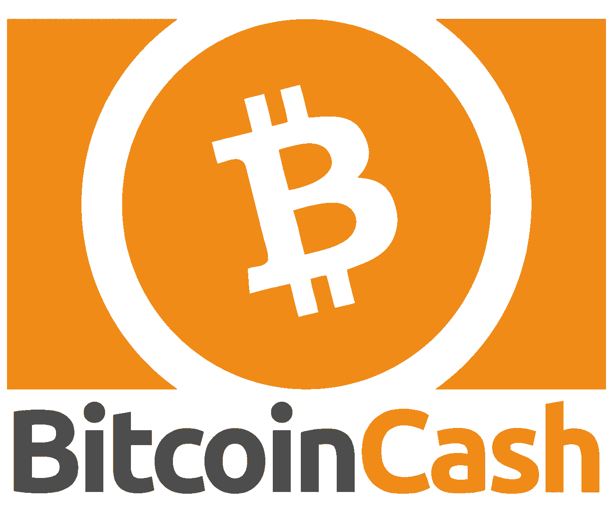
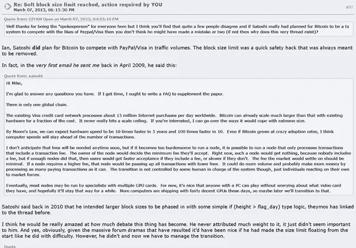
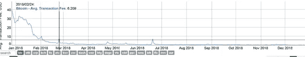
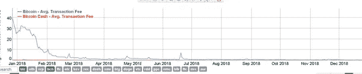
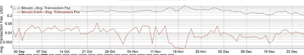
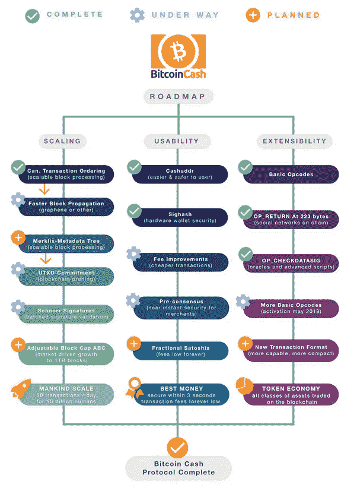
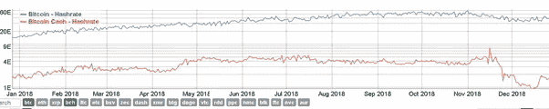
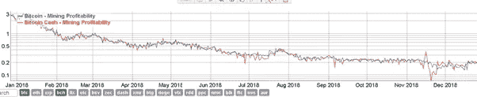

# 比特币现金|解释

> 原文：<https://medium.datadriveninvestor.com/bitcoin-cash-explained-2ad3b527f54f?source=collection_archive---------12----------------------->

Bitcoin Cash | Logo

# 比特币现金概述

比特币现金是一种加密货币，是最初比特币 BTC 的硬分叉。

# 比特币现金创造

2017 年 8 月 1 日发生硬分叉，块大小从 1Mb 增加到 8MB。其想法是改变最初比特币的概念，以提高处理速度，降低交易费用。一种观点得到了许多开发者的支持，那就是增加街区的大小；另一个变化可能是关于使用的签名。这个决定不仅是技术性的，也是意识形态性的:

***该走哪条“正确”的路？***

***哪个是“原聪异”？***

一个小组决定离开，在 block [478559](https://news.bitcoin.com/fork-watch-first-bitcoin-cash-block-mined-clears-over-6k-transactions/) 上创建一个分叉，从而创建了一个不同版本的比特币，称为比特币现金；分割后的第一个块是块# [478559](https://www.blockchain.com/btc/block/00000000000000000019f112ec0a9982926f1258cdcc558dd7c3b7e5dc7fa148) 。它于 8 月 1 日 18:24:21 UTC 发布，有一套不同的规则和网络基础设施。

这个团体背后的人是[罗杰·弗](https://twitter.com/rogerkver)，一个在加密领域非常大胆(也是有争议的)的人物，被称为比特币耶稣，[韩吉·吴](https://twitter.com/JihanWu)，的联合创始人和一个巨大的采矿农场的联合所有者。有趣的是，罗杰的观点是，比特币现金(本文缩写为 BCH)才是“真正的比特币”，这反映了中本聪的观点。我本人并不完全同意上面的这种说法。

# 解决方案

比特币现金试图解决的主要问题是原始比特币网络的“速度”非常低，在 7 tps 左右。相比之下，美国运通平均每秒处理几千笔交易，贝宝 194 tps(例如，网络星期一是这个数字的几倍)，BCH 大约 24-92，ETH 15 tps，DASH 48 tps，Cardano 5-7 TPS，Ripple 1000 tps，Visa 高达 22，000 tps(年度简单平均值大约为 1700 tps)。

比特币最大的问题之一一直是可扩展性。块大小已设置为 1MB。BCH 增加了块大小，从而部分解决了可伸缩性问题。

出现了关于块大小和设置新规则的可能性的问题。

这是 Mike Hearn 2013 年在 [bitcointalk](https://bitcointalk.org/index.php?topic=149668.80) 上的帖子。

Bitcoin average (not median) transaction Fee, USD, 1 year, historical chart

Bitcoin Cash average (not median) transaction Fee, USD, 1 year, historical chart

Bitcoin vs Bitcoin Cash average (not median) transaction Fee, USD, 3 months, log scale, historical chart

Bitcoin Cash | [roadmap](https://www.bitcoincash.org/roadmap.html)

# 优势

比特币现金确实在一定程度上解决了容量问题，使得支付交易更快、更高效、更便宜。

如果我们从采矿的角度来看，这有点复杂，因为我们还需要考虑 BTC 和 BCH 的杂凑率以及两种硬币的价格。这解释了 BTC 和 BCH 矿业的转变。

**Bitcoin vs Bitcoin Cash hash rate, E, 1 year, log scale, historical chart**

**Bitcoin vs Bitcoin Cash mining profitability, 1 year, log scale, historical chart**

罗杰对数字现金有一个非常好的观点，正如在最初的 Satoshi 白皮书“比特币:点对点电子现金系统”中，在摘要的第 1 页我们可以读到关于“[电子现金](https://bitcoin.org/bitcoin.pdf)”的内容。

> “电子现金的纯点对点版本将允许在线支付直接从一方发送到另一方，而无需通过金融机构。”

# 不足之处

在我看来，罗杰的观点过于激进，他已经多次声明，他的观点是唯一“正确”的。我也非常怀疑 BTC 和 BCH 商标的极端相似性。

BTC and BCH | Logos

此外，BCH 推特账户[比特币](https://twitter.com/bitcoin)的使用是荒谬的，因为它与比特币现金 BCH 有关，但与最初的比特币 BTC 无关。我可以保证，即使没有数百万美元，也有数千美元因为简单的混乱而被空运到 BCH。

更大，8 MB 的块大小和明显更少的哈希能力来保护 BCH，BCH 不像 BTC 那样分散和更少的抗攻击性。还有一点就是 CEO 或者说“比特币耶稣”，我们的加密货币真的需要一个国王或者君主吗？难道去中心化的社区不应该对密码的未来负责，而不是一个“中心化”的人站在顶端，提醒耶稣或国王吗？

最后，BCH 的采矿业也比 BTC 集中得多。

# 筹集的资金

> “区块链公司和矿池 Viabtc 使用虫洞协议和比特币现金链完成了第一个高价值初始硬币发行(ICO)。根据交易所的数据，Viabtc Token ICO 每秒钟筹集了 3700 美元，在 2.2 小时内总共捕获了[3000 万美元](https://news.bitcoin.com/first-major-bitcoin-cash-ico-raises-30m-in-record-time/)。”

这是继比特币现金区块链之后最重要的 ico 之一。

Bitcoin Cash

# 价格影响

BCH 目前的价格(UTC 04/02/19，11:25)为 119.12 美元，BTC 为 0.03450390 美元，市值约为 20 亿美元，流通供应量约为 1760 万 BCH。

请记住，BCH 的最大供应量，就像 BTC 一样，是 2100 万枚硬币。这一估值使 BCH 成为今天第五大加密公司。

# 竞争

许多人将比特币和比特币现金视为竞争对手，因为 BCH 是 BTC 的硬分叉。

我已经介绍了这两者之间的主要技术差异。哪个是更好的选择？在这个问题上有很多观点，对我个人来说 BHC 看起来更像是一种交易货币，至少在今天是这样。另一方面，BTC 更安全，更抗攻击，“原始”，从价值储存的角度来看，看起来像是更好的资产类别。

这个话题还涉及到很多意识形态和行为，我可以在另一篇文章中介绍。

# 比特币现金替代品

考虑投资比特币现金的投资者可能会密切关注“原始”比特币 BTC 以及其他 BTC 和 BCH 的分支。

关于 BCH，最近几个月在以下方面发生了巨大变化:

1.  罗杰和比特币 ABC(可调整区块大小上限)的阵营获得了最多的支持，包括预期中的(吴是的联合创始人)、和。我们已经讨论了这两个问题，但 ABC 的阵营希望改进规则，但保持目前的想法；
2.  bitcoing.org 等人支持克雷格·赖特的想法和比特币 SV (Satoshi 的设想)。克雷格·赖特博士是 nChain 的首席科学家，他也强调比特币是一种支付方式，更接近最初的 Satoshi 协议；和
3.  安德鲁·克利福德和合理/平衡比特币无限。

## 来自 DDI 的相关故事:

 [## 为什么数据会改变投资管理

### 有人称之为“新石油”虽然它与黑金没有什么相似之处，但它的不断商品化…

medium.com](https://medium.com/datadriveninvestor/why-data-will-transform-investment-management-4a60966c1c81)  [## 股票市场投资的机器学习

### 当你的一个朋友在脸书上传你的新海滩照，平台建议给你的脸加上标签，这是…

medium.com](https://medium.com/datadriveninvestor/machine-learning-for-stock-market-investing-f90ad3478b64)