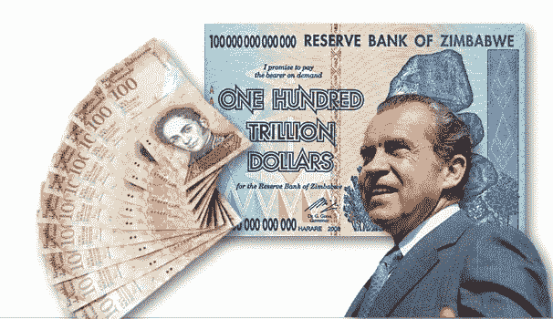
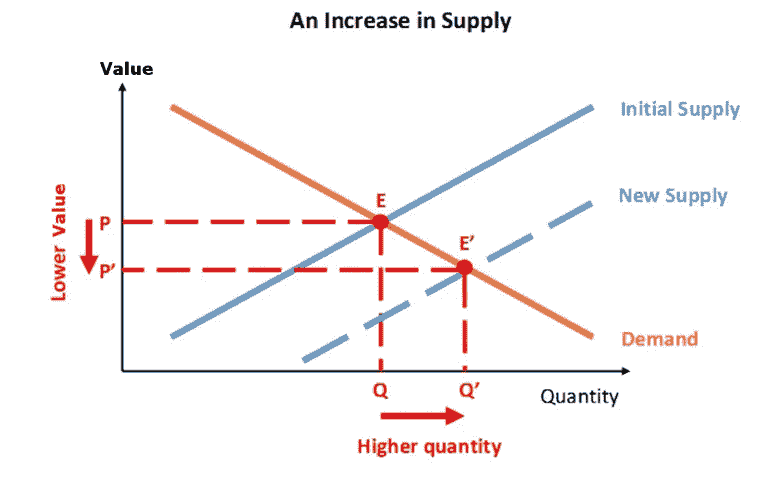

# 比特币终结通货膨胀时代

> 原文：<https://medium.datadriveninvestor.com/bitcoin-ends-the-era-of-inflation-aba15935a224?source=collection_archive---------3----------------------->

Fiat currencies are so 20th century

受了致命伤的理查德·尼克松政府在 1971 年发行了货币，让世界脱离了金本位制，结束了近 700 年来纸币作为黄金或其他贵金属的官方借据的历史。1971 年以前，美元的额外生产必须(至少部分)与黄金的额外生产相一致。现在，美元的生产成本几乎为零。货币政策的新策略是印刷足够多的钞票以支付每月的债务，同时不要印刷太快以至于你国家的人民对货币失去信心。只要人们仍然相信你的国家货币，增加国债就不是(短期)问题。信仰是当今政府强制(法定)货币的价值主张。

但是今天的法定货币规则对公民不利。公民个人对创造多少货币或政府负债多少没有任何发言权，因为政府/央行控制着公民必须使用的货币。由于存在无限的潜在供给，货币创造者指定的“太大而不能倒”的政府和行业可以在任何时候通过创造更多的货币来摆脱困境。这一战略为公民带来了非常高的长期成本，因为印钞票并不等同于创造财富。市民们目睹周围的一切变得越来越贵，感受到了这种影响。花 35 万美元在三藩市一个破旧的棚屋上[不仅意味着对土地的需求非常高。这也意味着对每一美元的需求越来越低。](https://www.vice.com/en_us/article/kwxpkn/the-cheapest-house-in-san-francisco-is-a-dilapidated-shack-selling-for-350k-511)

[It’s simple economics, son. I don’t understand it at all, but God I love it](https://www.youtube.com/watch?v=qhG4pCoiDBg).

**比特币永久地解决了货币通胀**，它解除了个人对货币政策的控制，代之以刚性软件。无论花多少精力创造新的比特币，除非 BTC 社区的绝大多数人(> 95%)同意，否则永远不会有超过 2100 万个，我永远不会同意。如果你拥有 5000 万个 satoshis (.5 个比特币)，你就恰好拥有整个比特币网络的 1/4200 万。衡量你拥有的美元或欧元的份额是不可能的，因为遗留货币的供应没有限制。没有人强制要求你使用比特币，如果你选择完全参与，任何网络升级都需要你的批准。

其他加密货币可能会给比特币增加额外的功能，并将这种功能标榜为颠覆性的，但长期使用替代加密货币意味着货币通胀的概念永久化。由于比特币解决了拜占庭将军的问题，可以创造出无限多种不同的加密货币，但比特币永远只有 2100 万。其他加密货币没有破坏性。他们接受现状；钱可以而且应该被膨胀。选择使用比特币来拒绝通胀，是你能采取的最具颠覆性的行动之一。

**其他资源:**

我的比特币入门指南:[https://medium . com/@ philgeiger/a-gentle-introduction-to-bit coin-c 8f 6 e 55855 c 1](https://medium.com/@philgeiger/a-gentle-introduction-to-bitcoin-c8f6e55855c1)

找一个你附近的比特币 ATM 试试: [CoinATMradar](https://coinatmradar.com/)

美元交易所/比特币银行:[比特币基地](https://www.coinbase.com/join/54808462bc7bf65d610000db)，[双子星](https://gemini.com/)

欧元兑换: [Bitonic](https://bitonic.nl/en/) ， [Bitstamp](https://www.bitstamp.net)

用 BTC 钱包在你的手机或电脑上成为你自己的银行:Android — [Samourai](https://samouraiwallet.com/index.html) ，iOS—[Edge](https://edgesecure.co/)，从电脑— [Electrum](https://electrum.org/#home)