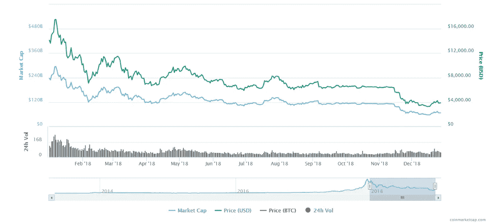

# 2018 年的比特币:比特币不幸的一年。

> 原文：<https://medium.datadriveninvestor.com/bitcoin-in-2018-the-unfortunate-year-of-bitcoin-574ea8096d57?source=collection_archive---------23----------------------->

全年多种加密货币有跌有涨。越来越多的货币进入市场，ico 不断发生，其中一些因其表现引起了公众的关注。大多数加密货币都出现了下跌(当我们将自己与去年的价格进行比较时)，包括比特币。我们的团队已经决定，本周我们将撰写排名前 5 的硬币的年度表现(我们根据它们的市值来看排名)，今天我们将从世界著名的比特币的表现开始。

众所周知，自去年以来，比特币的价格下跌了很多，所以这导致了市值的大幅下降。当我们看 2018 年第一季度(1 月至 3 月)时，比特币的一年开局并不太好。虽然它在一月份的价格最高，约为 17，533 美元(BTC/美元)，当时他们的市值为 294，290，592，412 美元。但这一价格并没有持续很长时间，因为在 2 月份，他们的价格下跌了 65% (6121.35 美元)，之后上涨到大约 11200 美元，但在 3 月底，又回到了 6890.52 美元。第二季度(Q2)没有 Q1 那么糟糕，虽然从 4 月初到 6 月底没有涨价，但中间有上涨。在 5 月份，它的季度最高值为 9，895.55。

然而，这是比特币在 Q2 最后一次涨价。第三季度是唯一一个比特币价格在年末高于年初的季度。价值仅增长 3%，第三季度收于 6，602 美元(当月最高价为 8，344.98，最低价为 5，985.71)。第四季度(最后一个季度)是比特币价值最糟糕的一个季度。比特币在 12 月份的价格最低(3，201.75 美元)，到目前为止(2018 年 12 月 27 日)，比特币的价格下跌了 41%(从 10 月到 12 月)。所以这一年来，比特币没有任何好的或显著的表现。根据我们掌握的数据，我们计算出他们损失了大约 1700 亿美元。

正如我们所看到的，比特币没有一个好年景。你预测 2019 年比特币会发生什么？

***引用列表。***

*比特币(BTC)价格、图表、市值和其他指标。(未注明)。从 https://coinmarketcap.com/currencies/bitcoin/#charts 取回*

*如果你想了解更多，请访问 BIDITEX 页面并提出你的问题，关注我们的* [*推特*](https://twitter.com/biditex_com) *，* [*脸书*](https://www.facebook.com/biditex/) *，* [*中型*](https://medium.com/@biditex) *，* [*电报*](https://t.me/biditex%20%28edited%29) *，*[*LinkedIn*](https://www.linkedin.com/company/biditex)*。投标变更用* [*投标变更用*](https://medium.com/@biditex/biditex.com) *。*