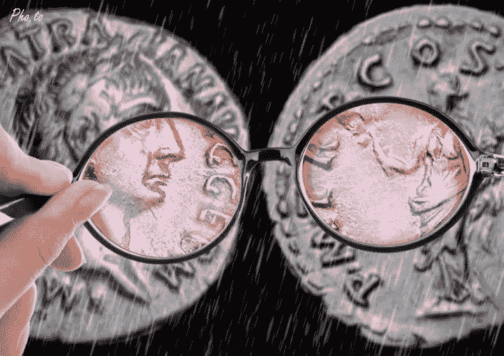

# 锅炉房里的比特币

> 原文：<https://medium.datadriveninvestor.com/bitcoin-in-the-boiler-room-6863019588d6?source=collection_archive---------0----------------------->

**没有价值的东西可以流通并在贸易中被接受吗？如果有，如何实现？这种状况能无限期持续下去吗？**

比特币的起源故事是一种反国家主义意识形态“暴君自由”和“非国家货币”的表达。这不仅对比特币的初始价值至关重要，对其生存也至关重要。所有的交换媒介都需要一个非货币价值的组成部分，否则它们未来的购买力是不确定的。

一个本质上无用、无支撑、无成本的法币可能在交易中被接受，但是**只有当它已经有一个正价格的时候。**正价格的历史将在潜在接受者中产生足够的预期，他们将能够在明天交易该对象。

*   **但是菲亚特的这一部分是如何获得正价格的呢？**
*   如果早期采用者期望它在交易中被其他人广泛接受，那么如果该物品还没有一个正价格，这些早期采用者是如何形成这些期望的呢？

我们正在处理一个**循环**的问题。没有办法“闯入”可能为平面对象生成正值的动态。没有价值的东西不能在市场上以正价值交易。

然而，像美元和日元这样的法定货币似乎有正价值。两个经济学派以不同的方式解决循环问题:

1.  **奥地利人**说，当早期采用者第一次获得菲亚特对象时，它还不是本质上无用、无支持或无成本的。由于其原始的商品性质，或者也许是其作为支持性金融资产的地位，它已经以正价格交易。即使这种特征消失了，物品突然变成了一个法币，基于人们对其法币前价格的记忆，它仍可能在交易中被广泛接受。因此，这个循环可以被打破，毫无价值的纸片可以合法地在贸易中获得正价值。
2.  **MMT**ers 的解决方案是另一个方向。只要像政府这样的机构强制人们用这些法定物品纳税，就足以推动它们的正价值。

争辩者可能会说，但是美联储……但是我不认为我们有现代中央纸币的循环问题，因为它们不是一文不值的纸，而是作为发行者的债务而存在。

# 如果比特币的崛起是被操纵的，一只现代的细价股票在现代的锅炉房里被抛出，会怎么样？

最早的大规模比特币交易是在一个只有一小群“交易所”的小圈子里完成的。

**如果他们彼此都认识，**这些交易或多或少都是虚构的，大量价值被交易，然后又被交易回来，目的是通过将人们的注意力从活跃得多的比特币市场转移开，来增强正价值均衡的重要性。比特币的发明者正在高调地加入他们自己的潮流，以鼓励其他人这样做，无论是在意识形态上表达自己还是通过这样做来获利。以这种方式推销比特币，**通过给一个原本无用的潜在交易媒介的预期价值打上一个积极的标记，取代了历史**。

## 外人是从什么时候开始在贸易中接受它的，是基于期待别人以后会从他们那里回购？嗯，我妹妹今年刚买了她的第一部智能手机。昨晚她问我“比特币是什么？”

**有许多机制可以让股市的弱势群体“向上移动”，这里只列举几个……**

***洗盘交易。一个个人或一群阴谋家在不同的账户之间来回交易一种缺乏流动性的、通常是一文不值的股票。目标是给人一种活跃的假象，从而吸引无辜的散户(夫妻店类型)，否则他们会放弃股票。***

***高收。一个交易者或一群交易者会在当天收盘前几秒买入一只股票，推动其价格上涨。这是媒体友好的，因为他们通常只报告股票的每日收盘价，股票图表也取决于每日收盘，高收盘可能是交易员创造和受益于高收盘价消息产生的积极价格势头的成本效益战略。***

***同盟会。*** 与卖方合作，提供虚假的出价，以抬高价格。

比特币从无到有，白手起家，白手起家。

如果比特币的价格跌至 0 美元，没有人能保证比特币会重新回到正价格。因此，比特币用户有理由期待比特币持有的惊人回报，以承担零价值均衡的风险。对于持有高风险加密货币来说，预期的极度通缩是必须拿出来的胡萝卜。当这些价格升值的预期没有实现时，当前价格(相对于其未来预期价格)的大幅下跌是必要的，以诱使下一批投机者再次持有它。

祝你好运

 [## 锅炉房里的比特币——亚当·汤森

### 没有价值的东西可以流通并在贸易中被接受吗？如果有，如何实现？这种状况能持续下去吗…

www.adamtownsend.me](http://www.adamtownsend.me/bitcoin-boiler-room/)