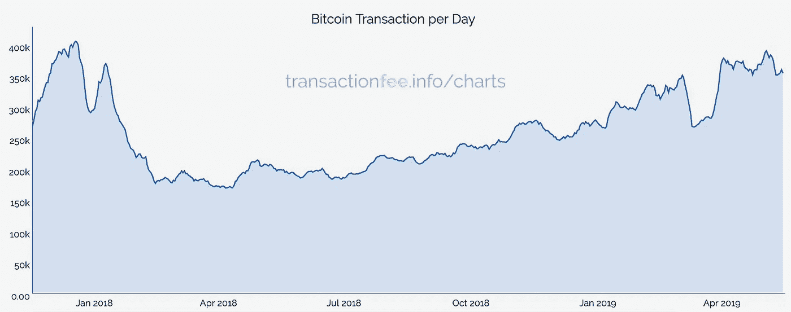
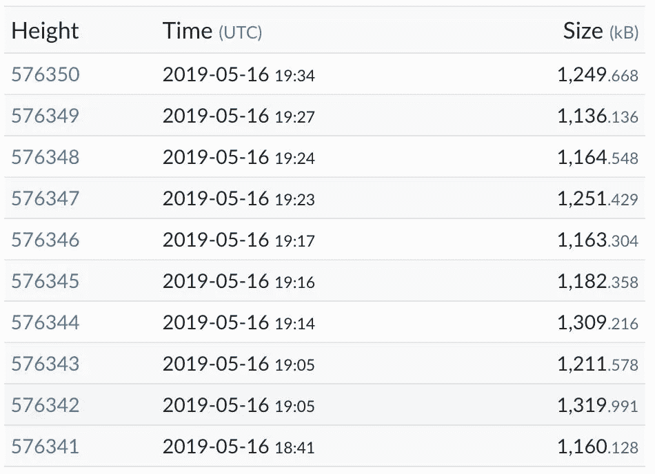
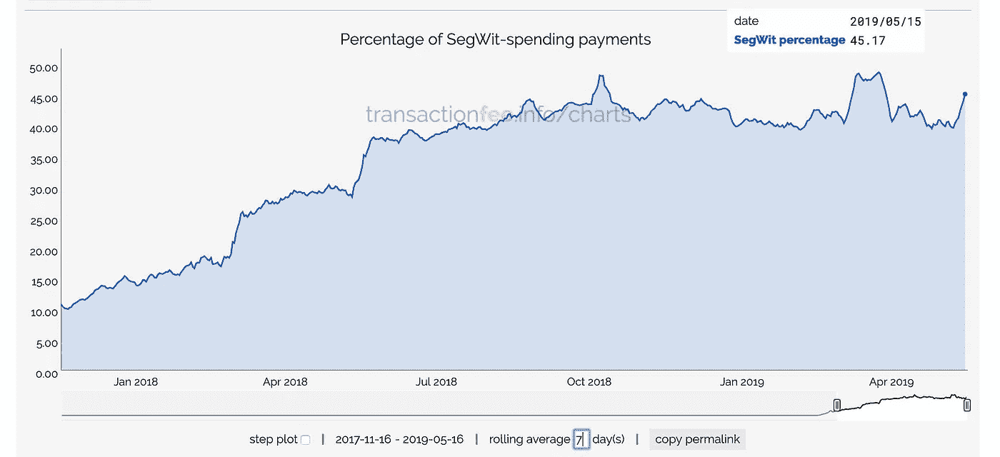
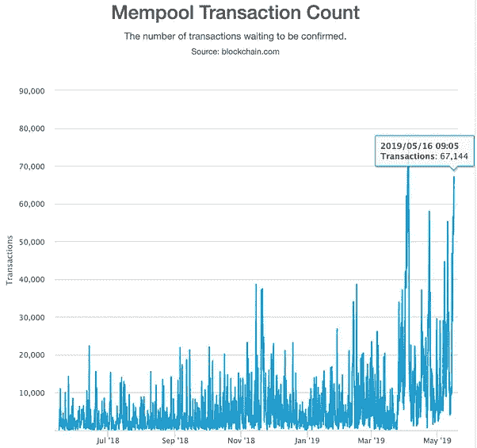
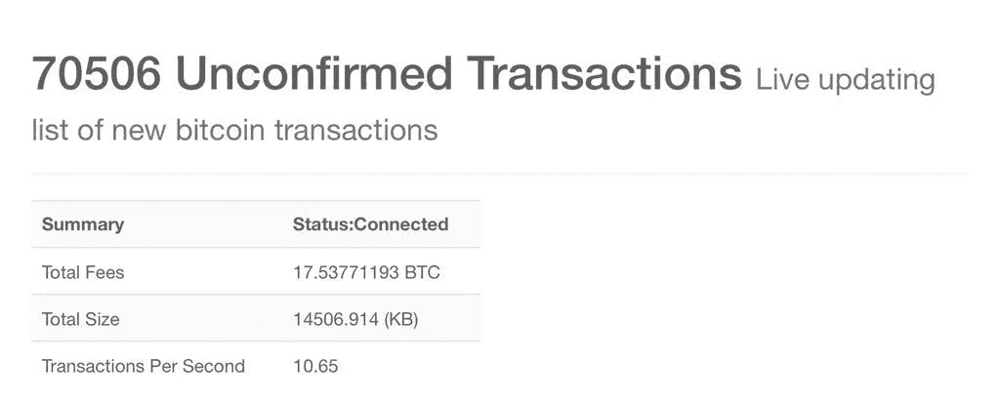
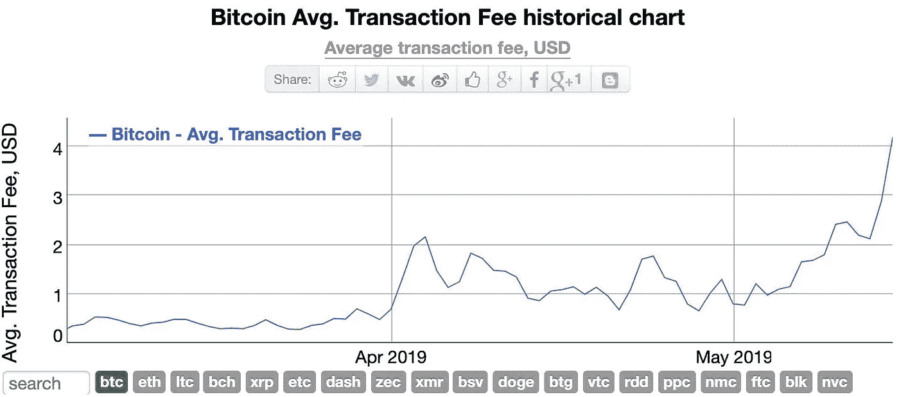

# 比特币即将再次变得无法使用

> 原文：<https://medium.datadriveninvestor.com/bitcoin-is-about-to-become-unusable-again-123b6c40457e?source=collection_archive---------8----------------------->

比特币正面临严重的网络瓶颈和疯狂的交易费用。SegWit 没有解决这个问题。LightningNetwork 还没有为黄金时间做好准备。

如果我们看看每天的交易数量，比特币在过去一年一直稳步增长，最近达到 39.1 万的峰值。2018 年的峰值利用率约为 406k。

查看最近的数据块大小，大多数数据块都在 1.2MB 左右，仅比最初的 1MB 数据块限制大 20%。

这远远低于最初对 SegWit 的估计，seg wit 将块大小设置为接近 4MB。

SegWit 的采用率似乎稳定在 45%左右。

未经确认的交易每天都在增加。每天都有 50k 到 70k 的数字被点击。

对网络拥堵和高收费的抱怨正在通过加密 Twitter 传播。

做一些非常粗略的数学计算:

*   0% SegWit = 1.0MB
*   45% SegWit = 1.2MB
*   100% SegWit 大约为 1.5MB

即使我们奇迹般地看到 100%的 SegWit 被采用(我们不会),我们仍然会面临严重的网络拥塞和费用飞涨。

 [## Azbit 旨在连接传统金融和加密货币-数据驱动的投资者

### Azbit 是下一个提供交易平台的加密项目，该平台提供保证金和算法交易。一样多…

www.datadriveninvestor.com](https://www.datadriveninvestor.com/2019/03/20/azbit-aims-to-connect-traditional-finance-and-cryptocurrency/) 

一旦交易开始堆积，费用就开始成倍增长。我们已经开始看到这一点。

这很糟糕。如果目前的加密牛市继续下去，比特币将在不久的将来碰壁。市场已经准备好了，但技术还没有。

你喜欢这个出版物吗？请给几个掌声！

