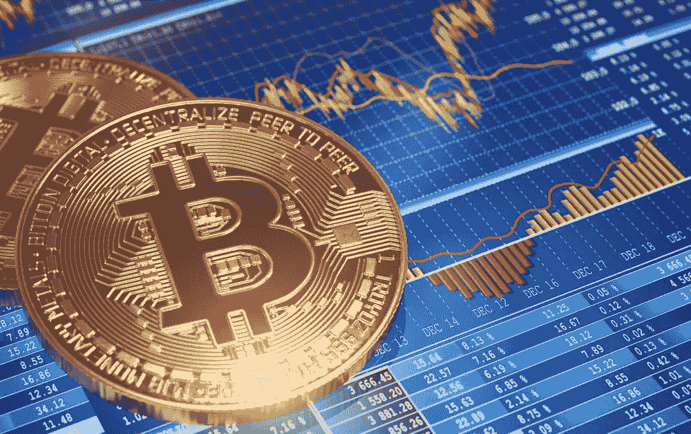

# 比特币正在崩溃——恐慌还是该买了？

> 原文：<https://medium.datadriveninvestor.com/bitcoin-is-crashing-freak-out-or-time-to-buy-3c2620610a95?source=collection_archive---------4----------------------->

虽然到 6 月底，比特币确实没有朝着许多人希望的方向发展，但现在还不是恐慌或对加密货币失去信心的时候。

在撰写本文时，比特币的交易价格为 6090 美元，这种明显的下跌再次提醒我们加密货币面临的高波动性。如果你是短期投资者，你可能会对你的投资感到有点不安，但对于我们这些长期投资者来说，我们认为这是一个绝佳的投资机会，也是一个利用低价的机会。

比特币就像我们其他人一样，在前进的道路上也有一些伤痕，但没有杀死我们的东西会让我们变得更强大，正如古语所说。至少比特币一直是这么告诉自己的。但是，如果你打赌比特币不会跌破 6000 美元，不要难过，你不是唯一一个。

尽管你现在可能在比特币投资上损失了一些钱，但我们这些有经验的人知道，时间可能会治愈所有的伤口。对于那些真正精通比特币的人，以及那些只想踏入比特币大门的人来说，这次经济低迷为我们提供了一个机会。

长线投资者现在应该已经认识到，现在是买入比特币的时候了，在这样的价格下，他们应该考虑比特币目前的交易区间。如果 6 万比特币的预言成真，那些错过这个机会的人以后肯定会后悔没有利用低价买进的机会。请记住，如果我们没有崩溃，我们就不会有集会。

新的人会想要进入，甚至可能会推动改善比特币背后的技术，以满足对区块链的高期望，这当然会产生更多的兴趣，新的资金将再次开始涌入。

如今，便宜的价格并不是比特币独有的。比预期更便宜的加密货币清单很长，但很有名，知情人士希望借此机会在多个交易所大捞一笔。

所以，对于那些在[加密货币投资](https://cryptoinvestinginsider.com/)上遇到困难的人，以及那些想要进入加密货币但每次你调出一些关于你最喜欢的硬币价格的信息时，你的电脑都会发出崩溃的噪音，所以你们要振作起来。

加密货币与传统资产或收入无关，几乎完全围绕投机而构建。出于这个原因，你会比其他类型的资产类别有更大的价格波动。这就是为什么你想有一个平衡的方法，不要把你需要的钱花在短期开支上，如果你想生存，并从这些低迷中获利，就要准备长期坚持。

