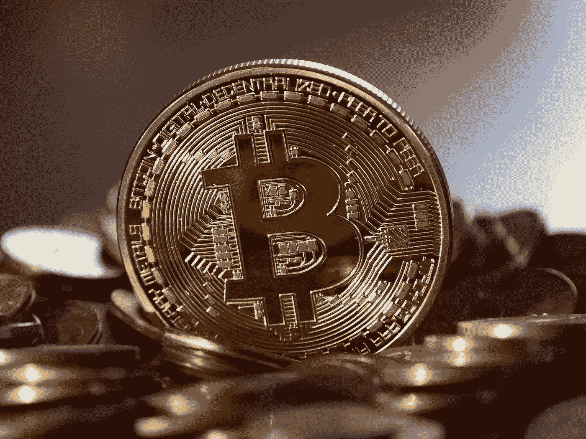

# 比特币就像黄金，但它更高级

> 原文：<https://medium.datadriveninvestor.com/bitcoin-is-like-gold-but-its-superior-675977c83746?source=collection_archive---------15----------------------->

“Bitcoin is digital gold”

印有比特币符号的金币图像已经成为与比特币相关的一切事物的代名词，以至于世界上几乎每个人在写比特币时都使用这种类型的图像。如果你不确定我指的是什么，看看我在这篇文章中使用的图片。

在比特币 9 年的生命周期中，类似黄金的硬币图像以及“数字黄金”的类比已经被广泛使用。当你想解释一些不容易理解的东西时，类比会非常有用。因此，人们经常用类比来解释比特币的各种事情是有道理的。毕竟，比特币是这个世界上很少有人深入了解的东西。

考虑到“比特币是数字黄金”这一类比的持续和广泛使用，你会认为这将为比特币新手提供积极的保证。然而，情况并非总是如此。我目睹过类比弊大于利的时候，因为:(一)相关的相似性没有得到很好的解释；以及(ii)比特币优于黄金的领域没有被突出。

这篇文章将介绍一些关于黄金的事情，可以帮助任何人更多地了解比特币。此外，我将强调比特币在哪些方面优于黄金，以及这些属性将如何使比特币在未来超越黄金和任何其他货币商品。

**黄金市场价值的构成**

市场上的黄金交易价格约为每盎司 1200 美元。然而，如果你将黄金用于你能使用的材料，比如牙科或电子元件，你只能回收每盎司 100 到 200 美元。当你把黄金用于这些目的时，你只能收回这个较少的金额，因为有其他商品也可以满足这些目的，但可以用这个较少的金额购买。因此，市场力量决定了黄金的“使用价值”在每盎司 100 到 200 美元之间。

黄金的使用价值(每盎司 100-200 美元)和市场价值(每盎司约 1200 美元)之间的差额约为每盎司 1000 美元。这种差异被称为“货币溢价”，黄金市场价值的 80%归因于这种货币溢价。

货币溢价是市场给予有能力履行货币职能的商品的溢价。货币的主要功能是充当交换媒介。然而，在社会使用某种东西作为交换媒介之前，商品必须首先能够起到价值储存的作用。因此，货币的功能之一是储存价值。

根据定义，如果持有人可以在任何时候在市场上出售该商品，并至少收回持有人收到或获得该商品时的相同价值，则该商品是一种良好的价值储存手段。

实际上，人们以黄金储存财富，因为他们期望将来别人会接受他们的财富，以换取至少与持有人收到或获得黄金时相同的价格。

世界上的每个人都需要储存价值，其中一些人相信黄金有能力实现这一功能。由此产生的对黄金的需求，与可获得的黄金供应相匹配，表明黄金具有大约每盎司 1000 美元的货币溢价。

黄金的很大一部分市场价值可归因于货币溢价，这一事实大大有助于人们理解，比特币之类的东西并不是完全没有价值，尽管它不是一家拥有现金流的公司，也不是像石油那样可以在生产中消耗的实物商品。

**为什么黄金可以起到价值储存的作用**

黎巴嫩美国大学的经济学教授 Saifedean Ammous 写了一本名为[比特币标准:中央银行的分散化替代方案](https://www.amazon.com/Bitcoin-Standard-Decentralized-Alternative-Central/dp/1119473861)的书。从这本书里可以得到许多有价值的东西，其中之一是 Saifedean 对历史上作为价值储存手段的商品的分析，以及这些商品的共同属性。

Saifedean 发现价值储存都有一个共同的属性；也就是说，人类很难增加商品的总供给，稀释现有供给的价值。如果人类很难增加总供应量，那么这种商品在很长一段时间内保持了其价值。供给难以增加的货币被称为“硬通货”，而供给容易增加的货币被称为“宽松货币”。

黄金以一种独特的方式达到它的硬度。实物黄金是坚不可摧的，其效果是历史上所有被开采的黄金今天仍与我们同在地球上。这种不断增加的黄金储备的连锁效应是，即使今年社会选择开采大量黄金，也只是现有黄金的一小部分。事实上，如果你看看过去 70 年的黄金开采速度，就会发现现有供应量每年只增加 1—2%。结果是黄金单位在很长一段时间内保持了它们的价值。

**为什么比特币可以起到价值储存的作用**

比特币是难以置信的‘硬通货’。这是因为比特币的供应上限为 2100 万比特币，新比特币进入系统的速度继续放缓。目前，约有 1740 万比特币在流通，比特币的总供应量以每年约 4%的速度增长。到 2020 年第二季度，总供应量的增长率将降至每年 2%以下，并且这一速度将继续放缓，直到大约 2140 年所有比特币都进入流通。

比特币的供应上限和通货紧缩的货币政策意味着它与黄金具有相似的属性。因此，比特币很有可能在未来充当价值储存手段，就像今天黄金充当价值储存手段一样。

**比特币更具颠覆性的特性**

除了是“硬通货”,比特币还有一些其他的属性，这些属性将它与其他货币区分开来。

*便携性*

比特币的便携性首屈一指。这是因为你可以把花比特币需要的私钥存储在一个 u 盘这么小的东西上，无论你去哪里，你都可以随身携带这个硬件设备。

重要的是，这种可携带性不受财富储存量的影响。不管你是用比特币储存 50 美元还是 5 亿美元的财富，你仍然可以在这个小硬件设备上储存你需要的私人密钥来消费这些财富。

而黄金则不是这样，因为以黄金储存的财富越多，将黄金从一个地方运输到另一个地方就越难，也越贵。

*审查阻力*

由于比特币的去中心化和网络中固有的经济激励，一个抵制审查的系统被创造出来。结果是:㈠任何人都可以向世界上任何地方的任何人汇寄任何数额的钱，交易将在一个小时内清算和结算；以及(ii)如果不对用比特币储存财富的人进行人身攻击，就无法没收该人的财富。

除了比特币，世界上没有其他资产具备这些属性。这是因为，对于传统资产，我们依赖机构来识别、保护和执行资产的所有权。举例来说，银行为政府资金(美元、欧元、兰特)的所有权提供便利，金融服务提供商的生态系统为股票所有权提供便利，政府机构为不动产所有权提供便利。有时，这些中央集权的机构会被影响去做一些不符合你的最佳利益的事情。

由于黄金的物理性质，在几乎所有情况下，以黄金储存大量财富的人不得不依赖服务提供商为他们储存黄金。不得不依赖服务提供商会带来风险，如果人们不愿意的话，他们可以不必承担这些风险。

*整除性*

每一个比特币都有 1 亿个比特，而比特币可以在如此微小的金额内消费。相比之下，当你不得不将黄金分成更小的数量以方便之前的交换时，就不容易使用黄金作为交换媒介。因此，黄金的不可分割性阻碍了它履行货币的基本功能——作为交换媒介的功能。比特币没有这个缺点。

**黄金曾经执行过货币的职能**

到 1900 年，大约有 50 个国家使用黄金作为价值储存手段和交易媒介。当黄金被用作国家之间和社会内部的交换媒介时，其便携性和可分割性的缺点必须得到解决。

当时当权者提出的答案是将所有黄金集中在国家控制的地方，并发行代表黄金的纸币。其逻辑是，这种纸将更容易分割和携带。

只要发行的纸币数量得到储备黄金的支持，这种解决方案就没问题。然而，在这种安排实施后不久，政府就让自己的利益占了上风，发行的纸币数量很快超过了储备的黄金数量。由于金钱在社会中的作用，人类总是会受到激励去创造更多的金钱……快进 100 年，我们有政府的钱是由债务支持的，正如我们所经历的，似乎可以创造的债务数量是没有限制的。

政府的钱是难以置信的“容易赚的钱”,而且总会有更多的钱。政府资金供给增加的不幸之处在于，它并没有平等地惠及所有人。如果你想了解更多关于政府资金供应的增加，以及为什么它没有平等地惠及每个人，我的文章[比特币要解决的大世界问题](https://medium.com/@grantralph18/the-big-world-problem-for-bitcoin-to-solve-c09ca8108486)应该是一个很好的介绍。

**比特币有可能成为有史以来发明的最好的货币**

随着比特币的发明，这个世界现在有了一种商品，它有潜力可持续地发挥价值储存和交换媒介的作用。我这么说是因为比特币是难以置信的“硬通货”,它没有黄金过去和现在都有的便携性和可分性缺点。

据估计，在大约 10-15 年的时间里，比特币应该能够发挥价值储存的功能。如何成为价值储存手段，然后成为全世界人民使用的交换媒介，将是未来文章的主题。

***免责声明*** *:评论、观点、意见和对未来事件的任何预测反映引用作者的观点，不一定反映其雇主或为同一雇主工作的其他专业人士的观点，不是对未来事件或结果的保证，也无意提供财务规划或投资建议。*